# Intro to IoC & Beans: Spring వెనకున్న Super Power! 🦸‍♂️

Mawa, welcome to the most important topic in Spring. Idi ardam aithe, Spring antha easy aipoddi. Interview lo kuda 100% adugutaru. Let's start!

### Source URL
[https://docs.spring.io/spring-framework/reference/core/beans/introduction.html](https://docs.spring.io/spring-framework/reference/core/beans/introduction.html)

### Why it Matters
Mawa, idi Spring ki heart lanti concept. Idi ardam aithe, migatha antha easy peasy. Ee Inversion of Control (IoC) ane principle eh Spring ni antha powerful ga, flexible ga chesindi. Loose coupling, easy testing - anni ee concept valle possible. Interview lo idi adagakunda undaru!

---

### The Problem: Normal Java lo unna kashtam 😫 (The Traditional Way)

Manam normal ga Java code ela rastam? Okasari chuddam.
Manaki oka `Car` object undi, daaniki oka `Engine` object kavali anukundam.

```java
// Normal Java Way - Idhi manam ippudu follow avvam
public class Car {
    private Engine engine;

    public Car() {
        // IKKADA CHUDU! Car object ye Engine object ni create chestundi.
        // Car is tightly coupled to a specific Engine implementation.
        this.engine = new V8Engine(); // Tight Coupling! 😥
    }

    public void start() {
        engine.turnOn();
    }
}
```
**Problem enti ikkada?**
1.  **Tight Coupling:** `Car` class ki `V8Engine` class gurinchi direct ga telusu. Repu manam `ElectricEngine` ki maarali ante, `Car` class code ni **modify cheyalsi vastundi**. Chinna change ki kuda code modify cheyadam pedda projects lo chala risky. ❌
2.  **Testing Kashtam:** `Car` class ni test cheyali ante, manam real `Engine` object lekunda test cheyalem. Mock cheyadam kashtam.

Ee problems ni solve cheyadanike **Inversion of Control (IoC)** vachindi.


### The Solution: Inversion of Control (IoC) & Dependency Injection (DI) ✨

Oka chinna but important point mawa:
- **Inversion of Control (IoC):** Idi oka broad design principle. "Don't create your dependencies, let someone else create them for you" ane idea ne IoC. Ee "someone else" ye framework (mana case lo, Spring).
- **Dependency Injection (DI):** Idi IoC ni implement cheyadaniki oka specific pattern. The "someone else" (the container) actively **injects** the dependencies into your object.

> So, you can say DI is a *form* of IoC. Spring uses the DI pattern to achieve IoC.

The control of creating objects is **inverted** - class nunchi container ki vellipoindi. Anduke "Inversion of Control".

Ee concept ni "The Hollywood Principle" ani kuda antaru:
> **"Don't call us, we'll call you."** 🎬
> (Objects: "Container, naku dependency kavali ani nenu adaganu, nuvve naaku icchey.")

**Main Advantage of IoC?**
**Loose Coupling!** ✅
`Car` class ki ippudu `V8Engine` or `ElectricEngine` ani specific ga teliyakkarledu. Daaniki oka generic `Engine` isthe chalu. Repu manam engine maarali anukunte, `Car` code ni touch cheyakunda, container ki chepthe chalu. Testing kuda super easy aipoddi!

---

### So, What is a Spring Bean? 🤔

Spring lo, ee objects (like `Car`, `Engine`) Spring Container create chesi, manage chese vatini **"Beans"** antam.

> **Interview Tip:** "Bean" ante edo pedda concept anukoku. It's just a fancy name for a plain old Java object (POJO) that is **instantiated, assembled, and managed by the Spring IoC container**. సింపుల్!

### And what is the Spring IoC Container? 📦

Adi oka magic box anuko. Ee container lo unna main responsibilities:
1.  **Bean Instantiation:** Beans ni create cheyadam.
2.  **Dependency Injection:** Okari dependencies ni inkokariki ivvadam (inject cheyadam).
3.  **Managing Lifecycle:** Bean puttina daggara nunchi, destroy ayye varaku manage cheyadam.

Spring lo ee container ki two main interfaces unnayi:
1.  **`BeanFactory`:** Idi basic container (`org.springframework.beans` package). Core functionality matrame untundi, like bean creation and management.
2.  **`ApplicationContext`:** Idi `BeanFactory` ki superset (`org.springframework.context` package). Idi `BeanFactory` kanna chala powerful and manam ekkuva use chesedi ide.

`ApplicationContext` lo `BeanFactory` features tho paatu, chala extra enterprise-level features untayi. For example:
-   Easier AOP Integration
-   Message Resource Handling (i18n)
-   Event Publication
-   Web-specific Contexts (`WebApplicationContext`)

```mermaid
graph TD
    subgraph "ApplicationContext (The Big Boss 😎)"
        direction LR
        A[BeanFactory]
        B["+ AOP Integration"]
        C["+ Message Resources (i18n)"]
        D["+ Event Publication"]
        E["+ ...and much more!"]
        A --> B
        A --> C
        A --> D
        A --> E
    end
```



> **Rule of Thumb:** Manam 99% of the time **`ApplicationContext`** ne use chestam. Adi powerful and easy. 💪

So, the whole story is:
1. You define your objects (**Beans**).
2. You tell the **Spring Container** about these beans and their dependencies.
3. The Spring Container uses **Inversion of Control (IoC)** to create them and wire them together.

Ee foundation tho, manam next topic lo container ni ela use cheyalo chuddam! Ready aa? 🔥

### Code Reference
Mawa, ee topic pure ga concept matrame. Manam container ni, beans ni inka create cheyaledu. So, deeniki specific code example ippudu avasaram ledu. Next section **"Container Overview"** lo manam actual ga container ni instantiate chesi, code tho aadukundam. Appudu ee concept antha live lo chustav!
