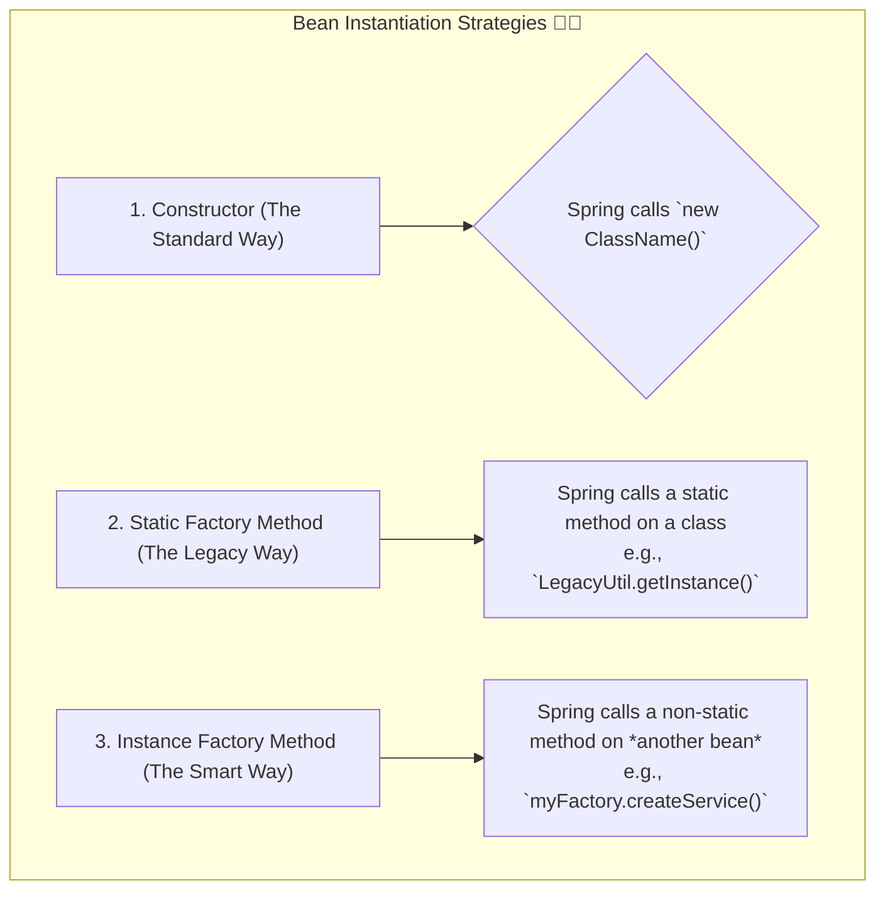

# Bean Overview: The Recipe for Objects 📜

Mawa, manam container gurinchi chusam. Ippudu aa container create chese "beans" gurinchi inka deep ga veldam. Asalu bean ante enti, daaniki manam instructions (recipe) ela ivvali?

### Source URL
[https://docs.spring.io/spring-framework/reference/core/beans/definition.html](https://docs.spring.io/spring-framework/reference/core/beans/definition.html)

### Why it Matters
Idi mana application ki building blocks lantiది. Okko bean ni ela configure cheyali, daaniki perulu ela pettali, and most importantly, daanni ela create cheyali anedi ikkade telustundi. Ee instantiation strategies (create chese vidhaanalu) interviews lo kuda adugutaru, especially factory methods gurinchi. So, jagrattha!

---

### What is a `BeanDefinition`? The Recipe! 🍳
Prati bean venakala oka recipe untundi, daanne `BeanDefinition` antam. Spring container ee recipe ni chuse bean ni tayaru chestundi. Ee recipe lo em untayi?
-   **Class Name:** Ee class tho object cheyali?
-   **Scope:** Singleton aa, prototype aa? (Manam mundu chustam).
-   **Dependencies:** Daaniki emaina vere beans kavala?
-   **Other settings:** Lifecycle callbacks, lazy initialization, etc.

Basically, `BeanDefinition` is the blueprint.

### Naming Beans: Peru Pettadam Convention 📛
Prati bean ki container lo oka unique peru undali.
- **Convention:** Standard Java variable naming follow avvali (e.g., `myService`, `accountDao`).
- **Aliases:** Okate bean ki multiple perlu ivvochu. Idi different parts of the application lo vere vere perlu tho same bean ni refer cheyadaniki use avutundi.

### Instantiating Beans: Create Cheyadam lo Rakalu ✨
Spring lo oka bean ni create cheyadaniki 3 main ways unnayi. Idi chala important concept.



Let's see the code for all three!

### Code Reference
Ee concept ni chudadaniki, `Spring-Project` lo `io.mawa.spring.core.bean` package chudu.

1.  **Instantiation with a Constructor (The Normal Way)**
    - Idi manam 99% of the time use chesedi. Spring direct ga class constructor ni call chesi object create chestundi.
    - `ConstructorInstantiatedService.java` chudu, adi oka simple POJO.

2.  **Instantiation with a Static Factory Method (The Legacy Wrapper)**
    - **Analogy:** Imagine, manam oka old third-party library vadutunnam. Aa library lo object ni `new` tho create cheyalem, kevalam `LegacyServiceFactory.createInstance()` ane static method dwara matrame create cheyagalam. Appudu ee approach vadatam.
    - `LegacyServiceFactory.java` and `StaticFactoryCreatedService.java` chudu.

3.  **Instantiation with an Instance Factory Method (The Smart Factory)**
    - **Analogy:** Imagine, manaki oka "Service Factory" undi. Adi current environment (DEV, PROD) batti `FastService` or `ReliableService` anedi decide chesi istundi. Appudu, ee Service Factory ni manam oka bean ga create chesi, daani meeda unna method ni call cheyamani Spring ki cheptam.
    - `InstanceServiceFactory.java` (idi kuda oka bean eh) and `InstanceFactoryCreatedService.java` chudu.

**The Configuration (`BeanConfig.java`):**
Ikkada manam Spring ki ee 3 rakala beans ni ela create cheyalo cheptunnam.

```java
// Path: Spring-Project/src/main/java/io/mawa/spring/core/bean/BeanConfig.java

@Configuration
public class BeanConfig {

    // 1. Constructor Instantiation
    @Bean
    public ConstructorInstantiatedService constructorService() {
        return new ConstructorInstantiatedService();
    }

    // 2. Static Factory Method Instantiation
    @Bean
    public StaticFactoryCreatedService staticFactoryService() {
        return LegacyServiceFactory.createInstance();
    }

    // 3. Instance Factory Method Instantiation
    @Bean
    public InstanceServiceFactory instanceServiceFactory() {
        return new InstanceServiceFactory();
    }

    @Bean
    public InstanceFactoryCreatedService instanceFactoryService(InstanceServiceFactory factory) {
        return factory.createInstance();
    }
}
```

**The Demo App (`BeanOverviewDemoApp.java`):**
Ee app lo, manam container ni start chesi, ee 3 beans ni retrieve chesi, vaati messages ni print chestunnam.

### How to Run
Project root `Spring-Project` folder lo undi, ee command run cheyi:
```bash
mvn compile exec:java -Dexec.mainClass="io.mawa.spring.core.bean.BeanOverviewDemoApp"
```
**Output:**
```
...Calling static factory method...
...Calling instance factory method...
1. Created via constructor! (The most common way)
2. Created via a static factory method! (Useful for legacy code)
3. Created via an instance factory method! (A powerful pattern)
```

Anthe mawa! Ippudu neeku bean ante ento, daanni enni rakalu ga create cheyochu anedi oka clear idea vachindi anukuntunna. Next manam dependencies gurinchi matladukundam. Ready aa? 💪
