# Bean Overview: The Recipe for Objects 📜

Mawa, manam container gurinchi chusam. Ippudu aa container create chese "beans" gurinchi inka deep ga veldam. Asalu bean ante enti, daaniki manam instructions (recipe) ela ivvali?

### Source URL
[https://docs.spring.io/spring-framework/reference/core/beans/definition.html](https://docs.spring.io/spring-framework/reference/core/beans/definition.html)

### Why it Matters
Idi mana application ki building blocks lantiది. Okko bean ni ela configure cheyali, daaniki perulu ela pettali, and most importantly, daanni ela create cheyali anedi ikkade telustundi. Ee instantiation strategies (create chese vidhaanalu) interviews lo kuda adugutaru, especially factory methods gurinchi. So, jagrattha!

---

### What is a `BeanDefinition`? The Recipe! 🍳
Prati bean venakala oka recipe untundi, daanne `BeanDefinition` antam. Spring container ee recipe ni chuse bean ni tayaru chestundi. Ee recipe lo em untayi?
-   **Class Name:** Ee class tho object cheyali?
-   **Scope:** Singleton aa, prototype aa? (Manam mundu chustam).
-   **Dependencies:** Daaniki emaina vere beans kavala?
-   **Other settings:** Lifecycle callbacks, lazy initialization, etc.

Basically, `BeanDefinition` is the blueprint.

### Naming Beans: Peru Pettadam Convention 📛
Prati bean ki container lo oka unique peru undali.
- **Convention:** Standard Java variable naming follow avvali (e.g., `myService`, `accountDao`).
- **Aliases:** Okate bean ki multiple perlu ivvochu. Idi different parts of the application lo vere vere perlu tho same bean ni refer cheyadaniki use avutundi.

### Instantiating Beans: Create Cheyadam lo Rakalu ✨
Spring lo oka bean ni create cheyadaniki 3 main ways unnayi. Idi chala important concept.

```mermaid
graph TD
    subgraph "Bean Instantiation Strategies 🧑‍🍳"
        A["1. Constructor (The Standard Way)"] --> B{"Spring calls `new ClassName()`"};
        C["2. Static Factory Method (The Legacy Way)"] --> D["Spring calls a static method on a class<br/>e.g., `LegacyUtil.getInstance()`"];
        E["3. Instance Factory Method (The Smart Way)"] --> F["Spring calls a non-static method on *another bean*<br/>e.g., `myFactory.createService()`"];
    end
```



Let's see the code for all three!

### Code Reference
Ee concept ni chudadaniki, `Spring-Project` lo `io.mawa.spring.core.bean` package chudu.

1.  **Instantiation with a Constructor (The Normal Way)**
    - Idi manam 99% of the time use chesedi. Spring direct ga class constructor ni call chesi object create chestundi.
    - `ConstructorInstantiatedService.java` chudu, adi oka simple POJO.

2.  **Instantiation with a Static Factory Method (The Legacy Wrapper)**
    - **Analogy:** Imagine, manam oka old third-party library vadutunnam. Aa library lo object ni `new` tho create cheyalem, kevalam `LegacyServiceFactory.createInstance()` ane static method dwara matrame create cheyagalam. Appudu ee approach vadatam.
    - `LegacyServiceFactory.java` and `StaticFactoryCreatedService.java` chudu.

3.  **Instantiation with an Instance Factory Method (The Smart Factory)**
    - **Analogy:** Imagine, manaki oka "Service Factory" undi. Adi current environment (DEV, PROD) batti `FastService` or `ReliableService` anedi decide chesi istundi. Appudu, ee Service Factory ni manam oka bean ga create chesi, daani meeda unna method ni call cheyamani Spring ki cheptam.
    - `InstanceServiceFactory.java` (idi kuda oka bean eh) and `InstanceFactoryCreatedService.java` chudu.

**The Configuration (`BeanConfig.java`):**
Ikkada manam Spring ki ee 3 rakala beans ni ela create cheyalo cheptunnam.

```java
// Path: Spring-Project/src/main/java/io/mawa/spring/core/bean/BeanConfig.java

@Configuration
public class BeanConfig {

    // 1. Constructor Instantiation
    @Bean
    public ConstructorInstantiatedService constructorService() {
        return new ConstructorInstantiatedService();
    }

    // 2. Static Factory Method Instantiation
    @Bean
    public StaticFactoryCreatedService staticFactoryService() {
        return LegacyServiceFactory.createInstance();
    }

    // 3. Instance Factory Method Instantiation
    @Bean
    public InstanceServiceFactory instanceServiceFactory() {
        return new InstanceServiceFactory();
    }

    @Bean
    public InstanceFactoryCreatedService instanceFactoryService(InstanceServiceFactory factory) {
        return factory.createInstance();
    }
}
```

**The Demo App (`BeanOverviewDemoApp.java`):**
Ee app lo, manam container ni start chesi, ee 3 beans ni retrieve chesi, vaati messages ni print chestunnam.

### How to Run
Project root `Spring-Project` folder lo undi, ee command run cheyi:
```bash
mvn compile exec:java -Dexec.mainClass="io.mawa.spring.core.bean.BeanOverviewDemoApp"
```
**Output:**
```
...Calling static factory method...
...Calling instance factory method...
1. Created via constructor! (The most common way)
2. Created via a static factory method! (Useful for legacy code)
3. Created via an instance factory method! (A powerful pattern)
```

---
<br>

### ✨ The Special One: `FactoryBean` Interface

Ippati varaku manam beans create cheyadaniki konni patterns chusam. Ippudu, Spring manaki ichina oka special tool gurinchi matladukundam: the `FactoryBean` interface. Idi oka pattern kadu, idi Spring ichina oka powerful interface!

**Asalu idi enti?** A `FactoryBean` anedi vere beans ni tayaru chese factory lanti bean. Ante, idi beans ni produce chese bean anamata! 🤯

Oka chinna analogy: Normal `@Bean` anedi shop ki velli direct ga oka toy car konnattu. Kani `FactoryBean` anedi, manam oka complex Lego set koni, daanitho maname aa toy car ni *build* chesinattu. Ikkada `FactoryBean` anedi aa Lego set, adi produce chese object mana final toy car.

#### The `FactoryBean` in Action

Manam chala complex object ni create cheyali anukundam, for example, chala custom configuration steps unna oka `Car` anukundam.

**Step 1: Mana `FactoryBean` ni Create Cheyadam**
```java
import org.springframework.beans.factory.FactoryBean;

// Ee class eh oka bean, kani idi oka Car object ni PRODUCE chestundi.
public class CarFactoryBean implements FactoryBean<Car> {

    private String color;

    // Manam ee factory ni kuda configure cheyochu!
    public void setColor(String color) {
        this.color = color;
    }

    @Override
    public Car getObject() throws Exception {
        // Ikkada entha complex creation logic aina rayochu!
        Car car = new Car();
        car.setColor(this.color);
        car.setEngine(new V8Engine()); // Inka logic undochu
        System.out.println("CarFactoryBean oka custom car ni build chestondi!");
        return car;
    }

    @Override
    public Class<?> getObjectType() {
        return Car.class;
    }

    @Override
    public boolean isSingleton() {
        return true; // Ikkada manam scope ni kuda control cheyochu!
    }
}
```

**Step 2: Daanini mana `@Configuration` lo Define Cheyadam**
```java
@Configuration
public class AppConfig {

    @Bean(name = "myCar")
    public CarFactoryBean carFactoryBean() {
        CarFactoryBean factory = new CarFactoryBean();
        factory.setColor("Red"); // Factory ni configure cheyadam
        return factory;
    }
}
```

#### The "Magic" Trick 🎩

Ippudu, asalu important vishayam! Nuvvu Spring container ni `"myCar"` ane bean adigithe, neeku em vastundi?

```java
// Idi em print chestundi?
Car car = context.getBean("myCar", Car.class);
System.out.println(car.getClass());
```

Neeku `CarFactoryBean` instance **RAADU**. Neeku `Car` object vastundi!

**Output:**
```
CarFactoryBean is building a custom car!
class com.example.Car
```
Spring chala smart. Adi ee bean `FactoryBean` ni implement chestondi ani chusi, automatic ga `getObject()` method ni call chesi, adi *produce* chesina object ni neeku istundi.

#### The Interview "Gotcha": The `&` Symbol

Appudu interviewer adugutadu, "Sare, kani naaku aa car kadu, aa factory object eh kavali, appudu em cheyali?"

Aha! Appude manam ampersand (`&`) prefix vadali!

```java
// Factory produce chesina Car kosam:
Car car = context.getBean("myCar", Car.class);

// FactoryBean object kosam:
FactoryBean factory = context.getBean("&myCar", FactoryBean.class);
```

**Mermaid Diagram: The Two-Faced Bean**
```mermaid
graph TD
    subgraph Spring Container
        A(Bean Definition: "&myCar")
    end

    B(Nee Code) -- "getBean("myCar")" --> C{Product: Car};
    B -- "getBean("&myCar")" --> D{Factory: CarFactoryBean};

    A -- produce chestundi --> C;
    A -- asalu instance --> D;
```

**Cliffhanger:**
Beans ni enni rakalu ga create cheyalo nerchukunnam. Ippudu vaatini kalapadam (wiring) gurinchi malli matladudam. Okavela oka dependency valla "chicken and egg" problem vaste? Ante, bean A ki bean B kavali, kani bean B ki malli bean A kavali! 🐔🥚 Deenini circular dependency antaru. Idi pedda disaster aa? Leka Spring daggara deenini solve cheyadaniki emaina secret trick unda? Chuddam...
