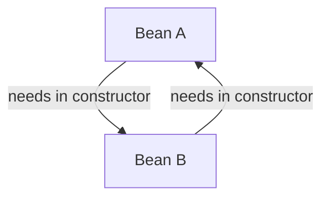

# Dependency Injection: How Beans Get Their Friends 🤝

Mawa, manam IoC ante ento chusam, beans ante ento chusam. Ippudu aa rendu kalise pani chese process gurinchi matladukundam: **Dependency Injection (DI)**. Idi IoC ki praanam lantiది. Okavela Spring anedi oka movie aite, DI anedi hero entry scene anamata! 😎

### Source URL
[https://docs.spring.io/spring-framework/reference/core/beans/dependencies/factory-collaborators.html](https://docs.spring.io/spring-framework/reference/core/beans/dependencies/factory-collaborators.html)

### Why it Matters
This is the *actual mechanism* of IoC. Mana objects (beans) verokari gurinchi vethakkunda, Spring eh vaallaki కావలసిన friends (dependencies) ni supply chestundi. Ee process ela jarugutundo telusukunte, mana application lo objects ela connect avutunnayo clear ga ardam avutundi.

Constructor Injection vs. Setter Injection anedi **pakka interview question**. Ekkada edi vadali anedi teliste, nuvvu రాసే code chala clean ga, maintainable ga untundi.

---

### The Two Main Types of DI
Spring lo manam dependencies ni ivvadaniki 2 main ways unnayi. Let's use a pizza analogy to understand this better. 🍕

1.  **Constructor-based DI (The "Must-Have" Ingredient)**
    - **Analogy:** Nuvvu oka `Pizza` tayaru chestunnav anuko. Topping lekunda pizza undadu, right? Adi **mandatory**. So, pizza tayaru chesetappude, ante constructor lone, topping ni iccheyali. `new Pizza(new CheeseTopping())`.
    - **Concept:** Spring lo kuda, oka bean ki oka dependency absolutely necessary and daani lekunda aa bean undaledu anukunte, manam constructor injection vadatam. The dependency is provided when the object is being constructed.
    - **Why it's Recommended:**
        - **Immutability:** Dependencies ni `final` ga declare cheyochu. Once set, they cannot be changed. Super safe! ✅
        - **Guaranteed Dependencies:** Object create ayye time ke anni mandatory dependencies vachesayi ani guarantee untundi. No `NullPointerException` risk! ✅
        - **Clean Code:** Class ki em kavalo constructor chudagane clear ga telisipotundi.

2.  **Setter-based DI (The "Optional" Ingredient)**
    - **Analogy:** Mana pizza ki extra cheese or special sauce anedi **optional**. Pizza ready ayyaka kuda manam add cheskovachu. `pizza.setExtraSauce(new TomatoSauce())`.
    - **Concept:** Oka bean ki oka dependency optional ayite, or default value unte, appudu setter injection vadatam. Spring first bean ni (no-argument constructor tho) create chesi, aa tarvata setter method ni call chesi dependency ni inject chestundi.
    - **Use Cases:**
        - Optional dependencies.
        - Re-configuration: App running lo undaga JMX lanti tools tho dependency ni change cheyadaniki veelu untundi.

> **Spring Team Recommendation:** Use **Constructor Injection** for mandatory dependencies and **Setter Injection** for optional ones. Idi best practice. 🚀

### The Deadly Embrace: Circular Dependencies 😵
Idi chala chala important interview topic mawa, jagratthaga vinu.

**What is it?**
-   Bean `A` constructor lo Bean `B` kavali.
-   Bean `B` constructor lo Bean `A` kavali.



**Problem:** Spring `A` ni create cheddam anukuntundi, kani daaniki `B` kavali. Sare, `B` ni create cheddam anukunte, daaniki `A` kavali. It's a deadlock! 💥 Spring ee situation ni detect chesi, `BeanCurrentlyInCreationException` ane error ni visurutundi.

**How to solve it?**
1.  **Refactor your code (The Best Way 👍):** Circular dependency anedi 99% of the time oka bad design ki sign. Your classes are doing too much. Danini refactor chesi, responsibilities ni separate cheyadam best solution.
2.  **Use Setter Injection (The Workaround 🤫):** Okavela refactor cheyadam kudarakapothe, dependencies lo okati setter injection ga marchali. Appudu Spring first object ni create chesi, tarvata setter dwara inject chestundi, so aa deadlock break avutundi. But remember, this is a workaround, not the ideal solution.

---

### Code Reference
Ee DI concepts ni live lo chudadaniki, `Spring-Project` lo `io.mawa.spring.core.di` package chudu.

1.  **The Dependencies:** Manam `Topping` and `Sauce` interfaces and vaati implementations (`CheeseTopping`, `TomatoSauce`) create chesam.
2.  **Constructor Injection in Action:** `ConstructorInjectedPizza.java` chudu. Daaniki `Topping` anedi constructor lo mandatory ga pass avutundi.
3.  **Setter Injection in Action:** `SetterInjectedPizza.java` chudu. Daaniki `Sauce` anedi `setSauce()` method dwara optionally inject avutundi.
4.  **The Configuration (`DIConfig.java`):** Ee config file lo, manam anni beans ni (`Topping`, `Sauce`, and the two `Pizza` beans) define chesi, Spring ki ela wire cheyalo cheptunnam.
5.  **The Demo (`DIDemoApp.java`):** Ee main class lo, manam rendu pizza beans ni container nunchi adigi, vaati dependencies correct ga inject ayyayo ledo chustam.

### How to Run
Project root `Spring-Project` folder lo undi, ee command run cheyi:
```bash
mvn compile exec:java -Dexec.mainClass="io.mawa.spring.core.di.DIDemoApp"
```
**Output:**
```
--- Constructor Injection Demo ---
This is a pizza with Cheese Topping 🧀 (constructor injected).

--- Setter Injection Demo ---
This is a pizza with Tomato Sauce 🍅 (setter injected).
```
---
<br>

### 🤫 Field Injection: The "Easy Way Out"

Dependencies ni inject cheyadaniki inko moodo (`third`) way undi, adi chudadaniki chala simple ga untundi. Just `@Autowired` ni direct ga field meeda petteyali. Constructors levu, setters levu. `Chala simple ga undhi, kada?`

Idi oka magician, pizza base meeda topping ni gaali lo nunchi teppinchiనట్లు. ✨ Chudadaniki cool ga untundi, kani adi akkada ki ela vachindi? Anedi oka secret!

```java
@Component
public class Pizza {

    @Autowired
    private Topping topping; // Look ma, no hands!

    public String getPizza() {
        return "A delicious pizza with " + topping.getName();
    }
}
```

#### The Good, The Bad, and The Ugly

Enduku idi kontha mandi vadataru?
*   **The Good (Conciseness):** Code chala chinna ga, clean ga untundi. Boilerplate taggistundi.

Enduku senior developers 'VADDHU' antaru?
*   **The Bad (Hides Dependencies):** Evaraina `Pizza` object ni create chesinappudu, daaniki lopalaki oka `Topping` kavali ani వాళ్ళకి teliyadu. Aa dependency constructor lo kanipinchadu. Idi oka hidden trap!
*   **The Ugly (Terrible for Testing):** Ide andari kante pedda problem. Manam unit test rasetappudu, oka `Pizza` object create chesi, daaniki oka *mock* `Topping` ivvali anukuntam. Field injection tho adi ela chestam? Cheyalem! `topping` field anedi private. Manam aa mock topping ni pizza loki pampadaniki complex Java "reflection" vadalsi vastundi, adi chala bad practice. Cheese kosam surgery chesinattu. 👨‍⚕️

**Mermaid Diagram: The Hidden Danger**
```mermaid
graph TD
    subgraph Nee Code
        A(new Pizza()) -- Pizza object ni create chestundi
    end
    subgraph Spring Magic World
        B(Topping) -- Magic ga lopaliki veltundi --> C((Pizza Object))
    end
    subgraph Nee Unit Test
        D(Mock Topping) -- Pizza loki vellali --> E{???};
        E -- Vellaledu! Field private --> F[Test Fails or uses ugly reflection];
    end

    A --> C;
```

#### The Final Verdict 👨‍⚖️

*   **Constructor Injection:** The Hero. Eppudu ide vadandi. 🥇
*   **Setter Injection:** The Sidekick. Optional dependencies kosam matrame. 🥈
*   **Field Injection:** The Villain in disguise. Friendly ga kanipinchina, chala problems testundi. Real projects lo avoid cheyandi. Tarvata meere naku thanks cheptaru! 🥉

**Cliffhanger:**
Okay, team! `Pizza` ki `Topping` kavali ani telusu. Kani okavela mana pizzeria lo chala toppings unte? `MushroomTopping`, `PaneerTopping`, `OliveTopping`... ivi anni kuda `Topping` eh! Appudu Spring `@Autowired private Topping topping;` ani chusi confuse avutundi. "Ee mooditlo neeku edi kavali?!" 🤯 Deenini `Ambiguity` error antaru. Ee confusion ni ela solve cheyali? Spring ki correct ga edi kavalo ela cheppali? Daaniki samadhanam rendu powerful annotations lo daagi undi... adi next episode lo!
