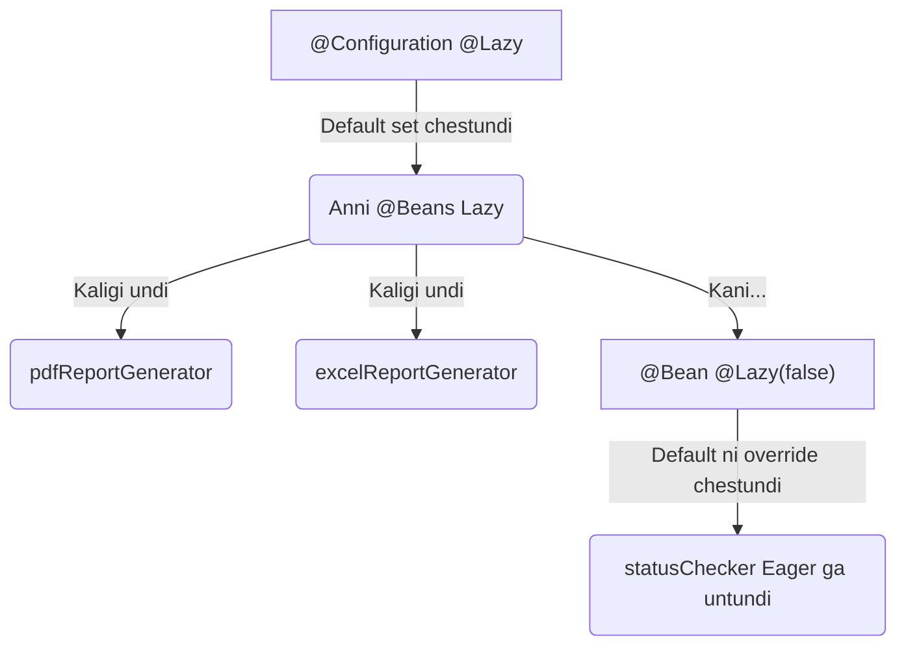

# `@Lazy` Beans: The "Call Me Only When You Need Me" Friend 😴🤙

Mawa, ippati varaku manam chusina beans anni chala punctual. Spring container start avvagane, "Nenu ready!" ani munduke vachi initialize aipothayi. Deenine **Eager Initialization** antam.

**Why is Eager the Default?**
Idi manchide, endukante application start appude antha correct ga unda, leda ani telisipotundi. Errors unte, mundhe dorikipothayi. 👍

But... what if oka bean chala peddadi? Adi create avvadaniki chala time or memory tesukuntundi anuko. Inka, aa bean manaki eppudo kani avasaram padadu. Appudu kuda daanini mundhe create cheyadam waste of time and resources kada? 🤔

Daaniki solution eh mana kotha friend: The **Lazy Bean**!

### Source URL
[https://docs.spring.io/spring-framework/reference/core/beans/dependencies/factory-lazy-init.html](https://docs.spring.io/spring-framework/reference/core/beans/dependencies/factory-lazy-init.html)

### Why it Matters
Application startup performance anedi chala critical mawa. Especially pedda applications lo, prathi millisecond count avutundi. `@Lazy` annotation use chesi, manam avasaram leni beans ni startup lo create cheyakunda apochu. Idi mana app startup time ni significant ga taggistundi. 🚀

---

### Eager vs. Lazy: The Party Analogy 🎉

Imagine nuvvu oka party host chestunnav (Spring Container start chestunnav).
*   **Eager Beans:** Party start avvagane vachesi, "Hey, I'm here!" ani cheppe friends. Vallu eppudu ready ga untaru. 🥳
*   **Lazy Beans:** Veellu intlo ne relax avutaru. Nuvvu specific ga call chesi, "Mawa, ekkadunnav ra?" ani adigithe tappa raru. Vallu party ki vachina, direct ga manatho matladataru. 😴


### How to Make a Bean Lazy?
Chala simple. Just `@Lazy` annotation ni add cheyడమే.
1.  `@Bean` method meeda.
2.  Leda direct ga `@Component` class meeda.

```java
@Configuration
public class MyConfig {

    @Bean
    @Lazy // <-- Ikkada pettochu
    public MyHeavyBean myHeavyBean() {
        return new MyHeavyBean();
    }
}

// ---- OR ----

@Component
@Lazy // <-- Leda ikkada pettochu
public class AnotherHeavyBean {
    // ...
}
```

**One Important Catch! ⚠️**
Oka lazy bean, vere non-lazy (eager) bean ki dependency ga undi anuko. Appudu Spring ki vere option ledu. Aa eager bean ni create cheyali ante, daani dependency aina mana lazy bean ni kuda create cheyalsi vastundi. So, in that case, mana lazy bean kuda application startup lone create avutundi. It gets pulled into the party early!

---

### Code Reference: Let's See the Difference!
Ee Eager vs. Lazy fight ni live lo chudadaniki, `Spring-Project` lo `io.mawa.spring.core.lazy` package chudu.

1.  **`EagerBean.java`:** A punctual friend who prints a message in its constructor.
2.  **`LazyBean.java`:** Mana lazy friend. Deeni `@Bean` method meeda `@Lazy` annotation undi. Idi kuda constructor lo message print chestundi.
3.  **`LazyConfig.java`:** Ee config file lo rendu beans ni define chesam.
4.  **`LazyDemoApp.java`:** The main app. Ikkada manam magic chustam.

### How to Run
Project root `Spring-Project` folder lo undi, ee command run cheyi:
```bash
mvn compile exec:java -Dexec.mainClass="io.mawa.spring.core.lazy.LazyDemoApp"
```
**Expected Output:**
```
--- Starting the Spring Container ---
EagerBean created! 🎉 (I'm always on time!)

--- Container has started. Notice only the EagerBean was created. ---

--- Now, let's ask for the LazyBean... ---
LazyBean created! 😴 (You finally called me!)
--- LazyBean has been retrieved! ---
```
Chusava mawa! Container start ayinappudu, `EagerBean` matrame create ayyindi. Manam `context.getBean(LazyBean.class)` ani adiginappudu matrame, `LazyBean` create ayyindi.

---
<br>

### 😴 Pro-Tip: Go Full Lazy Mode on a `@Configuration` Class!

Konni sarlu, mana daggara konni beans group ga untayi, avi kevalam oka specific feature kosame vadatam, ಉದಾహరణకు (for example) oka admin dashboard or reporting tool. Aa feature vadithe tappa, aa beans ni load cheyadam anavasaram.

Prati `@Bean` method meeda `@Lazy` pette badulu, manam daanini mottham `@Configuration` class meeda ne pettochu!

Idi party organizer tho, "Ee specific guest list lo unna andariki cheppu, andaru late ga rammani" ani cheppinattu.

```java
// Ee class lo define chesina anni beans ippudu default ga lazy avutayi!
@Configuration
@Lazy
public class ReportingConfig {

    @Bean
    public HeavyPdfReportGenerator pdfReportGenerator() {
        // Ee bean LAZY, endukante config class lazy ga undi
        return new HeavyPdfReportGenerator();
    }

    @Bean
    public HeavyExcelReportGenerator excelReportGenerator() {
        // Ee bean KUDA LAZY
        return new HeavyExcelReportGenerator();
    }

    @Bean
    @Lazy(false) // Manam override cheyochu!
    public ReportingStatusChecker statusChecker() {
        // Ee bean EAGER ga untundi, endukante manam explicit ga cheppam.
        return new ReportingStatusChecker();
    }
}
```

**The Rule:**
*   `@Configuration` class meeda unna `@Lazy`, daani lopala unna anni `@Bean` methods ki default avutundi.
*   Manam eppudaina ee default ni, okko `@Bean` method meeda `@Lazy(true)` or `@Lazy(false)` petti override cheyochu.

**Mermaid Diagram: The Lazy Club**


**Cliffhanger:**
Beans ni *ela* and *eppudu* create cheyalo control cheyadam nerchukunnam. Kani manam Spring magic meeda depend ayyam vaatini find chesi inject cheyadaniki. Okavela ee magic confuse aite? Okate type lo rendu beans unte? Appudu Spring edi choose cheskuntundi? Manam "director" ga mari, Spring ki correct ga edi kavalo cheppe time vachindi. Daaniki `Qualifier` and `@Primary` lanti powerful annotations vadatam. Next, autowiring ni fine-tune cheyadam nerchukundam!
