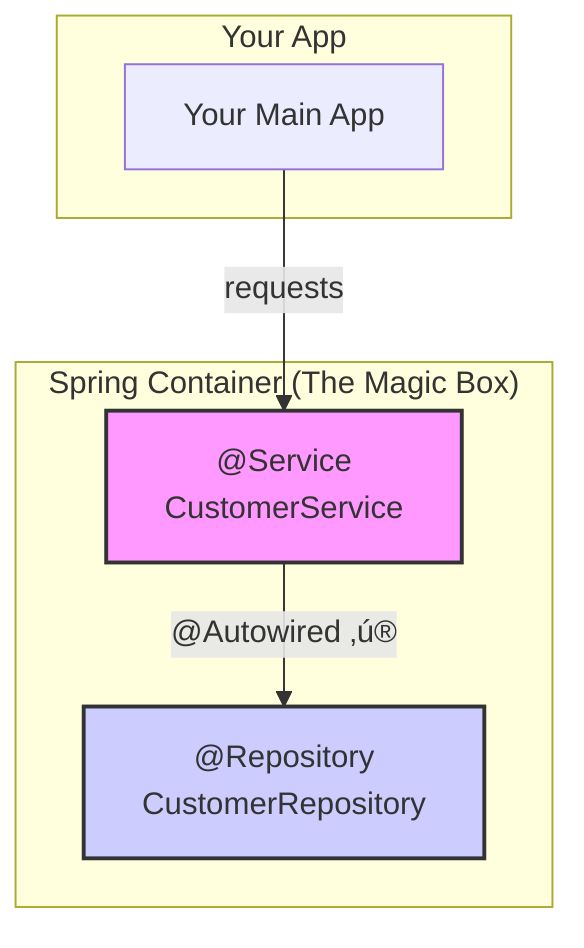

# Autowiring: The "Nuvve Chusko!" Magic of Spring! ✨

Mawa, ippati varaku manam `@Configuration` class lo kashtapadi, okko bean ki daani dependency ni maname chetho link chesam (`new Service(new Repository())` laaga). Chinna projects ki idi okay, kani pedda project lo 100s of beans unte? Prati okkarini maname kalupukuntu velthe, mana pani antha ide aipotundi! 🤯

Ikkade Spring gadu oka magic wand 🪄 teeskuni vastadu. Dani peru **`@Autowired`**.

### Source URL
[https://docs.spring.io/spring-framework/reference/core/beans/dependencies/factory-autowire.html](https://docs.spring.io/spring-framework/reference/core/beans/dependencies/factory-autowire.html)

### Why it Matters
Autowiring anedi Spring lo most powerful features lo okati. Idi manaki chala boilerplate code ni taggistundi. Manam just "Naaku ee dependency kavali" ani adigithe chalu, Spring eh container lo vethiki, correct dependency ni thechi isthundi. "Nuvve chusko, mawa!" ani Spring ki cheppadam anamata. Idi Spring Boot lo default behavior, so idi master cheyadam chala important.

---

### How Autowiring Works: The Big Picture
Imagine Spring Container anedi oka pedda box, daantlo manam anni beans (`@Component`, `@Service`, `@Repository`) ni padesam. `@Autowired` use chesinappudu, adi automatic ga aa box lo vethiki correct type unna bean ni thechi, manaki కావలసిన chota pettesthundi.



### The 3 Places to Use `@Autowired`

Ee magic wand ni manam 3 places lo use cheyochu.

#### 1. Constructor Injection (The Best Spot 🥇)
Idi Spring team recommend chese best approach.
```java
@Service
public class ConstructorAutowiredService {
    private final CustomerRepository customerRepository;

    @Autowired // Constructor meeda annotation
    public ConstructorAutowiredService(CustomerRepository customerRepository) {
        this.customerRepository = customerRepository;
    }
}
```

#### 2. Setter Injection (The Flexible Spot 🥈)
Optional dependencies ki idi manchi choice.
```java
@Service
public class SetterAutowiredService {
    private CustomerRepository customerRepository;

    @Autowired // Setter method meeda annotation
    public void setCustomerRepository(CustomerRepository customerRepository) {
        this.customerRepository = customerRepository;
    }
}
```

#### 3. Field Injection (The "Easy but Risky" Spot 🥉)
Chala easy ga untundi, kani chala disadvantages unnayi.
```java
@Service
public class FieldAutowiredService {
    @Autowired // Direct ga field meeda annotation
    private CustomerRepository customerRepository;
}
```

### The Ultimate Showdown: Constructor vs. Setter vs. Field 🥊

| Feature                 | Constructor Injection 👍 (Recommended)                               | Setter Injection 🤔 (Okay for Optional)                          | Field Injection 👎 (Avoid if Possible)                               |
| ----------------------- | -------------------------------------------------------------------- | ---------------------------------------------------------------- | -------------------------------------------------------------------- |
| **Dependency Type**     | **Mandatory** dependencies kosam best.                             | **Optional** dependencies kosam better.                          | Edaina okay, kani clarity undadu.                                    |
| **Immutability**        | `final` fields use cheyochu. Object create ayyaka dependencies maravu. | `final` fields use cheyalem. Dependencies ni tarvata marchochu.    | `final` fields use cheyalem.                                         |
| **Testability**         | Super easy to test. Direct ga constructor ki mock objects pass cheyochu. | Okay, but you need to call the setter in your test.              | **Very hard to test.** Reflection use cheyalsi vastundi. 👎         |
| **Circular Dependencies** | Startup lone error vastundi (`BeanCurrentlyInCreationException`). Manchi vishayame! | Circular dependency ni resolve cheyagaladu (but adi bad design eh). | Circular dependency ni resolve cheyagaladu (but adi bad design eh). |
| **Code Smell**          | Too many constructor parameters unte, class ki ekkuva responsibilities unnayi ani easy ga telustundi. | Easy ga chala optional dependencies add chese chance undi.         | Class ki enni dependencies unnayo chala easy ga hide chesestundi. 🙈 |

**The Winner:** **Constructor Injection** is the clear winner for most use cases! It leads to more robust, testable, and readable code.

---

### Code Reference: Let's See the Magic!
Ee autowiring magic ni live lo chudadaniki, `Spring-Project` lo `io.mawa.spring.core.autowiring` package chudu. Ee package lo manam paina cheppina 3 service classes and vaati dependency (`DatabaseCustomerRepository`) unnayi.

**The Configuration (`AutowiringConfig.java`):**
Ee sari manam `@Bean` methods rayatledu! Just `@ComponentScan` tho Spring ki cheptunnam, "Ee package lo unna anni `@Component` beans ni nuvve scan chesi, vaati dependencies ni nuvve chusko" ani.

```java
// Path: .../autowiring/AutowiringConfig.java
@Configuration
@ComponentScan(basePackages = "io.mawa.spring.core.autowiring")
public class AutowiringConfig {
    // That's it! No @Bean methods needed!
}
```

### How to Run
Project root `Spring-Project` folder lo undi, ee command run cheyi:
```bash
mvn compile exec:java -Dexec.mainClass="io.mawa.spring.core.autowiring.AutowiringDemoApp"
```
Output chuste, manam ekkada manually wire cheyakapoina, anni services lo `CustomerRepository` perfect ga inject avvadam chudochu.

---
<br>

### ✨ @Autowired Superpowers!

`@Autowired` basics neeku telusu. Ippudu konni tricks nerchukundam, avi nee code ni inka clean ga, safe ga, and powerful ga chestayi.

#### 1. The Invisible `@Autowired` 👻

Modern Spring lo (version 4.3 and tarvata), oka class ki **oke okka constructor** unte, daani meeda `@Autowired` rayalsina avasaram ledu!

Spring chala smart, adi, "Hey, ee object ni build cheyadaniki oke oka daari undi, so nenu aa constructor ne dependency injection kosam vadestha" ani anukuntundi.

**Paatha Paddati:**
```java
@Component
public class ReportGenerator {
    private final DataFetcher fetcher;

    @Autowired // <-- Idi mundu avasaram unde
    public ReportGenerator(DataFetcher fetcher) {
        this.fetcher = fetcher;
    }
}
```

**Kotha, Clean Paddati:**
```java
@Component
public class ReportGenerator {
    private final DataFetcher fetcher;

    // @Autowired ledu! Ayina pani chestundi!
    public ReportGenerator(DataFetcher fetcher) {
        this.fetcher = fetcher;
    }
}
```
Idi nee code ni clean ga chestundi and ippudu ide recommend chese style. `Enta neat ga undho chudandi!`

#### 2. The Optional Dependency: `required = false` 🤔

Okavela neeku oka bean kavali, kani adi context lo lekapovachu anukundam. Udaharanaki, oka `PremiumFeature`, adi kevalam app "pro" version lo matrame load avutundi. Nuvvu daanini simple ga `@Autowired` cheste, aa bean lekapothe application startup lo ne crash avutundi.

Solution `required = false`.

```java
@Service
public class UserDashboard {

    private final AnalyticsService analytics;
    private PremiumFeature premiumFeature; // Idi null undochu!

    // Ee main dependency avasaram
    public UserDashboard(AnalyticsService analytics) {
        this.analytics = analytics;
    }

    // Ee dependency OPTIONAL
    @Autowired(required = false)
    public void setOptionalPremiumFeature(PremiumFeature feature) {
        this.premiumFeature = feature;
        if (feature != null) {
            System.out.println("Premium feature enabled! 👑");
        }
    }
}
```
Idi Spring ki cheptundi: "`PremiumFeature` bean kosam vethuku. Dorikithe, inject cheyi. Dorakkapothe, no problem! Daanini `null` ga vadhilesi munduku vellu." Idi nee application crash avvakunda aputundi.

#### 3. The "Gather 'Em All" Technique: Injecting a List! 🗃️

Idi Spring lo unna atyanta `powerful` patterns lo okati. Neeku oka interface undi, daaniki multiple implementations unte? Udaharanaki, `NotificationSender` ane interface ki, `EmailSender`, `SMSSender`, and `PushNotificationSender` ane classes unnayyi anukundam.

Vaatini anni ela teeskuntav? Simple ga aa interface type unna `List` ni inject cheyi!

**The Interface:**
```java
public interface NotificationSender {
    void send(String message);
}
```

**The Implementations:**
```java
@Component public class EmailSender implements NotificationSender { ... }
@Component public class SMSSender implements NotificationSender { ... }
@Component public class PushNotificationSender implements NotificationSender { ... }
```

**The Magic:**
```java
@Service
public class NotificationService {

    private final List<NotificationSender> allSenders;

    // Spring, NotificationSender ni implement chese anni beans ni
    // vethiki, ee list lo inject chestundi!
    public NotificationService(List<NotificationSender> allSenders) {
        this.allSenders = allSenders; // Ikkada 3 objects untayi!
    }

    public void notifyAll(String message) {
        for (NotificationSender sender : allSenders) {
            sender.send(message); // Email, SMS, and push notification pampistundi!
        }
    }
}
```

**Mermaid Diagram: The Collector**
```mermaid
graph TD
    subgraph Spring Container
        A(EmailSender)
        B(SMSSender)
        C(PushNotificationSender)
    end

    D(NotificationService Constructor) -- Adigindi `List<NotificationSender>` --> E{Spring};
    E -- Anni implementations ni gather chesindi --> F[List: [A, B, C]];
    F -- Injects into --> D;
```

**Cliffhanger:**
Sare, beans ni ela inject cheyalo chusam. Kani manam eppudu oka "singleton" bean ni inko "singleton" bean loki inject chesam. Okavela nuvvu oka "prototype" bean (prati sari kotha object) ni oka singleton loki inject cheyali anukunte? Idi oka chala tricky problem ni create chestundi! Singleton aa prototype ni okkasari teeskuni, daanini eppatiki pattukuni untundi, prototype uddeshanne debba testundi! Ee samasyani ela solve cheyali? Daaniki samadhanam `@Lookup` ane oka vichitramaina and powerful annotation lo undi... adi next chuddam!
