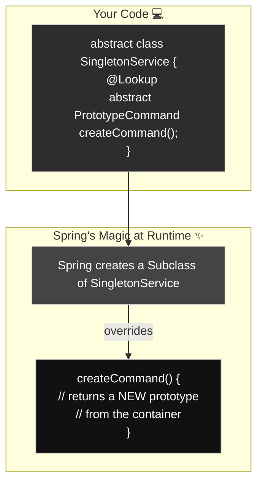

# Method Injection: The "Fresh Object, Please!" Button 🔄

Mawa, ippati varaku manam chusina concepts anni straight forward ga unnai. Ippudu konchem mind-bending, kani chala powerful concept loki veldam. Idi oka classic Spring interview question: **"How do you inject a prototype-scoped bean into a singleton-scoped bean?"**

Ee question ardam cheskune mundu, manaki aa rendu scopes gurinchi oka chinna idea undali.

---
### Quick Intro: Singleton vs. Prototype Scopes

Mawa, Spring lo prathi bean ki oka "scope" untundi. Adi daani lifecycle ni define chestundi.

*   **Singleton (The Default 👑):** Idi default scope. Ante, Spring container lo oka type ki **oke okka object** create avutundi. Nuvvu `context.getBean()` ani 100 sarlu adigina, Spring neeku ade original object ni malli malli istundi. It's like having one shared coffee machine for the whole office.
*   **Prototype (A New One Every Time ✨):** Ee scope lo, nuvvu bean ni adiginapudalla, Spring neeku oka **kotha, fresh object** ni create chesi istundi. It's like getting a new paper cup every time you want coffee.

> **Important Note:** Don't worry mawa, manam ee scopes gurinchi inka chala detailed ga **"Bean Scopes"** ane separate episode lo matladukundam. For now, just remember this basic difference.

---

### The Real Problem: Singleton-Prototype Conflict
Ippudu main matter ki vacheddam. `SingletonService` (mana office coffee machine) undi, adi application antha oke okati untundi. Kani, adi process chese prathi request ki, daaniki oka **kotha**, stateful `PrototypeCommand` (mana paper cup) object kavali.

Nuvvu simple ga `@Autowired` vadithe emavutundi?
```java
@Service // Singleton
public class MySingleton {
    @Autowired
    private PrototypeCommand command; // Injected only ONCE!
}
```
`MySingleton` create ayinappudu, `PrototypeCommand` okkasari matrame inject avutundi. Aa tarvata, `MySingleton` antha life ki, ade **okate** `PrototypeCommand` object ni vadutundi. This completely defeats the purpose of the prototype scope! 🤯 Ee problem ni "singleton-prototype problem" antaru.

Method Injection ee problem ki oka elegant solution istundi.

### The Vending Machine Analogy 🥤

Imagine, mana `SingletonService` anedi oka **Vending Machine**. Adi factory lo okasari matrame install chestaru.
Mana `PrototypeCommand` anedi oka **Soda Can**. Prati customer ki oka kotha can kavali.

-   **The Problem:** Nuvvu vending machine lo okate okka soda can petti, daanini autowire chesinattu. Prati customer ki ade can vastundi. Not good!
-   **The "Bad" Solution:** Vending machine ki factory phone number ivvadam (`ApplicationContextAware`). Prati sari customer vachinappudu, vending machine factory ki call chesi, "Oka kotha can pampu" ani adugutundi. This works, but the vending machine is now tightly coupled to the factory (the Spring framework).
-   **The "Good" Solution (Method Injection):** Spring tho manam cheptunnam, "Ee vending machine lo unna 'Get Soda' button ni, direct ga soda factory ki connect ayye oka magic button tho replace chey." Ee magic button eh **`@Lookup` method**. Ippudu, customer aa button press chesinapudalla, factory nunchi oka brand new soda can vastundi!

### The Magic: `@Lookup` Method Injection

Idi ela pani chestundi?
1.  Mana singleton bean ni `abstract` class ga marchali.
2.  Daanilo, manaki కావలసిన prototype bean ni return chese oka `abstract` method rayali.
3.  Aa method meeda `@Lookup` annotation pettali.

```java
// Snippet from SingletonService.java
@Service
public abstract class SingletonService {

    public void processSomething() {
        // createCommand() ni call cheste, Spring manaki kotha object istundi
        PrototypeCommand command = createCommand();
        command.execute();
    }

    // Ee abstract method ki body manam rayam!
    // Spring eh runtime lo deeniki implementation istundi.
    @Lookup
    protected abstract PrototypeCommand createCommand();
}
```

**Behind the Scenes:**
Spring container ee `SingletonService` ni chusinappudu, adi direct ga daani object ni create cheyadu. Daani బదులు, CGLIB ane library use chesi, runtime lo `SingletonService` ki oka **subclass** ni create chestundi. Aa subclass lo, adi `createCommand()` method ki implementation రాస్తుంది. Aa implementation, container nunchi oka kotha prototype bean ni get cheskuni return chestundi.



---

### Code Reference: Let's See the Magic Button!
Ee advanced concept ni live lo chudadaniki, `Spring-Project` lo `io.mawa.spring.core.methodinjection` package chudu.

1.  **The Soda Can (`PrototypeCommand.java`):** `@Scope("prototype")` tho unna mana stateful bean. Prati object ki oka separate creation time untundi.
2.  **The Vending Machine (`SingletonService.java`):** Mana `abstract` singleton class with the magic `@Lookup` method.
3.  **The Config (`MethodInjectionConfig.java`):** Simple ga `@ComponentScan` tho antha set chesam.
4.  **The Demo (`MethodInjectionDemoApp.java`):** Ee main class lo, manam singleton ni okkasari teeskuni, daani `process()` method ni rendu sarlu call chestam. Output lo hash codes veru veru ga undadam chusi, prati sari kotha prototype create avutundi ani confirm cheskovachu.

### How to Run
Project root `Spring-Project` folder lo undi, ee command run cheyi:
```bash
mvn compile exec:java -Dexec.mainClass="io.mawa.spring.core.methodinjection.MethodInjectionDemoApp"
```
**Expected Output:**
```
--- Calling process() on the SingletonService the first time ---
Executing command created at: 2025-09-14T03:43:11.122660 (hashCode: 12345)

--- Calling process() on the SingletonService the second time ---
Executing command created at: 2025-09-14T03:43:12.123660 (hashCode: 67890)

Notice the different hashCodes and creation times for the PrototypeCommand!
```

That's Method Injection! Oka tricky problem ki chala clean solution. With this, we have finished the "Dependencies" section. Next, we will *officially* enter the world of **Bean Scopes**! Ready aa? 🔥
