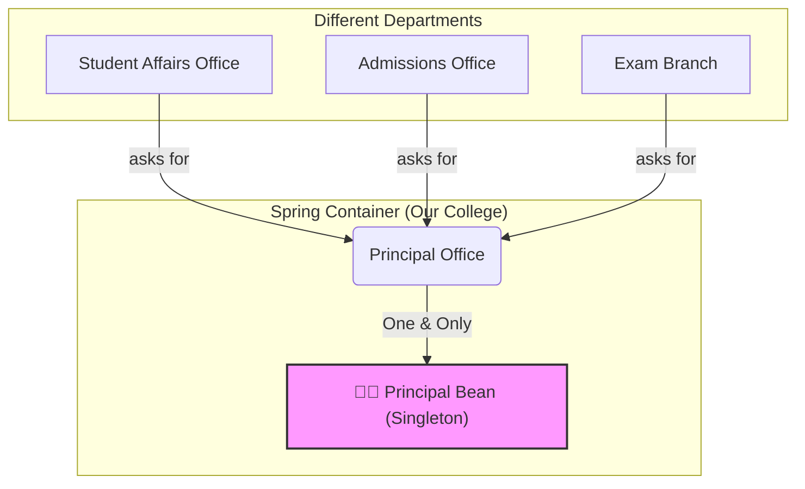

# Singleton Scope: The "Okate Piece, Master Piece!" 😎👑

Mawa, welcome to the world of **Bean Scopes**! Idi Spring lo oka fundamental kani chala important topic. Okko bean ela puttali, entha kalam bratakali anedi ee scopes eh decide chestayi.

Andulo mana first hero, the one and only, the default king: **Singleton Scope**.

### Source URL
[https://docs.spring.io/spring-framework/reference/core/beans/factory-scopes.html#beans-factory-scopes-singleton](https://docs.spring.io/spring-framework/reference/core/beans/factory-scopes.html#beans-factory-scopes-singleton)

### What is Singleton Scope?
Perulo ne undi kada, "Single" ani. Ante, oka particular bean type ki, Spring IoC container antha, **oke okka object instance** create chestundi. Nuvvu aa bean ni enni sarlu adigina, ekkada adigina, Spring neeku ade original, "master piece" object ni malli malli istundi.

Idi Spring lo **default scope**. Ante, nuvvu emi cheppakapothe, Spring prathi bean ni singleton ga ne treat chestundi.

### The College Principal Analogy 👨‍🏫
Imagine mana Spring Container anedi oka college anuko.
*   **Singleton Bean (`Principal`):** College ki entha mandi students unna, HODs unna, principal okkare untaru. Evaru vachi "Principal evaru?" ani adigina, manam ade okka person ni chupistam. He is the single, shared instance for the entire college.
*   **Other Beans (`Student`):** Students chala mandi untaru, prathi student veru. Idi vere scope (like prototype), daani gurinchi tarvata matladukundam.


Ee diagram lo, college lo unna anni departments ki, oke okka Principal bean instance serve chestondi.

### Why is it the Default?
Most of the time, mana application lo beans ki state undadu (stateless). For example, services, repositories, controllers. Veetiki data ni store cheskune pani undadu, just logic execute chestayi. Alantappudu, prathi request ki kotha object create cheyadam anavasaram. Oke object ni andaru share cheskunte, memory save avutundi, performance better avutundi. Anduke, singleton anedi chala efficient and default choice.

### How to Declare a Singleton?
As I said, idi default. So nuvvu emi cheyanakkarledu.
```java
@Configuration
public class AppConfig {

    @Bean // By default, this is a singleton
    public MyService myService() {
        return new MyService();
    }
}

// OR using component scanning

@Service // By default, this is a singleton
public class MyOtherService {
    // ...
}
```
Kani, explicit ga cheppali anukunte, `@Scope("singleton")` ani rayochu. But it's redundant (avasaram ledu).
```java
@Bean
@Scope("singleton") // This is redundant but valid
public MyService myService() {
        return new MyService();
    }
```

---
### Code Reference: Let's Prove it!
Ee "Okate Piece" concept ni prove cheyadaniki, `Spring-Project` lo `io.mawa.spring.core.scopes.singleton` package create chesi, andulo code petta.

1.  **`SingletonBean.java`:** A simple bean that prints its hash code in the constructor, so we can see which object it is.
2.  **`SingletonScopeConfig.java`:** A configuration class that defines our singleton bean.
3.  **`SingletonScopeDemoApp.java`:** The main app. Ikkada manam container nunchi bean ni **rendu sarlu** adugudam.

### How to Run
Project root `Spring-Project` folder lo undi, ee command run cheyi:
```bash
mvn compile exec:java -Dexec.mainClass="io.mawa.spring.core.scopes.singleton.SingletonScopeDemoApp"
```
**Expected Output:**
```
--- Creating SingletonBean ---
Hash code of created SingletonBean: 123456789

--- Retrieving bean 'singletonBean' for the first time ---
Retrieved Bean Hash Code: 123456789

--- Retrieving bean 'singletonBean' for the second time ---
Retrieved Bean Hash Code: 123456789

Both hash codes are the same. Spring returned the SAME instance!
```
Chusava! Bean okkasare create ayyindi, and manaki rendu sarlu ade object vachindi. That's the singleton scope for you!

---
<br>

### ⚠️ DANGER ZONE: The Thread Safety Trap!

Singleton bean anedi, oka busy office lo unna oke okka shared whiteboard lantiది. Andaru ade board ni vadataru. Ippudu imagine chesko, Person A vachi board meeda "Buy Milk" ani rasadu. At the exact same time, Person B vachi aa board ni erase chesi "Call Client" ani rasadu. Inka anthe, anukoni ghoram jarigipoindi! Person A yokka note eppatiki kanipinchadu.

Singletons tho ide andari kante pedda `danger`. Oka web application lo, prathi user request anedi oka veru "person" (ante, oka veru thread). Vallandaru oke sari aa singleton bean yokka state ni (whiteboard meeda rayadam lantiది) marchali ani try cheste, neeku data corrupt avvadam, bugs ravadam, antha gola gola avvadam ఖాయం. Deenine "race condition" antaru.

#### The Golden Rule of Singletons: BE STATELESS!

Oka singleton bean, oka particular user ki or request ki sambandinchina data ni **store chesukokudadu**. Adi "stateless" ga undali. Daaniki dependencies undochu (avi kuda singletons), kani daanilo request ki maripoye instance variables undakudadu (e.g., `private int count;` or `private String currentUser;`).

**BAD Singleton 👎 (Stateful - Chala Pramadakaram!)**
```java
@Service // Default ga Singleton
public class VisitorCounter {
    private int count = 0; // <--- DANGER! STATEFUL FIELD!

    public void newVisitor() {
        // Multi-threaded app lo, idi safe KADU!
        // Rendu threads oke sari `count` value ni chadavachu,
        // okati increment chese mundare inkoti kuda chadavochu.
        this.count++;
    }
}
```

**GOOD Singleton 👍 (Stateless - Safe!)**
```java
@Service // Default ga Singleton
public class GreetingService {
    // Ee dependency kuda oka stateless singleton. Safe!
    private final MessageSource messageSource;

    public GreetingService(MessageSource messageSource) {
        this.messageSource = messageSource;
    }

    // State (name) anedi method parameter ga vastondi.
    // Adi class lo store avvatledu. PERFECT!
    public String greet(String name) {
        String template = messageSource.getGreetingTemplate();
        return template.replace("{}", name);
    }
}
```

**Mermaid Diagram: The Whiteboard Problem**
```mermaid
graph TD
    subgraph Bad Design (Stateful)
        T1(User 1 Request) -- raastundi --> SB(Singleton Bean with `count` field);
        T2(User 2 Request) -- ade samayaniki raastundi --> SB;
        SB -- daari teestundi --> RC(Race Condition / Corrupt Data!);
    end
    subgraph Good Design (Stateless)
        T3(User 1 Request) -- call chestundi greet("Alice") --> SS(Stateless Singleton);
        T4(User 2 Request) -- call chestundi greet("Bob") --> SS;
        SS -- State anedi method lo undi, bean lo kadu --> OK(Safe & Predictable);
    end
```

**Cliffhanger:**
Sare, singletons powerful kani stateless ga undali ani telisindi. Kani okavela manaki *nijaanga* prathi request ki oka separate object kavali anukunte? Prati sari adiginapudalla oka "fresh copy" kavali anukunte, dispenser nunchi prati drink ki oka kotha paper cup teeskunnattu? Akkade manaki `prototype` scope scene loki vastundi. Kani jagrattha... daanilo kuda oka dangerous trap undi! Next episode lo prototype scope yokka rahasyalu chuddam...
