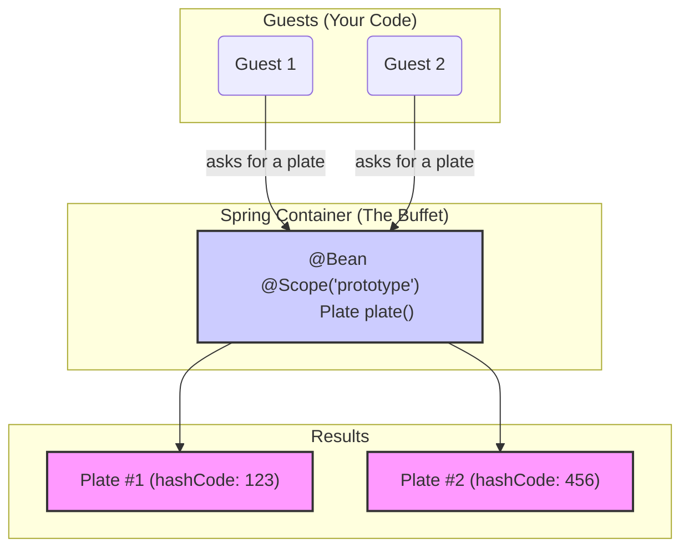

# Prototype Scope: "Adiginapudalla Kotha Piece!" ✨

Mawa, manam last time college lo okkare unde `Principal` (Singleton) gurinchi matladukunnam. Ippudu college lo unna students gurinchi matladukundam. Prati student veru, unique. Ade mana **Prototype Scope**.

### Source URL
[https://docs.spring.io/spring-framework/reference/core/beans/factory-scopes.html#beans-factory-scopes-prototype](https://docs.spring.io/spring-framework/reference/core/beans/factory-scopes.html#beans-factory-scopes-prototype)

### What is Prototype Scope?
Prototype ante "a new one every time". Ante, nuvvu oka bean ni prototype ga define cheste, Spring container ni adiginapudalla, adi neeku **oka brand new, fresh instance** ni create chesi istundi.

Singleton lo laaga, same object ni malli malli ivvadu. Prati sari kotha piece!

### The Buffet Plate Analogy 🍽️
Imagine manam oka grand buffet ki vellam.
*   **Singleton Bean (The Serving Spoon):** Akkada unna curry bowl lo, andaru oke okka serving spoon ni share cheskuntaru. Adi singleton.
*   **Prototype Bean (The Plates):** Buffet line start lo, pedda stack of plates untayi. Prati person vachi, oka kotha, clean plate teeskuntaru. Evaru పాత plate ni vadaru. Ee stack of plates eh mana prototype bean definition. Nuvvu adiginapudalla, neeku oka kotha plate vastundi.



### The Most Important Point: The Lifecycle Trap! ⚠️
Mawa, idi chala important, interview lo kuda adagachu. Jagrattha!

Spring, singleton beans ni puttina daggara nunchi chachipoyye varaku chuskuntundi (`@PostConstruct` to `@PreDestroy`).

Kani, prototype beans vishayam lo, Spring oka **responsible parent kadu**.
1.  Adi prototype bean ni **create chestundi**.
2.  Dependencies ni **inject chestundi**.
3.  Daanini neeku **ichestundi**.
4.  **And then... it forgets about it!** 🤷‍♂️

Spring container ki, aa tarvata aa bean instance ekkada undi, em chestundi anedi teliyadu. Anduke, prototype beans ki **destruction lifecycle callbacks (`@PreDestroy` lantiవి) call avvavu**.

> **The Rule:** If your prototype bean holds expensive resources (like a database connection or a file handle), **you**, the client code, are responsible for cleaning it up. Spring will not do it for you.

### How to Declare a Prototype?
Simple ga `@Scope("prototype")` or `@Scope(ConfigurableBeanFactory.SCOPE_PROTOTYPE)` ani annotation add cheyadame.

```java
@Configuration
public class AppConfig {
    @Bean
    @Scope("prototype")
    public MyPrototypeBean myPrototypeBean() {
        return new MyPrototypeBean();
    }
}

// OR using component scanning

@Component
@Scope("prototype")
public class MyOtherPrototypeBean {
    // ...
}
```

---
### Code Reference: Let's See the New Plates!
Ee "prati sari kotha piece" concept ni prove cheyadaniki, `Spring-Project` lo `io.mawa.spring.core.scopes.prototype` ane kotha package create cheddam.

1.  **`PrototypeBean.java`:** A simple bean with `@Scope("prototype")`. Constructor lo daani hash code print chestundi.
2.  **`PrototypeScopeConfig.java`:** Ee bean ni define chese configuration class.
3.  **`PrototypeScopeDemoApp.java`:** Mana main app. Ikkada manam container nunchi bean ni **rendu sarlu** adigi, vaati hash codes veru veru ga unnayo ledo chustam.

Ee code manam next step lo create cheddam. Appudu ee concept live lo chudochu!

That's it for the prototype scope! A simple concept with one very important lifecycle rule. Ippudu manam deeniki code rasi, inka clear ga ardam cheskundam. Ready aa? 🔥
