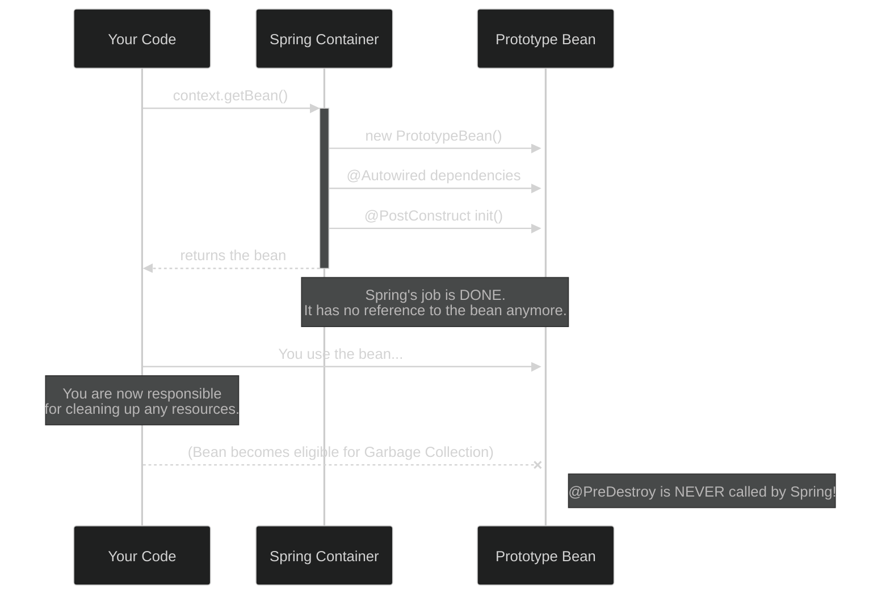

# Prototype Scope: "Adiginapudalla Kotha Piece!" ✨

Mawa, manam last time college lo okkare unde `Principal` (Singleton) gurinchi matladukunnam. Ippudu college lo unna students gurinchi matladukundam. Prati student veru, unique. Ade mana **Prototype Scope**.

### Source URL
[https://docs.spring.io/spring-framework/reference/core/beans/factory-scopes.html#beans-factory-scopes-prototype](https://docs.spring.io/spring-framework/reference/core/beans/factory-scopes.html#beans-factory-scopes-prototype)

### What is Prototype Scope?
Prototype ante "a new one every time". Ante, nuvvu oka bean ni prototype ga define cheste, Spring container ni adiginapudalla, adi neeku **oka brand new, fresh instance** ni create chesi istundi.

Singleton lo laaga, same object ni malli malli ivvadu. Prati sari kotha piece!

### The Vending Machine Analogy 🥤
Imagine a vending machine for soda cans.
*   **The Vending Machine (The Spring Container):** The machine itself.
*   **The Blueprint (The `PrototypeBean.java` file):** The recipe for a soda can stored inside the machine.
*   **The Action (calling `context.getBean()`):** You press a button on the machine.
*   **The Result (The Object):** The machine creates a **brand new, physical soda can** and drops it for you. It's yours now. The machine doesn't care what you do with it. If you press the button again, you get another, completely new can.

```mermaid
%%{init: {'theme': 'dark', 'themeVariables': { 'primaryColor': '#2d2d2d', 'primaryTextColor': '#fff'}}}%%
graph LR
    subgraph Your Code
        A[You] -- "1. context.getBean(Soda.class)" --> B{Vending Machine<br>(Spring Container)};
        B -- "2. Creates NEW Soda Can" --> C(🥤 Soda Can #1);
        A -- "3. context.getBean(Soda.class)" --> B;
        B -- "4. Creates NEW Soda Can" --> D(🥤 Soda Can #2);
    end
    style B fill:#333,stroke:#8f8,color:#fff
    style C fill:#552,stroke:#ff8,color:#fff
    style D fill:#255,stroke:#8ff,color:#fff
```

### The Lifecycle Trap: "I Don't Know You Anymore" ⚠️
Mawa, idi chala important, interview lo pakka adugutaru. Jagrattha!

Spring, singleton beans ni puttina daggara nunchi chachipoyye varaku chuskuntundi (`@PostConstruct` to `@PreDestroy`). Kani, prototype beans vishayam lo, Spring oka **irresponsible parent**.

It does this:
1.  **Creates** the bean object.
2.  **Configures** it (injects dependencies).
3.  Calls `@PostConstruct` callbacks.
4.  **Hands the bean to you.**
5.  ...and then completely **forgets about it**. It no longer holds a reference to that bean.

Because the container forgets about the bean, it **cannot call the `@PreDestroy` method**.

**Diagram: The Lifecycle Difference**


> **The Rule:** If your prototype bean holds expensive resources (like a database connection or a file handle), **you**, the client code, are responsible for cleaning it up. Spring will not do it for you.

### How to Declare a Prototype?
Simple ga `@Scope("prototype")` or `@Scope(ConfigurableBeanFactory.SCOPE_PROTOTYPE)` ani annotation add cheyadame.

```java
@Configuration
public class AppConfig {
    @Bean
    @Scope("prototype")
    public MyPrototypeBean myPrototypeBean() {
        return new MyPrototypeBean();
    }
}

// OR using component scanning

@Component
@Scope("prototype")
public class MyOtherPrototypeBean {
    // ...
}
```

---
### Code Reference: Let's See the New Plates!
Ee "prati sari kotha piece" concept ni prove cheyadaniki, `Spring-Project` lo `io.mawa.spring.core.scopes.prototype` ane kotha package create cheddam.

1.  **`PrototypeBean.java`:** A simple bean with `@Scope("prototype")`. Constructor lo daani hash code print chestundi.
2.  **`PrototypeScopeConfig.java`:** Ee bean ni define chese configuration class.
3.  **`PrototypeScopeDemoApp.java`:** Mana main app. Ikkada manam container nunchi bean ni **rendu sarlu** adigi, vaati hash codes veru veru ga unnayo ledo chustam.

Ee code manam next step lo create cheddam. Appudu ee concept live lo chudochu!

That's it for the prototype scope! A simple concept with one very important lifecycle rule. Ippudu manam deeniki code rasi, inka clear ga ardam cheskundam. Ready aa? 🔥
