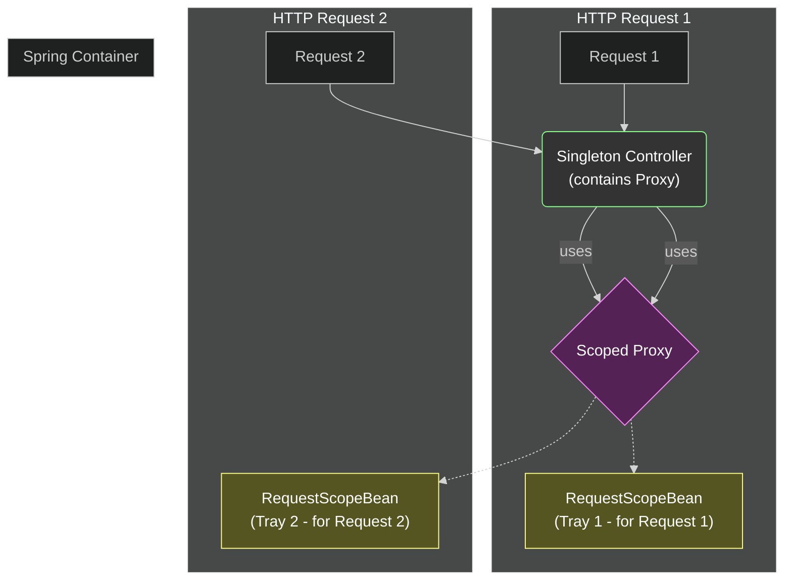

# Request Scope: "One Request, One Instance" Rule 🌐

Mawa, manam ippudu web world loki enter avutunnam! Ee web scopes lo first and most common di **Request Scope**.

Perulo ne undi, oka bean ni `request` scope lo define cheste, prathi HTTP request ki, Spring oka **kotha, separate instance** ni create chestundi. Aa request aipogane, aa bean instance kuda destroy aipotundi.

### Source URL
[https://docs.spring.io/spring-framework/reference/core/beans/factory-scopes.html#beans-factory-scopes-request](https://docs.spring.io/spring-framework/reference/core/beans/factory-scopes.html#beans-factory-scopes-request)

### Why it Matters
Imagine, nuvvu oka user request ni handle chestunnav. Aa request ki sambandinchina data (like user ID, tracking info) ni oka bean lo store cheyali anukuntunnav. Ee data, vere user request tho mix avvakudadu. Request scope ee isolation ni guarantee chestundi. Prati request ki oka separate world anamata.

### The Hotel Room Service Analogy 🏨
Imagine manam oka hotel lo unnam.
*   **Singleton Bean (The Hotel Kitchen 🍳):** Hotel antha ki oke okka kitchen untundi. Idi singleton. Anni orders ikkade prepare avutayi.
*   **Request-Scoped Bean (The Room Service Tray 🍽️):** Guest A room service order cheste (HTTP Request 1), kitchen oka tray (`Tray A`) prepare chesi pampistundi. Aa tray A anedi kevalam Guest A order ki matrame. Konchem sepaina, Guest B inkoka order cheste (HTTP Request 2), kitchen malli oka kotha tray (`Tray B`) prepare chestundi. Kitchen, Guest B ki, Guest A యొక్క పాత tray ni pampadu kada! Prati request ki kotha tray.

### The BIG Problem: Injecting a Short-Lived Bean into a Long-Lived Bean
Idi chala important practical problem mawa. Mana `HotelKitchen` (singleton) eppudo application start appude create aindi. Mana `RoomServiceTray` (request-scoped) ippudu create avutundi. Singleton bean lo, request-scoped bean ni direct ga `@Autowired` cheste emavutundi?

The singleton bean gets the dependency injected **only once** when it is created. So, it will hold onto the tray from the very first request forever, which is a huge bug! 💀

### The Solution: The Magic Proxy ✨
Ee problem ni solve cheyadaniki, manam Spring ki cheptam, "Hey, naku direct ga `RoomServiceTray` bean ivvaku. Daaniki బదులుగా, oka **proxy** object ni ivvu."

Ee proxy anedi oka special object. Adi chudadaniki `RoomServiceTray` laane untundi, kani daani venakala oka magic untundi. Ee proxy ni manam singleton lo inject cheskovachu. Eppudైతే manam aa proxy meeda oka method call chestamo, adi appudu current HTTP request ki aasalaina `RoomServiceTray` bean evaro vethiki, aa call ni daaniki pass chestundi.

How to enable this? Simple ga, `proxyMode` ni add cheyali.
`@RequestScope(proxyMode = ScopedProxyMode.TARGET_CLASS)`


Ee diagram lo chudu, rendu requests ki oke controller, oke proxy untundi. Kani aa proxy matram, correct request ki correct tray ni point chestundi. Super kada!

### Important Gotcha: Proxy `hashCode()` vs. Real Bean `hashCode()` 🧐
Mawa, oka chinna but chala important vishayam. Manam `curl` tho test chesinappudu, response lo vachina `hashCode` rendu sarlu same undochu. Enduku?

Because, mana singleton controller lo inject aindi **proxy object**, not the real bean. Manam `requestScopeBean.hashCode()` ani call chesinappudu, konni sarlu aa call real bean ki velladu, proxy object meedha ne execute avutundi. Controller eppudu oke proxy ni chustundi kabatti, aa hash code same vastundi.

The **real proof** is in the **server-side application logs**. Akkada manam `--- RequestScopeBean CREATED! ---` ane message lo, prati request ki oka kotha hash code generate avvadam chudochu. So, don't get confused by the client-side output, always trust the server logs for bean creation details!

---
### Code Reference: Let's Run a Web App!
Ee concept ni chudadaniki, manam oka real web application run cheyali.
1.  **`pom.xml`:** Manam deenini already Spring Boot project ga marcham, so we are ready.
2.  **`WebApp.java`:** Idi mana kotha entry point (`src/main/java/io/mawa/spring/WebApp.java`). Idi Spring Boot application ni start chestundi.
3.  **`RequestScopeBean.java`:** Mana `RoomServiceTray` lanti bean. `@RequestScope(proxyMode = ScopedProxyMode.TARGET_CLASS)` tho untundi.
4.  **`RequestScopeController.java`:** Oka REST Controller. Deenini manam browser or `curl` tho call cheyochu. Idi request-scoped bean ni inject cheskuni, daani details ni print chestundi.

### How to Run
Ee sari manam `mvn exec:java` vadamu. Spring Boot manaki oka kotha, powerful command istundi.
1.  Project root `Spring-Project` folder lo undi, ee command run cheyi:
    ```bash
    mvn spring-boot:run
    ```
2.  App start ayyaka, inko terminal open chesi, ee `curl` command ni run cheyi. Rendu sarlu run chesi, output chudu.
    ```bash
    curl http://localhost:8080/request-scope
    ```
Prati `curl` call ki, neeku kotha bean create avvadam console lo kanipistundi!

Ee code antha manam next steps lo create cheddam. Get ready for some web magic! 🔥
