# Request Scope: "One Request, One Instance" Rule 🌐

Mawa, manam ippudu web world loki enter avutunnam! Ee web scopes lo first and most common di **Request Scope**. Perulo ne undi, oka bean ni `request` scope lo define cheste, prathi HTTP request ki, Spring oka **kotha, separate instance** ni create chestundi. Aa request aipogane, aa bean instance kuda destroy aipotundi.

### Source URL
[https://docs.spring.io/spring-framework/reference/core/beans/factory-scopes.html#beans-factory-scopes-request](https://docs.spring.io/spring-framework/reference/core/beans/factory-scopes.html#beans-factory-scopes-request)

---
### The Core Puzzle: Singleton Controller meets Request-Scoped Bean 🤔

Let's get straight to the point that causes confusion.
*   **Fact 1:** Mana `@RestController` (e.g., `MySingletonController`) anedi **Singleton**. Application start ayinappudu **oke okka sari** create avutundi.
*   **Fact 2:** Mana `@RequestScope` bean anedi **prati kotha HTTP request ki** create avvali.
*   **The Puzzle:** Controller create ayye time ki, asalu `RequestScopeBean` anedi ledhu! Mari Spring, `MySingletonController` lo unna `private final RequestScopeBean myBean;` lanti field ni ela fill chestundi?

The answer is a powerful, behind-the-scenes trick: **The Scoped Proxy**.

---
### Doubt 1: Who Creates the Proxy and When?

Ee question ki answer, "Assembly Line" lo chuddam.

*   **You (The Programmer):** Nuvvu `MySingletonController.java` ane blueprint design chesav. You also created the `RequestScopeBean.java` blueprint and marked it with `@RequestScope(proxyMode = ...)`. Your job is done.
*   **Spring (The Factory Foreman):** Application start ayye time lo, the Foreman (Spring) starts the assembly line.

**The Startup Story (Assembly Line) Diagram**

```mermaid
%%{init: {'theme': 'dark', 'themeVariables': { 'primaryColor': '#2d2d2d', 'primaryTextColor': '#fff'}}}%%
sequenceDiagram
    participant Spring as Spring Container 🏭
    participant Proxy as Proxy for RequestScopeBean ✨
    participant Controller as MySingletonController 🤖

    Spring->>Spring: 1. Read all blueprints (.java files)
    Spring->>+Proxy: 2. Sees `@RequestScope(proxyMode=...)`.<br>Creates the Proxy object first (Just Once!)
    Proxy-->>-Spring: Proxy is ready!

    Spring->>+Controller: 3. Now, creates the Singleton Controller (Just Once!)
    Controller-->>Spring: Controller object is ready!

    Spring->>Controller: 4. Injects the PROXY ✨ into the Controller
    Note right of Controller: The Controller now holds a<br>reference to the Proxy forever.
```

**Conclusion:** **Spring creates the proxy, not your controller.** And it only creates it **one time** at the very beginning.

---
### Doubt 2: What is a Request-Scoped Bean For?

So, why do we even need this? What's its purpose?

Think of the `RequestScopeBean` as a **clean, request-specific data carrier 📦**. Its main job is to hold information related to a *single* HTTP request, keeping it separate from other requests.

The most powerful use is to **pull data *from* the `HttpServletRequest` and store it in a clean, object-oriented way.** Our example does exactly this: it injects the `HttpServletRequest` and pulls the `User-Agent` header from it.

**The Flow of Data and Dependencies**

```mermaid
%%{init: {'theme': 'dark', 'themeVariables': { 'primaryColor': '#2d2d2d', 'primaryTextColor': '#fff'}}}%%
graph TD
    subgraph "Incoming HTTP Request"
        direction LR
        Req[("HttpRequest<br/>Header: User-Agent='curl/7.68'")]
    end

    subgraph "Spring's Magic for this Request"
        direction TB
        subgraph "Step 1: Create Real Bean"
            RealBean["Real RequestScopeBean<br/>(Created for this request ONLY)"];
            Req -- "Spring injects the request<br/>into the bean's constructor" --> RealBean;
            RealBean -- "Pulls 'curl/7.68' from header<br/>and stores it" --> Data["Stored Data:<br/>userAgent = 'curl/7.68'"];
        end

        subgraph "Step 2: The Service Layer"
            Service["MySingletonController (Singleton)"];
            Proxy["Proxy to<br/>RequestScopeBean ✨"];
            Service -- "holds a reference to" --> Proxy;
            Proxy -.->|delegates call to| RealBean;
        end
    end

    style Req fill:#234,stroke:#fff
    style RealBean fill:#552,stroke:#ff8,color:#fff
    style Service fill:#333,stroke:#8f8,color:#fff
    style Proxy fill:#525,stroke:#f8f,color:#fff
```

**The Benefit:** Our `MySingletonController` doesn't need to know about the messy `HttpServletRequest`. It only knows about the clean `RequestScopeBean` object, which makes our code much cleaner and easier to test.

---
### Code and How to Run

Ee concepts ni live lo chudadaniki, manam create chesina code chudu:
*   **`WebApp.java`**: The main application entry point that now prints all bean names.
*   **`RequestScopeBean.java`**: Our request-scoped bean that now holds the User-Agent.
*   **`MySingletonController.java`**: The controller (renamed for clarity!) that uses the bean.

**How to Run:**
1.  `cd Spring-Project`
2.  `mvn spring-boot:run`
3.  Open another terminal and run `curl http://localhost:8080/request-scope`. Check the server logs and the JSON response!

I hope this new, detailed, evidence-based explanation makes the concept crystal clear, mawa! Let me know.
