# Real-World Request Scope: The Tracking ID Problem

Mawa, manam ippati varaku request scope gurinchi chala discuss chesam. Ippudu, asalu deeni real power ento chuddam. Why is this feature not just for demos, but used in almost every major microservice application?

### The Problem: Parameter Drilling (The Headache) 🤕

Imagine this common scenario:
-   A user's request comes to our application with a special header: `X-Tracking-ID`.
-   Our application needs to call another microservice (`Service B`).
-   We **must** pass this same `X-Tracking-ID` in the header when we call `Service B` for tracing purposes.

Our internal code structure is: `Controller` -> `Service` -> `Client`.

**The "Ugly" Way:**
```java
// Controller
public void handleRequest(@RequestHeader("X-Tracking-ID") String trackingId) {
    service.doBusinessLogic(trackingId, ...); // Pass it down
}

// Service
public void doBusinessLogic(String trackingId, ...) {
    client.callServiceB(trackingId, ...); // Pass it down again
}

// Client
public void callServiceB(String trackingId, ...) {
    // Finally, use it here
    httpClient.addHeader("X-Tracking-ID", trackingId);
    httpClient.post(...);
}
```
Chusava? The `trackingId` is polluting every method signature. The `BusinessService` doesn't need to know about this ID for its logic, but it's forced to accept it just to pass it down. This is called **parameter drilling**, and it makes code ugly, hard to read, and difficult to maintain.

### The "Clean" Solution with Request Scope ✨

Request scope solves this beautifully. It allows us to create a bean that holds this tracking ID for the duration of a single request. Any component, at any layer, can then just ask for this bean when it needs the ID.

**The Plan:**
1.  **`TrackingIdBean`:** A `@RequestScope` bean that injects `HttpServletRequest` and extracts the `X-Tracking-ID` header.
2.  **`Controller` and `Service`:** These classes become clean. They don't know or care about the tracking ID.
3.  **`Client`:** This class will inject the `TrackingIdBean` (it gets a proxy) and will pull the ID from it when making the downstream call.

**The Flow of Decoupled Power**

Ee diagram lo chudu, `Controller` and `Service` ki `TrackingIdBean` tho sambandam eh ledu. Kevalam `Downstream Client` ki matrame adi kavali, so adi matrame daanini adugutundi. This is clean, decoupled architecture!

Let's see the code for this in the `io.mawa.spring.realworld` package.

---
### The Golden Rule of Proxies: When and Why?

**The Rule:** Spring only creates a proxy when there is a **scope mismatch**.

#### Scenario A: No Scope Mismatch (No Proxy Needed)
Controller (Singleton) asks for a Service (Singleton). Their lifecycles match. Spring directly injects the **real** service object. No magic needed.


#### Scenario B: Scope Mismatch (Proxy is the Solution!)
Client (Singleton) asks for a TrackingIdBean (Request-Scoped). Their lifecycles do NOT match. This is a problem. Spring's solution is to inject a **Proxy**.

```mermaid
%%{init: {'theme': 'dark', 'themeVariables': { 'primaryColor': '#2d2d2d', 'primaryTextColor': '#fff'}}}%%
graph TD
    subgraph "Spring Container (Startup)"
        C["DownstreamClient (Singleton)"];
        P["Proxy for TrackingIdBean ✨"];
        C -- "injects PROXY, not the real bean" --> P;
    end

    subgraph "During a Request"
        R["Real TrackingIdBean"];
        P -.-> R;
    end
    style C fill:#333,stroke:#8f8,color:#fff
    style P fill:#525,stroke:#f8f,color:#fff
    style R fill:#552,stroke:#ff8,color:#fff,stroke-dasharray: 5 5
```


### Best Practice: When to use Request-Scoped Beans?

For simple cases where only the controller needs a header, use `@RequestHeader` in the method. It's the easiest way.

Use a `@RequestScope` bean when a piece of request-specific data (like a tracking ID) is needed by **multiple, different, deep components** in your application (`LoggingService`, `MetricsService`, `DownstreamClient`, etc.). It helps you avoid "parameter drilling" and keeps your code clean.

---
### Final Doubts Answered

**Q1: Does Spring create a request bean automatically?**
**A:** No. Spring creates **nothing** automatically. We must provide the blueprint (`.java` class) with the `@RequestScope` annotation. If we don't provide the blueprint, no request-scoped bean will ever exist.

**Q2: How does the HTTP request flow to the proxy?**
**A:** It doesn't. The flow is: `Request -> Controller -> Proxy -> Real Bean`. The request hits the controller first. The proxy is only used when the controller's code tries to access the request-scoped dependency.

**Q3: Is this used in the real world?**
**A:** Yes, all the time. It's a very common pattern for passing request-level information like Tracking IDs, User IDs, or Tenant IDs through an application without polluting method signatures.

**Q4: How can we see the beans and their scopes?**
**A:** We can ask the `ApplicationContext`! The code added to our `WebApp.java` now iterates through all bean definitions at startup and prints their registered scope, giving us proof of what Spring is managing.
