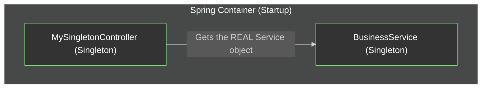
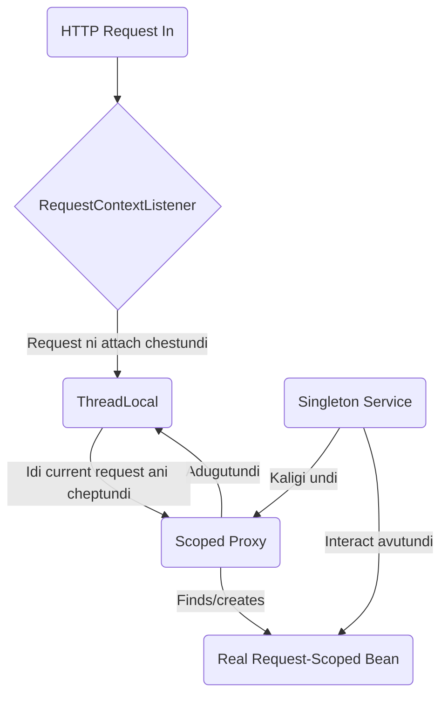

# Grand Finale: The Golden Rule of Proxies 🔑

Mawa, manam ee journey lo chala nerchukunnam. Ippudu, antha knowledge ni kalipi, the single most important rule to understand scopes and proxies nerchukundam. This is the master key.

### The Golden Rule: "No Scope Mismatch, No Proxy"

Spring anedi chala lazy mawa. Adi avasaram lenide ye pani cheyyadu. Extra magic em cheyyadu. It only does magic when it **must**.

> **Spring creates a proxy ONLY when there is a SCOPE MISMATCH.**

Ante, long-lived bean (singleton) oka short-lived bean (request) ni adiginappudu matrame proxy scene loki vastundi. Let's see this in action with three final scenarios.

---
### Scenario A: No Mismatch, No Proxy (The Simple Case)
A **Singleton** bean asks for another **Singleton** bean.
- `MySingletonController` needs `BusinessService`.
- `MySingletonController` lifecycle: Lives forever.
- `BusinessService` lifecycle: Lives forever.
- **Result:** Lifecycles match perfectly. There is **NO PROBLEM** for Spring to solve. So, it injects the **REAL** `BusinessService` object directly. No proxy needed.

**Diagram A: Direct Injection**

---
### Scenario B: Mismatch + Our Bean (We Must Ask for a Proxy)
A **Singleton** bean asks for our custom **Request-Scoped** bean.
- `DownstreamClient` (Singleton) needs `TrackingIdBean` (Request-Scoped).
- `DownstreamClient` lifecycle: Lives forever.
- `TrackingIdBean` lifecycle: Lives for only one request.
- **Result:** Lifecycles do NOT match. This is a **PROBLEM**. How can a permanent object hold a temporary one?
- **Solution:** We must explicitly tell Spring to solve this problem by creating a proxy. We do this with the instruction: `@RequestScope(proxyMode = ScopedProxyMode.TARGET_CLASS)`.

**Diagram B: We Ask, Spring Provides a Proxy**

```mermaid
%%{init: {'theme': 'dark', 'themeVariables': { 'primaryColor': '#2d2d2d', 'primaryTextColor': '#fff'}}}%%
graph TD
    subgraph "Our Code (The Blueprint)"
        B["TrackingIdBean.java"];
        I["<b>Our Instruction:</b><br/>@RequestScope(proxyMode=...)"];
        B -- has --> I;
    end

    subgraph "Spring Container (Startup)"
        C["DownstreamClient (Singleton)"];
        P["Proxy for TrackingIdBean ✨"];
        C -- "gets a Proxy because<br/>we asked for one" --> P;
    end

    style B fill:#003,stroke:#33f
    style I fill:#400,stroke:#f66
    style C fill:#333,stroke:#8f8
    style P fill:#525,stroke:#f8f
```

---
### Scenario C: Mismatch + Spring's Bean (Spring is Smart)
A **Singleton** bean asks for a special, framework-level **Request-Specific** object.
- `TrackingIdBean` (Request-Scoped) needs `HttpServletRequest`.
- `TrackingIdBean` lifecycle: Lives for only one request.
- `HttpServletRequest` lifecycle: Lives for only one request.
- **Result (No Mismatch):** In this case, the lifecycles match! The `TrackingIdBean` is created *during* a request, and the `HttpServletRequest` also exists *during* that same request. So Spring can inject the **REAL** `HttpServletRequest` directly. No proxy needed here.

**BUT... what if a Singleton asked for it?**
```java
@Service
public class MySingletonService {
    @Autowired
    private HttpServletRequest request; // How?!
}
```
- **Result (Mismatch!):** Now we have a scope mismatch again! But `HttpServletRequest` is not our class. We can't add `@RequestScope(proxyMode=...)` to it.
- **Solution:** Spring is smart. It knows that `HttpServletRequest` is a special object that is always tied to a request. So, if a singleton asks for it, Spring **AUTOMATICALLY** creates and injects a proxy for it. We don't need to do anything.

**Diagram C: Spring's Automatic Proxy**

```mermaid
%%{init: {'theme': 'dark', 'themeVariables': { 'primaryColor': '#2d2d2d', 'primaryTextColor': '#fff'}}}%%
graph TD
    subgraph "Spring's Own Web Objects"
        B["HttpServletRequest.class"];
        I["<b>Spring's Internal Logic:</b><br/>'I know this is request-specific'"];
        B -- has --> I;
    end

    subgraph "Spring Container (Startup)"
        C["MySingletonService (Singleton)"];
        P["Proxy for HttpServletRequest ✨"];
        C -- "gets a Proxy AUTOMATICALLY" --> P;
    end

    style B fill:#330,stroke:#ff6
    style I fill:#400,stroke:#f66
    style C fill:#333,stroke:#8f8
    style P fill:#525,stroke:#f8f
```

---
<br>

### 🧙‍♂️ The Magic Behind the Curtain

Scoped proxy anedi oka adbhutamaina trick, kani daaniki oka friend sahayam kavali. Singleton lo unde aa proxy ki, ippudu active ga unna HTTP request edho ela telustundi?

Oka pedda hotel (mana application) lo, chala mandi guests (requests) unnaru anukondi. Front desk (proxy) ki, వాళ్ళ mundu nilabadda person ki, ఏ room key (request-scoped bean) ivvalo ela telustundi? Evaro okaru door daggara ID check chestu undali!

#### 1. The ID Checker: `RequestContextListener`

Standard Java web application lo, ee "ID checker" ye `ServletRequestListener`. Spring manaki `RequestContextListener` ane oka specific listener ni istundi.

**Idi em chestundi:**
*   Oka kotha HTTP request ragane, ee listener `HttpServletRequest` object ni pattukuntundi.
*   Adi oka `ThreadLocal` variable use chesi, aa request object ni, aa request ni handle chestunna current thread ki "attach" chestundi.
*   Request aipogane, ee listener antha clean up chesi, request object ni thread nunchi detach chestundi.

Ide **critical link**! Scoped proxy, current `ThreadLocal` lo chusi, current request ni kanukkuntundi. Daanini batti, aa request tho associate ayina request-scoped bean ni kanukkuntundi.

**The Spring Boot Bonus:** Spring Boot, manam oka web application build chestunnam ani detect cheste, ee `RequestContextListener` ni automatic ga configure chesi, register chestundi. Manaki antha free ga vastundi! Okavela manam paatha, non-Boot application vadutunte, deenini maname `web.xml` file lo register cheyali.

#### 2. Choosing Your Proxy Superpower: `proxyMode`

`@Scope` annotation ki oka secret power-up undi: `proxyMode` attribute. Ee `proxyMode` attribute, Spring eh rakamaina proxy ni create cheyalo manalni choose cheyyanistundi.

```java
@Bean
@Scope(value = "request", proxyMode = ScopedProxyMode.TARGET_CLASS)
public UserContext userContext() {
    return new UserContext();
}
```

Rendu main rakalu untayi:
*   **`ScopedProxyMode.TARGET_CLASS` (The Default):**
    *   **Ela:** CGLIB ane library use chesi, runtime lo nee bean class ki oka kotha *subclass* ni create chestundi. E.g., `UserContext$$EnhancerBySpringCGLIB`.
    *   **Pro:** Idi just pani chestundi, nee bean ye interface ni implement cheyakapoina.
    *   **Con:** Idi oka `final` class ki proxy create cheyaledu (endukante final class ni subclass cheyalem).

*   **`ScopedProxyMode.INTERFACES` (The Diplomat):**
    *   **Ela:** Standard Java JDK Dynamic Proxies ni vadutundi. Idi nee bean implement chesina *interface* ni implement chese proxy ni create chestundi.
    *   **Pro:** Idi oka standard Java feature.
    *   **Con:** Deeniki nee bean **tappakunda** okka interface ayina implement cheyali. Nee bean just oka concrete class aite, ee mode fail avutundi.

**The Rule of Thumb:** Default (`TARGET_CLASS`) ne vadandi, neeku specific karanam unte tappa (like `final` classes tho pani cheyadam or interface-based proxies ante neeku chala istam aite).

**Mermaid Diagram: The Full Machinery**


**Cliffhanger:**
`request` scope anedi oka single API call varaku unde data ki perfect. Kani oke user nunchi vache multiple requests varaku unde data gurinchi enti? Shopping cart lantiది. Nuvvu oka item add chesi, vere page ki click cheste, aa item akkade undali. Daanikosam, manaki inka long-lived scope kavali: the `session` scope. Next episode lo shopping ki veldam! 🛒
