# Grand Finale: The Golden Rule of Proxies 🔑

Mawa, manam ee journey lo chala nerchukunnam. Ippudu, antha knowledge ni kalipi, the single most important rule to understand scopes and proxies nerchukundam. This is the master key.

### The Golden Rule: "No Scope Mismatch, No Proxy"

Spring anedi chala lazy mawa. Adi avasaram lenide ye pani cheyyadu. Extra magic em cheyyadu. It only does magic when it **must**.

> **Spring creates a proxy ONLY when there is a SCOPE MISMATCH.**

Ante, long-lived bean (singleton) oka short-lived bean (request) ni adiginappudu matrame proxy scene loki vastundi. Let's see this in action with three final scenarios.

---
### Scenario A: No Mismatch, No Proxy (The Simple Case)
A **Singleton** bean asks for another **Singleton** bean.
- `MySingletonController` needs `BusinessService`.
- `MySingletonController` lifecycle: Lives forever.
- `BusinessService` lifecycle: Lives forever.
- **Result:** Lifecycles match perfectly. There is **NO PROBLEM** for Spring to solve. So, it injects the **REAL** `BusinessService` object directly. No proxy needed.

**Diagram A: Direct Injection**

---
### Scenario B: Mismatch + Our Bean (We Must Ask for a Proxy)
A **Singleton** bean asks for our custom **Request-Scoped** bean.
- `DownstreamClient` (Singleton) needs `TrackingIdBean` (Request-Scoped).
- `DownstreamClient` lifecycle: Lives forever.
- `TrackingIdBean` lifecycle: Lives for only one request.
- **Result:** Lifecycles do NOT match. This is a **PROBLEM**. How can a permanent object hold a temporary one?
- **Solution:** We must explicitly tell Spring to solve this problem by creating a proxy. We do this with the instruction: `@RequestScope(proxyMode = ScopedProxyMode.TARGET_CLASS)`.

**Diagram B: We Ask, Spring Provides a Proxy**

```mermaid
%%{init: {'theme': 'dark', 'themeVariables': { 'primaryColor': '#2d2d2d', 'primaryTextColor': '#fff'}}}%%
graph TD
    subgraph "Our Code (The Blueprint)"
        B["TrackingIdBean.java"];
        I["<b>Our Instruction:</b><br/>@RequestScope(proxyMode=...)"];
        B -- has --> I;
    end

    subgraph "Spring Container (Startup)"
        C["DownstreamClient (Singleton)"];
        P["Proxy for TrackingIdBean ✨"];
        C -- "gets a Proxy because<br/>we asked for one" --> P;
    end

    style B fill:#003,stroke:#33f
    style I fill:#400,stroke:#f66
    style C fill:#333,stroke:#8f8
    style P fill:#525,stroke:#f8f
```

---
### Scenario C: Mismatch + Spring's Bean (Spring is Smart)
A **Singleton** bean asks for a special, framework-level **Request-Specific** object.
- `TrackingIdBean` (Request-Scoped) needs `HttpServletRequest`.
- `TrackingIdBean` lifecycle: Lives for only one request.
- `HttpServletRequest` lifecycle: Lives for only one request.
- **Result (No Mismatch):** In this case, the lifecycles match! The `TrackingIdBean` is created *during* a request, and the `HttpServletRequest` also exists *during* that same request. So Spring can inject the **REAL** `HttpServletRequest` directly. No proxy needed here.

**BUT... what if a Singleton asked for it?**
```java
@Service
public class MySingletonService {
    @Autowired
    private HttpServletRequest request; // How?!
}
```
- **Result (Mismatch!):** Now we have a scope mismatch again! But `HttpServletRequest` is not our class. We can't add `@RequestScope(proxyMode=...)` to it.
- **Solution:** Spring is smart. It knows that `HttpServletRequest` is a special object that is always tied to a request. So, if a singleton asks for it, Spring **AUTOMATICALLY** creates and injects a proxy for it. We don't need to do anything.

**Diagram C: Spring's Automatic Proxy**


Mawa, this is the complete picture. You have now understood this topic at a very deep level. Congratulations! 🚀
