# Session Scope: The "User's Shopping Cart" 🛒

Mawa, manam request scope gurinchi nerchukunnam (prati request ki kotha bean). Ippudu inko important web scope gurinchi nerchukundam: **Session Scope**.

Perulo ne undi, oka bean ni `session` scope lo define cheste, prathi user session ki, Spring oka **kotha, separate instance** ni create chestundi. User browser close chese varaku, or session expire ayye varaku, aa user ki ade bean instance malli malli vastundi.

### Source URL
[https://docs.spring.io/spring-framework/reference/core/beans/factory-scopes.html#beans-factory-scopes-session](https://docs.spring.io/spring-framework/reference/core/beans/factory-scopes.html#beans-factory-scopes-session)

### The Shopping Cart Analogy 🛍️
Idi session scope ki perfect analogy, and real-world use case kuda.
-   **User A (You):** Nuvvu oka e-commerce website open chesav. Nuvvu oka `Milk` packet add chesav. Ee `Milk` packet nee personal **Shopping Cart** (Session Bean) loki veltundi.
-   **User B (Your Friend):** At the same time, mee friend vere computer lo ade website open chesadu. Atanu `Bread` add chesadu. Ee `Bread` packet atani personal **Shopping Cart** (vere Session Bean) loki veltundi.
-   Nee cart lo `Bread` kanipinchadu, mee friend cart lo `Milk` kanipinchadu. Prati user ki వాళ్ళ own separate, private cart untundi for their entire browsing session.

The same **scope mismatch** problem and **proxy solution** that we saw for request scope applies here too. A singleton controller needs a proxy to talk to a temporary session bean.

**The Flow:**

```mermaid
%%{init: {'theme': 'dark', 'themeVariables': { 'primaryColor': '#2d2d2d', 'primaryTextColor': '#fff'}}}%%
graph TD
    subgraph "User A's Session"
        U1[User A] -->|Request 1| C(Controller);
        C -->|uses proxy to get| S1["🛒 Cart A<br/>(Milk)"];
        U1 -->|Request 2| C;
        C -->|uses proxy to get| S1;
    end

    subgraph "User B's Session"
        U2[User B] -->|Request 1| C;
        C -->|uses proxy to get| S2["🛒 Cart B<br/>(Bread)"];
    end

    C -- is a --> Singleton;
    S1 -- is a --> SessionBean;
    S2 -- is a --> SessionBean;

    style C fill:#333,stroke:#8f8,color:#fff
    style S1 fill:#552,stroke:#ff8,color:#fff
    style S2 fill:#255,stroke:#8ff,color:#fff
```

Ee diagram lo, oke Singleton Controller, iddari veru veru users ki, veru veru shopping carts ni serve chestondi, thanks to the magic of proxies.

---
### Code Reference: Let's Go Shopping!
Ee concept ni chudadaniki, manam `io.mawa.spring.core.scopes.session` package lo code create cheddam.
1.  **`ShoppingCartBean.java`:** Mana session-scoped bean. `@SessionScope(proxyMode = ScopedProxyMode.TARGET_CLASS)` tho untundi. Deenilo items `List` untundi.
2.  **`SessionDemoController.java`:** Oka REST controller with two endpoints: `/session/add` and `/session/cart`.

### How to Run: The `curl` Session Trick
Session ni test cheyali ante, manam cookies ni manage cheyali. `curl` lo ee pani cheyadaniki manaki two flags unnayi:
-   `-c cookie-jar.txt`: Server nunchi vachina cookies ni ee file lo save cheyi.
-   `-b cookie-jar.txt`: Ee file lo unna cookies ni server ki malli pampinchu.

**Test Plan:**
1.  Start the app: `mvn spring-boot:run`
2.  **First Request (User A):** Add milk. Ee command `JSESSIONID` ane cookie ni `cookies.txt` lo save chestundi.
    ```bash
    curl -c cookies.txt http://localhost:8080/session/add?item=Milk
    ```
3.  **Second Request (User A):** View the cart. Manam save chesina cookie ni pampistunnam, so Spring ki telustundi idi ade user ani.
    ```bash
    curl -b cookies.txt http://localhost:8080/session/cart
    ```
    *Output should contain "Milk".*
4.  **Third Request (User A):** Add bread. Again, using the same cookie.
    ```bash
    curl -b cookies.txt -c cookies.txt http://localhost:8080/session/add?item=Bread
    ```
5.  **Fourth Request (User A):** View the cart again.
    ```bash
    curl -b cookies.txt http://localhost:8080/session/cart
    ```
    *Output should contain "Milk" and "Bread".*
6.  **Fifth Request (User B):** A new user. Manam cookie em pampatledu, so Spring kotha session, kotha cart create chestundi.
    ```bash
    curl http://localhost:8080/session/cart
    ```
    *Output should be an empty cart!*

---
<br>

### 🚀 Pro-Tip: Sessions in a Multi-Server World! (Clustering)

Nee app pedda hit aindi anuko! Nuvvu inka okka server meeda run cheyatledu, oka load balancer venakala chala servers unna cluster ni vadutunnav.

Ippudu oka pedda problem vastundi.
*   **Request 1:** User vachi, tana cart lo oka book add chesadu. Load balancer aa request ni **Server A** ki pampistundi. Shopping cart object anedi Server A memory lo create avutundi.
*   **Request 2:** Ade user vachi, tana cart lo oka pen add chesadu. Ee sari load balancer aa request ni **Server B** ki pampistundi. Server B ki, Server A lo unna shopping cart gurinchi em teliyadu! User ki tana cart empty ga kanipistundi. Pedda disaster! 😱

**The Solution: Session Replication**
Application servers (like Tomcat), cluster lo unna anni servers ki session data ni "replicate" (copy) cheyagalavu. Ante, Server A lo data update aite, adi Server B and C ki kuda pampistundi.

**The Golden Rule for Replication:**
Oka object ni network dwara oka server nunchi inkoti ki copy cheyali ante, adi "serializable" ga undali. Ante, daanini bytes stream ga marchagalagali.

Anduke, nee session-scoped bean **tappakunda `java.io.Serializable` interface ni implement cheyali.**

**The Code Change (Chinnade, kani chala critical!):**
```java
import java.io.Serializable; // <-- Step 1: Import cheyi
import java.util.List;
import java.util.ArrayList;

// @Scope, @Component, etc.
public class ShoppingCart implements Serializable { // <-- Step 2: Implement cheyi!

    // Idi serialization kosam oka special ID. Pettadam manchi practice.
    private static final long serialVersionUID = 1L;

    private List<String> items = new ArrayList<>();

    // ... migatha methods anni same
}
```
Nuvvu `implements Serializable` marchipothe, session replication fail avutundi, and clustered environment lo nee users ki chala बेकार anubhavam vastundi. Ee chinna vishayam telusukovadam, nuvvu entha anubhavam unna developer vo chupistundi.

**Mermaid Diagram: The Session Copy Machine**

```mermaid
graph TD
    LB(Load Balancer) --> S1(Server A);
    LB --> S2(Server B);
    LB --> S3(Server C);

    subgraph "User yokka మొదటి Request"
        U(User) -- book add chestadu --> LB;
        S1 -- create chestundi --> SC1(Cart with Book);
    end

    SC1 -- Tomcat replicate chestundi --> SC2(Copy of Cart on S2);
    SC1 -- Tomcat replicate chestundi --> SC3(Copy of Cart on S3);

    subgraph "User yokka రెండో Request"
        U2(User) -- pen add chestadu --> LB;
        S2 -- daggara already cart undi! --> CartOK(Cart lo ippudu book + pen unnayi);
    end

    style SC1 fill:#cde4ff
    style SC2 fill:#cde4ff
    style SC3 fill:#cde4ff
```


**Cliffhanger:**
Session scope anedi oka user yokka browsing session varake untundi. Kani manaki inka pedda scope unna bean kavali anukunte? Ante, **andaru users** tho, **anni sessions** lo, web application antha காலம் share cheskune oka object? Udaharanaki, country codes cache or global application configuration lantiది. Idi `application` scope. Kani... adi `singleton` laage anipinchadam leda? Mari daaniki, deeniki teda enti? Chuddam!
