# Application Scope: The "Town's Clock Tower" 🕰️

Mawa, manam web scopes lo final stage ki vachesam. This is the **Application Scope**. Idi anni scopes kanna peddadi and most long-lived.

Perulo ne undi, oka bean ni `application` scope lo define cheste, Spring **oke okka instance** ni create chestundi for the **entire lifecycle of the web application**. App start ayinappudu create avutundi, app shut down ayinappude destroy avutundi.

### Source URL
[https://docs.spring.io/spring-framework/reference/core/beans/factory-scopes.html#beans-factory-scopes-application](https://docs.spring.io/spring-framework/reference/core/beans/factory-scopes.html#beans-factory-scopes-application)

### The Town Clock Tower Analogy 🏛️
Imagine mana web application anedi oka Town.
-   **Request Scope (A Postcard):** Temporary, for one delivery.
-   **Session Scope (A Library Card):** Belongs to one person for a while.
-   **Application Scope (The Town Clock Tower):** The entire town has only **one** clock tower. Everyone in the town, no matter who they are or when they look, sees the same clock tower and the same time. It is built when the town is founded and is destroyed only if the town is abandoned. It is a true global singleton for everyone in the town.

### The Critical Difference: Application vs. Singleton
Ee doubt pakka vastundi: "Mawa, idi kuda singleton laane undi kada, mari తేడా enti?" (This looks like a singleton, what's the difference?)

This is a very important, subtle difference.
1.  **Scope Boundary:**
    *   A **Singleton** bean lives within the Spring `ApplicationContext`.
    *   An **Application-scoped** bean lives within the `ServletContext`.
2.  **What's the difference?**
    *   `ServletContext` anedi web server (like Tomcat) level lo untundi. It represents the entire web application.
    *   `ApplicationContext` anedi Spring-specific.
    *   In simple apps like ours, there is only one Spring context and one Servlet context, so they *seem* the same. But in very complex enterprise applications, you could have **multiple Spring `ApplicationContext`s running inside one `ServletContext`**.
    *   In that complex case:
        *   You would have **multiple** singleton beans (one for each Spring context).
        *   But you would still have only **one** application-scoped bean (shared across all Spring contexts).

**The Main Takeaway:** `ApplicationScope` is the ultimate global singleton, tied to the web server itself.

```mermaid
%%{init: {'theme': 'dark', 'themeVariables': { 'primaryColor': '#2d2d2d', 'primaryTextColor': '#fff'}}}%%
graph TD
    subgraph "Web Server (Tomcat)"
        A["ServletContext (The entire Web App)"];
        B["Application-Scoped Bean 🕰️<br>(Only ONE exists here)"];

        subgraph "Spring's World"
            C["Spring Context 1"];
            D["Singleton Bean 1A"];
            C --- D;

            F["Spring Context 2 (in complex apps)"];
            G["Singleton Bean 2A"];
            F --- G;
        end

        A -- contains --> B;
        A -- contains --> C;
        A -- contains --> F;

        C -- can access --> B;
        F -- can access --> B;
    end
```


---
### Code Reference: The Global App Cache
Application scope is great for things like global caches, application version info, or startup timestamps. Manam `io.mawa.spring.core.scopes.application` package lo code create cheddam.
1.  **`ApplicationScopeBean.java`:** Mana application-scoped bean. `@ApplicationScope` tho untundi. It will store the application startup time.
2.  **`ApplicationScopeController.java`:** A REST controller to display the startup time from the bean.

Manam `curl` tho ee controller ni enni sarlu call chesina, different sessions nunchi call chesina, manaki eppudu oke startup time vastundi, because there is only one "Town Clock Tower".

---
<br>

### ⚠️ DANGER: Thread Safety Red Alert!

`singleton` scope lo manam chusina 'shared whiteboard' problem gurtunda? Adi ikkada kuda apply avutundi, and inthe dangerous kuda!

Oka `application`-scoped bean anedi, nee application lo unna **prati okka user** share cheskune okka object. Aa bean lo state marutunte (e.g., counter, list, or user peru), nuvvu disaster ni korukuntunnav anate. Chala user requests (threads) oke sari daanini marchali ani try cheste, data corrupt avutundi.

**Golden Rule ide:** Application-scoped beans **tappakunda STATELESS ga undali**. Avi read-only, global information (application version, country codes list, configuration settings) ni store cheyadaniki perfect. Kani, maarpu chende data ni store cheyadaniki assalu paniki ravu.

**Mermaid Diagram: The Town Crier**
```mermaid
graph TD
    subgraph Good Use (Stateless)
        A(App-Scoped Bean with List of Countries) -- Chaduvutunnadu --> T1(User 1);
        A -- Chaduvutunnadu --> T2(User 2);
        A -- Result --> OK(Safe & Consistent);
    end
    subgraph Bad Use (Stateful)
        B(App-Scoped Bean with `lastVisitor` field) -- Raastunnadu --> T3(User 1);
        B -- Overwrite chestunnadu --> T4(User 2);
        B -- Result --> Chaos(Data is wrong!);
    end
```

### 🚀 Pro-Tip: Talking to the "Outside World"

`application` and `singleton` scope ki unna teda ni inka clear ga cheppe oka chinna detail undi. Application-scoped bean anedi **`ServletContext` lo oka attribute ga store avutundi**.

**Ante enti?**
Ante, nee web app lo unna non-Spring parts kuda, for example, oka paatha JSP page or legacy Servlet, ee bean ni access cheyagalavu!

Udaharanaki, neeku `globalConfig` ane oka application-scoped bean undi anukundam.
```java
// Edo oka paatha, non-Spring Servlet lo...
public void doGet(HttpServletRequest request, HttpServletResponse response) {
    ServletContext servletContext = request.getServletContext();

    // Nuvvu Spring bean ni ServletContext nunchi access cheyochu!
    GlobalConfig config = (GlobalConfig) servletContext.getAttribute("globalConfig");

    // ... and daanini vadukovachu!
}
```
Kani, `singleton`-scoped bean anedi kevalam Spring `ApplicationContext` lopalane untundi, and ila automatic ga expose avvadu. Anduke, `application` scope anedi Spring ni paatha Java web technologies tho integrate cheyadaniki use avutundi.

**Cliffhanger:**
Bean scopes meeda manam master aipoyam! Beans ela pudatayo, eppudu pudatayo, entha kalam brathukutayo manaki telusu. Kani, oka bean puttagane or chanipoye mundu jarige moments gurinchi enti? Aa moments lo manam mana custom logic ni run cheyochha? Biddapu modalati edupu or actor yokka final bow lantiవి? Yes, cheyochu! Daanine lifecycle callbacks antaru. Next episode lo `@PostConstruct` and `@PreDestroy` gurinchi chuddam!
