# Bean Lifecycle Callbacks: The "I'm Ready!" and "I'm Done!" Signals 🎬

Mawa, manam oka bean ni create chesam. Super. Kani, aa bean "ready" ayyaka, daanitho konni initial setup panulu cheyali anuko? For example, a database connection pool needs to be initialized, or a cache needs to be pre-loaded with data.

Similarly, application close ayye mundu, aa bean "destroy" ayye mundu, konni cleanup panulu cheyali. For example, database connection ni close cheyali, or in-memory data ni file lo save cheyali.

Ee "ready ayyaka" and "destroy ayye mundu" ane signals ni pattukovadanike manaki **Lifecycle Callbacks** unnayi.

### Source URL
[https://docs.spring.io/spring-framework/reference/core/beans/factory-nature.html](https://docs.spring.io/spring-framework/reference/core/beans/factory-nature.html)

### Why it Matters
Idi chala practical and important topic mawa. Real-world applications lo, stateful beans (like connection pools, cache managers) ni correctly initialize and gracefully shut down cheyadam chala critical. Idi lekunte, resource leaks avvochu, data corrupt avvochu, or application properly shutdown avvakapovachu. Ee callbacks mana beans ki self-awareness ni istayi.

---
### The Actor's Entry and Exit: An Analogy 🎭

Imagine mana bean anedi stage meeda perform chese oka Actor.
1.  **Constructor:** Actor ni select chesi, makeup vesaru. (Object is constructed).
2.  **DI:** Actor ki కావలసిన props (sword, shield) icharu. (Dependencies are injected).
3.  **`@PostConstruct` (The Grand Entry):** Ippudu actor stage meediki vachi, "Hello audience!" ani cheppi, ready ga nilchunnadu. Ee method call ayyindi ante, mana bean fully configured, dependencies anni inject ayyi, use ki **ready** ga undi ani ardam.
4.  **Bean is in Use:** Actor is performing on stage. (Application is running, bean is being used).
5.  **`@PreDestroy` (The Final Bow):** Show aipoyindi. Actor audience ki final bow chesi, stage nunchi vellipotunnadu. Ee method call avutondi ante, container aa bean ni destroy cheyadaniki ready ga undi ani ardam. Cleanup activities ki idi perfect place.

**The Lifecycle Flow**

```mermaid
sequenceDiagram
    participant Container as Spring Container 🏭
    participant Bean as Your Bean 🤖

    Container->>+Bean: 1. Constructor()
    Container->>Bean: 2. Setter/Field Injection
    Container->>Bean: 3. @PostConstruct Method
    Note right of Bean: Bean is now fully initialized and ready to use! ✨
    loop Application is Running
        participant Client as Your App Code
        Client->>Bean: Use the bean's methods
    end
    Container->>Bean: 4. @PreDestroy Method
    deactivate Bean
    Note right of Bean: Bean is about to be destroyed. Clean up now! 🧹
```

---
### The Modern Way: `@PostConstruct` and `@PreDestroy`
Ee rendu annotations JSR-250 standard nunchi vachayi. Ivanni ippudu Spring lo best practice.
-   **`@PostConstruct`:** Ee annotation unna method, bean constructor call ayi, dependencies anni inject ayyaka, **immediately** call avutundi.
-   **`@PreDestroy`:** Ee annotation unna method, container bean ni destroy chese mundu call avutundi.

**Important Note:** `@PreDestroy` anedi singleton beans ki matrame reliably call avutundi. Manam mundu chusinattu, prototype beans ni create chesi ichesaka, Spring vaatini marchipotundi, so daani destruction callbacks call cheyadu.

### The Old Way: `InitializingBean` and `DisposableBean` (Just for Info)
Mawa, paatha Spring versions lo, ee panulu cheyadaniki manam rendu interfaces ni implement cheyalsi vachedi:
-   `InitializingBean`: Deenilo `afterPropertiesSet()` ane method untundi.
-   `DisposableBean`: Deenilo `destroy()` ane method untundi.

**Problem enti deenitho?**
Mana clean POJO class, Spring-specific interfaces (`InitializingBean`, `DisposableBean`) tho tightly coupled aipotundi. Adi manchi practice kadu. Anduke, ippudu manam annotations eh prefer chestam. They keep our code clean.

---
### Code Reference: Let's See the Actor On Stage!
Ee lifecycle ni live lo chudadaniki, manam `io.mawa.spring.core.lifecycle` ane kotha package create cheddam.

1.  **`LifecycleDemoBean.java`:** Ee bean lo manam constructor, `@PostConstruct` method, and `@PreDestroy` method - anni petti, prathi chota oka print statement peddam.
2.  **`LifecycleConfig.java`:** A simple configuration class to define our bean.
3.  **`LifecycleDemoApp.java`:** The main app. Ikkada manam container ni start chesi, use chesi, and importantly, **close** cheddam. Container ni close cheste tappa `@PreDestroy` call avvadu!

Ee code antha manam next step lo create cheddam! Ready aa? 🎬🔥
