# Aware Interfaces: The Bean That Knows Itself 🧠

Mawa, manam ippati varaku Spring container ni oka magic box la chusam. Adi beans ni create chestundi, manage chestundi. Kani, okavela oka bean ki tanu ekkada undi, tana peru enti, or tanani create chesina factory gurinchi telusukovali anukunte?

Appude ee **`Aware` Interfaces** scene loki vastayi. Evi implement cheste, mana bean ki konni "superpowers" or "self-awareness" vastundi.

### Source URL
[https://docs.spring.io/spring-framework/reference/core/beans/factory-nature.html#beans-factory-aware](https://docs.spring.io/spring-framework/reference/core/beans/factory-nature.html#beans-factory-aware)

### Why it Matters
Mawa, idi general ga manam daily application code lo ekkuva vadamu. This is more of a **framework-level feature**. Kani, idi telusukunte, Spring internals inka clear ga ardam avutayi. Also, idi oka classic interview question, "What are Aware interfaces in Spring?".

The most common ones are:
1.  **`BeanNameAware`**: "Naa peru enti?" (What is my ID in the container?)
2.  **`ApplicationContextAware`**: "Nannu manage chestunna Big Boss evaru?" (Gives access to the container itself).

### The "New Employee Onboarding" Analogy 🧑‍💼
Imagine a new employee (`Your Bean`) joins a company (`Spring Container`).
1.  **Constructor & DI:** Employee ki oka desk, computer (dependencies) assign chesaru.
2.  **`BeanNameAware`:** HR (Spring) vachi, "Welcome! Your employee ID is `emp101`" ani cheptaru. Now the employee knows their own ID. (`setBeanName()` is called).
3.  **`ApplicationContextAware`:** The manager (Spring) gives the employee an internal phone directory (`ApplicationContext`). "Need anything? Here's the directory to find any department or person in the company." (`setApplicationContext()` is called).
4.  **`@PostConstruct`:** Ippudu employee ki anni vachayi. He is ready to start his work.

**The Lifecycle with Aware Interfaces**

```mermaid
sequenceDiagram
    participant Container as Spring Container 🏭
    participant Bean as Your Bean 🤖

    Container->>+Bean: 1. Constructor() & DI
    Container->>Bean: 2. setBeanName() (if BeanNameAware)
    Container->>Bean: 3. setApplicationContext() (if ApplicationContextAware)
    Container->>Bean: 4. @PostConstruct Method
    Note right of Bean: Bean is now fully initialized! ✨
```

**Important:** Ee `Aware` methods anevi `@PostConstruct` kanna **mundu** call avutayi!

### `ApplicationContextAware`: A Double-Edged Sword 🗡️
`ApplicationContextAware` implement cheste, mana bean ki container ki direct access vastundi. Daani tho manam vere beans ni programmatically get cheskovachu (`context.getBean(...)`).

**But be careful!** Idi Spring IoC principle ki against. It's like breaking the "Don't call us, we'll call you" rule. Idi vadithe, mana code Spring framework tho tightly coupled aipotundi.

> **Best Practice:** Avoid using `ApplicationContextAware` if you can. Use normal `@Autowired` dependency injection. Idi kevalam konni rare, specific scenarios lo matrame use cheyali.

---
### Code Reference: The Self-Aware Bean
Ee concept ni live lo chudadaniki, `Spring-Project` lo `io.mawa.spring.core.aware` package lo code create chesam.

1.  **`MyAwareBean.java`**: Ee bean `BeanNameAware` and `ApplicationContextAware` rendu implement chestundi. Adi tana peru, and context hash code ni store cheskuntundi.
2.  **`AwareConfig.java`**: A simple configuration class to define our bean with the name `myAwesomeAwareBean`.
3.  **`AwareDemoApp.java`**: Mana main app. Ikkada manam bean ni retrieve chesi, adi nerchukunna vishayalu (tana peru) correct ga unnayo ledo check chestam.

### How to Run
Project root `Spring-Project` folder lo undi, ee command run cheyi:
```bash
mvn compile exec:java -Dexec.mainClass="io.mawa.spring.core.aware.AwareDemoApp"
```
**Expected Output:**
```
--- Starting the Spring Container ---
setBeanName() called. My name in the container is: myAwesomeAwareBean
setApplicationContext() called. I am now aware of the container.

--- Retrieving the bean ---
--- My Aware Details ---
My bean name is: myAwesomeAwareBean
The ApplicationContext hashcode is: 123456789 (some hash code)

--- Spring Container Started and Demo Complete ---
```
Chusava! `setBeanName()` and `setApplicationContext()` anevi manam bean ni adagakamunde, container start ayye process lone call ayyayi.

---
<br>

### ✨ The Modern Way: Just Autowire It!

`Aware` interfaces ni implement cheyadam anedi paatha paddati, kani chala cases lo, modern Spring manaki inka simple option istundi: **avasaramaina resource ni direct ga `@Autowired` cheyadam!**

Idi "onboarding" process lantiది kadu, company ne kotha employee ki, andulo unna anni important contacts tho unna phone ni direct ga icchinattu.

**The Classic `Aware` Way (manam chusindi):**
```java
public class MyBean implements ApplicationContextAware {
    private ApplicationContext context;

    @Override
    public void setApplicationContext(ApplicationContext context) {
        this.context = context; // Spring deenini manakosam call chestundi
    }
}
```

**The Modern, Cleaner Autowired Way:**
```java
@Component
public class MyModernBean {
    private final ApplicationContext context;

    // Daanini constructor lo adagandi, anthe!
    @Autowired
    public MyModernBean(ApplicationContext context) {
        this.context = context;
    }

    public void doSomething() {
        // Ikkada nuvvu context ni vadukovachu!
        MyOtherBean other = context.getBean(MyOtherBean.class);
    }
}
```
**Enduku ee kotha paddati better anipistundi?**
*   **Consistency:** Anni dependencies ki oke rakamaina pattern (constructor injection) vadutunnav. Special interfaces avasaram ledu.
*   **Clarity:** Constructor chudagane, "Ee bean ki `ApplicationContext` meeda dependency undi" ani clear ga cheptundi.
*   **Immutability:** `context` field ni `final` ga cheyochu.

So, `Aware` interfaces ela pani chestayo telusukovadam anedi lifecycle ardam chesukovadaniki chala mukhyam, kani `ApplicationContext` kosam, direct injection eh ippudu clean choice.

### 🦸 Other Aware Superpowers

`ApplicationContextAware` anedi andari kante famous, kani konni specific situations lo use ayye inkonni `Aware` interfaces unnayi. Veetilo konni telisinte, neeku ee mottham pattern ardam ayyindi ani chupistundi.

*   **`BeanNameAware`:**
    *   **Em istundi:** Container lo bean ki icchina ID or peru (e.g., `"myAwesomeService"`).
    *   **Eppudu use avtundi:** Logging or tasks create chesetappudu, ఏ bean aa pani start chesindo telusukovadaniki.

*   **`BeanFactoryAware`:**
    *   **Em istundi:** Bean ni create chesina `BeanFactory`. Idi `ApplicationContext` kanna konchem simpler version.

*   **`EnvironmentAware`:**
    *   **Em istundi:** Spring `Environment` object, deenitho manam property files (`application.properties`) and environment variables ni chadovachu.

**Mermaid Diagram: Two Paths to the Context**
```mermaid
graph TD
    A(Mana Bean) -- kavali --> C(ApplicationContext);

    subgraph "Daari 1: Classic"
        A -- implement chestundi --> I(ApplicationContextAware);
        I -- lo untundi --> M(setApplicationContext());
        C -- deeniki pass avutundi --> M;
    end

    subgraph "Daari 2: Modern"
        A -- lo undi --> CTOR(MyBean(ApplicationContext ctx));
        C -- deeniki inject avutundi --> CTOR;
    end
```

**Cliffhanger:**
Bean lifecycle lo antha chusesam, creation nunchi awareness, initialization varaku. Kani, manam inka cover cheyani oka ultra-powerful bean undi. Adi, create ayyaka **prati okka vere bean** ni inspect chesi, *modify* kuda cheyagaladu. Adi nee application ki ultimate quality control inspector lantiది. Daanine `BeanPostProcessor` antaru. Ee master-level topic loki next dive cheddam!
