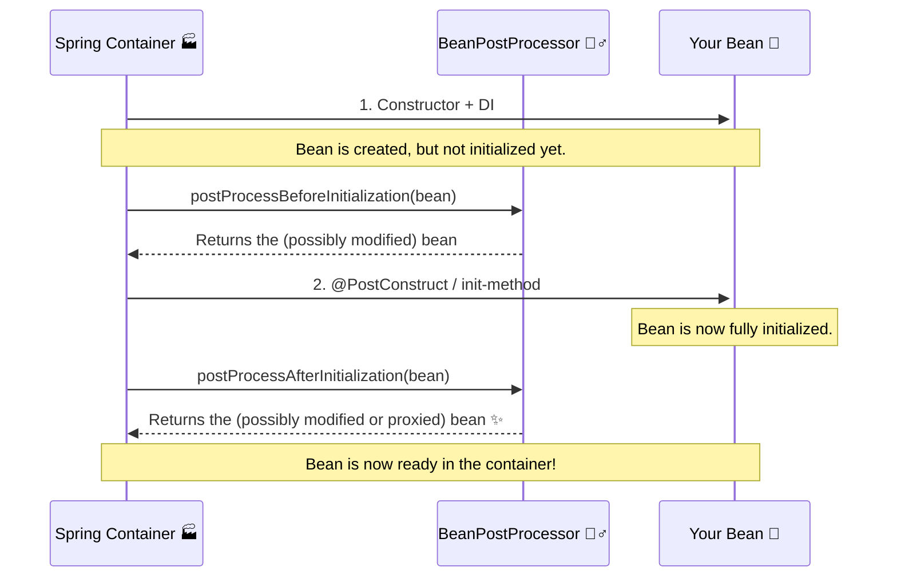

# BeanPostProcessor: The "Quality Control" Inspector 🕵️‍♂️

Mawa, ippudu manam Spring container lopaliki velli, daani assembly line lo oka manishini nilabettabotunnam. Ee "manishi" eh **`BeanPostProcessor`**. Idi Spring lo oka chala powerful, advanced concept.

**The Main Idea:** Spring container lo create ayye **prati okka bean** meeda, manam konni operations cheyochu. Just think of the power!

### Source URL
[https://docs.spring.io/spring-framework/reference/core/beans/factory-extension.html#beans-factory-extension-bpp](https://docs.spring.io/spring-framework/reference/core/beans/factory-extension.html#beans-factory-extension-bpp)

### Why it Matters
Idi oka framework extension point. Ante, manam Spring core behavior ni manaki కావలసినట్టు customize cheskovachu.
-   **Proxying:** Spring AOP (Aspect-Oriented Programming) antha ee `BeanPostProcessor` meedha ne depend avutundi. Okka bean create ayyaka, daani chuttu oka proxy ni create chesi, original bean బదులు aa proxy ni return cheyadaniki idi vadataru.
-   **Annotation Processing:** Spring lo `@Autowired`, `@Value` lanti annotations ela pani chestayi anukuntunnav? Vaati venakala `AutowiredAnnotationBeanPostProcessor` lanti BPPs untayi. Avi prathi bean ni scan chesi, ee annotations unte, vaatiki taggattu logic execute chestayi.
-   **Custom Logic:** Manam kuda mana custom BPPs rasi, beans create ayyaka vaatiki extra logging add cheyochu, or konni properties ni modify cheyochu.

Ee concept ardam aithe, Spring lopaliki velli, adi ela pani chestundo chala deep ga telustundi. This is Top 1% knowledge, mawa! 💪

---
### The Car Factory Analogy 🚗

Imagine Spring container anedi oka Car Factory assembly line.
1.  **Chassis Assembled:** Car chassis (basic object) tayaru chesaru. (Constructor is called).
2.  **Engine & Wheels Fitted:** Daaniki engine, wheels lanti parts (dependencies) add chesaru. (Dependency Injection).
3.  **QC Check 1 (`postProcessBeforeInitialization`):** Ippudu car "final finishing" ki velle mundu, mana **Quality Control Inspector** (`BeanPostProcessor`) vachi check chestadu. "Anni parts correct ga unnaya? Basic structure okay na?" ani. Ikkada inspector konni chinna adjustments cheyochu.
4.  **Final Finishing (`@PostConstruct`):** Car ki final polish, logo sticking lanti panulu chestaru. (Bean's `init` method is called).
5.  **QC Check 2 (`postProcessAfterInitialization`):** Final finishing kuda aipoyaka, mana Inspector malli vachi, final check chestadu. "Antha perfect ga unda? Ready to ship aa?" ani. Ikkada inspector car ki oka "OK" sticker veyochu, or even car ni oka waterproof cover (a Proxy) tho wrap chesi pampinchocchu.
6.  **Car Ready:** The final car (bean) is now ready in the showroom (container).

**The Lifecycle with BPP**

---
### The Two Methods of `BeanPostProcessor`
Ee interface lo rende rendu methods untayi:
1.  `postProcessBeforeInitialization(Object bean, String beanName)`
    -   Idi bean `init` method (`@PostConstruct`) kanna **mundu** call avutundi.
    -   Ikkada manam original bean ni return cheyochu, or daaniki konni modifications chesi return cheyochu.
2.  `postProcessAfterInitialization(Object bean, String beanName)`
    -   Idi bean `init` method (`@PostConstruct`) **tarvata** call avutundi.
    -   This is the most powerful one. Ikkada manam original bean ni return cheyochu, or daani బదులు complete ga vere object (like a proxy) ni kuda return cheyochu. Spring AOP ikkade magic chestundi.

**How to Register It?**
Chala simple. Manam raasina `BeanPostProcessor` class ni kuda oka normal bean laaga define cheste chalu. Spring container chala smart, adi `BeanPostProcessor` interface ni implement chese prathi bean ni automatic ga detect chesi, special ga treat chesi, munduga register cheskuntundi.

---
### Code Reference: The Inspector in Action!
Ee powerful concept ni live lo chudadaniki, manam `io.mawa.spring.core.bpp` ane kotha package create cheddam.

1.  **`MyBean.java`:** Oka simple bean, daaniki oka `init()` method undi.
2.  **`MyBeanPostProcessor.java`:** Mana custom inspector. Idi `postProcessBefore/AfterInitialization` lo messages print chestundi.
3.  **`BppDemoApplication.java`:** Mana Spring Boot application. Manam BPP ni and MyBean ni rendu `@Component` ga mark chestam. Spring Boot vaatini automatic ga scan chesi, register chestundi.

Ee code antha manam next step lo create cheddam! Ready for the deep dive? 🚀
