# BeanPostProcessor: The "Quality Control" Inspector 🕵️‍♂️

Mawa, ippudu manam Spring container lopaliki velli, daani assembly line lo oka manishini nilabettabotunnam. Ee "manishi" eh **`BeanPostProcessor`**. Idi Spring lo oka chala powerful, advanced concept.

**The Main Idea:** Spring container lo create ayye **prati okka bean** meeda, manam konni operations cheyochu. Just think of the power!

### Source URL
[https://docs.spring.io/spring-framework/reference/core/beans/factory-extension.html#beans-factory-extension-bpp](https://docs.spring.io/spring-framework/reference/core/beans/factory-extension.html#beans-factory-extension-bpp)

### Why it Matters
Idi oka framework extension point. Ante, manam Spring core behavior ni manaki కావలసినట్టు customize cheskovachu.
-   **Proxying:** Spring AOP (Aspect-Oriented Programming) antha ee `BeanPostProcessor` meedha ne depend avutundi. Okka bean create ayyaka, daani chuttu oka proxy ni create chesi, original bean బదులు aa proxy ni return cheyadaniki idi vadataru.
-   **Annotation Processing:** Spring lo `@Autowired`, `@Value` lanti annotations ela pani chestayi anukuntunnav? Vaati venakala `AutowiredAnnotationBeanPostProcessor` lanti BPPs untayi. Avi prathi bean ni scan chesi, ee annotations unte, vaatiki taggattu logic execute chestayi.
-   **Custom Logic:** Manam kuda mana custom BPPs rasi, beans create ayyaka vaatiki extra logging add cheyochu, or konni properties ni modify cheyochu.

Ee concept ardam aithe, Spring lopaliki velli, adi ela pani chestundo chala deep ga telustundi. This is Top 1% knowledge, mawa! 💪

---
### The Car Factory Analogy 🚗

Imagine Spring container anedi oka Car Factory assembly line.
1.  **Chassis Assembled:** Car chassis (basic object) tayaru chesaru. (Constructor is called).
2.  **Engine & Wheels Fitted:** Daaniki engine, wheels lanti parts (dependencies) add chesaru. (Dependency Injection).
3.  **QC Check 1 (`postProcessBeforeInitialization`):** Ippudu car "final finishing" ki velle mundu, mana **Quality Control Inspector** (`BeanPostProcessor`) vachi check chestadu. "Anni parts correct ga unnaya? Basic structure okay na?" ani. Ikkada inspector konni chinna adjustments cheyochu.
4.  **Final Finishing (`@PostConstruct`):** Car ki final polish, logo sticking lanti panulu chestaru. (Bean's `init` method is called).
5.  **QC Check 2 (`postProcessAfterInitialization`):** Final finishing kuda aipoyaka, mana Inspector malli vachi, final check chestadu. "Antha perfect ga unda? Ready to ship aa?" ani. Ikkada inspector car ki oka "OK" sticker veyochu, or even car ni oka waterproof cover (a Proxy) tho wrap chesi pampinchocchu.
6.  **Car Ready:** The final car (bean) is now ready in the showroom (container).

**The Lifecycle with BPP**

```mermaid
sequenceDiagram
    participant Container as Spring Container 🏭
    participant BPP as BeanPostProcessor 🕵️‍♂️
    participant Bean as Your Bean 🚗

    Container->>+Bean: 1. Constructor + DI
    Note over Container,Bean: Bean is created, but not initialized yet.

    Container->>BPP: postProcessBeforeInitialization(bean)
    BPP-->>Container: Returns the (possibly modified) bean

    Container->>Bean: 2. @PostConstruct / init-method
    Note over Bean: Bean is now fully initialized.

    Container->>BPP: postProcessAfterInitialization(bean)
    BPP-->>Container: Returns the (possibly modified or proxied) bean ✨

    Note over Container,Bean: Bean is now ready in the container!
```


---
### The Two Methods of `BeanPostProcessor`
Ee interface lo rende rendu methods untayi:
1.  `postProcessBeforeInitialization(Object bean, String beanName)`
    -   Idi bean `init` method (`@PostConstruct`) kanna **mundu** call avutundi.
    -   Ikkada manam original bean ni return cheyochu, or daaniki konni modifications chesi return cheyochu.
2.  `postProcessAfterInitialization(Object bean, String beanName)`
    -   Idi bean `init` method (`@PostConstruct`) **tarvata** call avutundi.
    -   This is the most powerful one. Ikkada manam original bean ni return cheyochu, or daani బదులు complete ga vere object (like a proxy) ni kuda return cheyochu. Spring AOP ikkade magic chestundi.

**How to Register It?**
Chala simple. Manam raasina `BeanPostProcessor` class ni kuda oka normal bean laaga define cheste chalu. Spring container chala smart, adi `BeanPostProcessor` interface ni implement chese prathi bean ni automatic ga detect chesi, special ga treat chesi, munduga register cheskuntundi.

---
<br>

### 🏛️ The Blueprint Architect: `BeanFactoryPostProcessor`

QC Inspector (`BeanPostProcessor`) car ni check chese mundu, evaro okaru aa car blueprint ni design cheyali kada? Spring lo, ee panine `BeanFactoryPostProcessor` (BFPP) chestundi.

Oka BFPP anedi oka special bean. Adi, container inka regular beans ni create cheyadam **mundare**, bean definitions (ante blueprints) ni chadavadaniki and **modify** cheyadaniki permission istundi.

**Analogy:**
*   **`BeanFactoryPostProcessor` (The Architect):** Car blueprint ni modify chestadu. "Car build cheyaka mundhe, deeni engine ni V6 nunchi V8 ki marchandi!"
*   **`BeanPostProcessor` (The QC Inspector):** Poorthiga assemble ayina car ni inspect chestadu. "Car tayarayyindi. Ippudu deeniki rust-proofing spray kotti deliver cheddam."

Andari kante famous BFPP `PropertySourcesPlaceholderConfigurer`. Ade mana `application.properties` file ni chadivi, mana bean definitions lo unna `${db.url}` lanti placeholders ni replace chestundi. Ante, adi blueprint ni marustondi!

### 🥊 The Ultimate Showdown: BPP vs. BFPP

Ee comparison table interviews ki chala upayogapadutundi.

| Feature | `BeanPostProcessor` (BPP) | `BeanFactoryPostProcessor` (BFPP) |
| :--- | :--- | :--- |
| **Deeni meeda pani chestundi** | Asalu **bean instance** (the object) | **Bean definition** (the metadata/blueprint) |
| **Eppudu run avutundi** | Prati bean instantiate ayyaka | Regular beans anni instantiate avvaka mundu |
| **Analogy** | Quality Control Inspector | Blueprint Architect |
| **Key Interface Method** | `postProcessBefore/AfterInitialization` | `postProcessBeanFactory` |
| **Mukhyamaina Use Case** | Proxies create cheyadam (AOP), custom injections | Placeholders replace cheyadam, bean scopes marchadam |

### 🚀 BPP Power-User Details

Mana QC Inspectors gurinchi inko rendu pro details chuddam.

#### 1. Controlling the Assembly Line: `@Order`

Okavela neeku multiple `BeanPostProcessor`s unte? Edi mundu run avutundi? Udaharanaki, Spring yokka AOP BPP (`@EnableAspectJAutoProxy`) mana custom logging BPP kanna mundu run avvali.

Deenini manam `Ordered` interface implement chesi or, inka easy ga, `@Order` annotation tho control cheyochu. **Takkuva number unnavi mundu run avutayi!**

```java
@Component
@Order(1) // Mundu idi run avutundi
public class SecurityBeanPostProcessor implements BeanPostProcessor { ... }

@Component
@Order(10) // Tarvata idi run avutundi
public class LoggingBeanPostProcessor implements BeanPostProcessor { ... }
```

#### 2. The Inception Rule: The Processor Can't Process Itself!

Idi chala aalochinchalsina, kani chala critical rule. `BeanPostProcessor`s anevi special beans. Avi container startup lo chala munduga create avutayi.

Avi antha munduga create avvadam valla, avi **vere `BeanPostProcessor`s dwara process cheyabadavu**. Ante, nuvvu oka `BeanPostProcessor` meeda AOP (`@Aspect`) apply cheyalevu.

Enduku? Imagine BPP 'A' anedi BPP 'B' ni process cheyali anukondi. Kani BPP 'B' anedi BPP 'A' ni process cheyali. Appudu infinite loop vastundi! Spring ee samasyani, "Anni BPPs special. Avi okarini okaru process chesukovu" ani cheppi avoid chestundi.

**Mermaid Diagram: The Full Factory Flow**


Ee concept tho, nuvvu Spring container yokka lothulaloki velli vachavu. Ippudu nuvvu దేనికైనా ready! `Abhinandanalu!` (Congratulations!) 🎉
