# BeanFactoryPostProcessor: The Head Chef Who Changes Recipes! 🧑‍🍳📜

Mawa, manam ippati varaku `BeanPostProcessor` gurinchi chusam. Adi oka "QC Inspector" lantiది. Ante, bean antha ready ayyaka, final dish ni check chesi, daani meeda garnish chestundi.

Kani, `BeanFactoryPostProcessor` (BFPP) anedi inka powerful. Idi "Head Chef" lantiది. Dosa tayaru cheyakamunde, Head Chef vachi, dosa pindi (the recipe, or `BeanDefinition`) ni chusi, "Ee pindi lo konchem uppu taggindi, kalupu" ani recipe ne change chestaru.

> **The Golden Rule:**
> *   `BeanPostProcessor` modifies the **actual bean object** after it's created.
> *   `BeanFactoryPostProcessor` modifies the **bean definition (the recipe)** before any bean is even created.

### Source URL
[https://docs.spring.io/spring-framework/reference/core/beans/factory-extension.html#beans-factory-extension-factory-postprocessors](https://docs.spring.io/spring-framework/reference/core/beans/factory-extension.html#beans-factory-extension-factory-postprocessors)

### Why it Matters
This is a very powerful extension point, mawa. It allows you to programmatically change the configuration metadata. Spring Boot and other frameworks use this heavily behind the scenes. For example:
-   Reading properties from `.properties` files and replacing placeholders like `${db.url}` in your bean definitions (`PropertySourcesPlaceholderConfigurer` is a BFPP!).
-   Changing the scope of a bean from singleton to prototype dynamically.
-   Adding a new dependency to a bean definition before it's created.

**The Lifecycle with BFPP**

```mermaid
sequenceDiagram
    participant Container as Spring Container 🏭
    participant BFPP as BeanFactoryPostProcessor 🧑‍🍳
    participant Bean as Your Bean 🤖

    Container->>Container: 1. Load all bean definitions (recipes)
    Note over Container: At this point, no beans are created yet!

    Container->>+BFPP: 2. postProcessBeanFactory()
    Note over BFPP: The Head Chef reads all recipes and can modify them!
    BFPP-->>-Container: Modified recipes are ready!

    Container->>+Bean: 3. Create bean instances using the MODIFIED recipes
    Note over Bean: The bean is created with the new instructions.
    Container->>Bean: 4. DI, Aware, BPP, etc.
```


---
### Code Reference: The Secret Password Obfuscator
Ee concept ni chudadaniki, manam oka fun example cheddam. Manam config lo oka bean ki password istam, kani security kosam, aa password ni log avvakunda, `BeanFactoryPostProcessor` tho daanini "***" tho replace cheddam.

The code for this is in the `io.mawa.spring.core.bfpp` package.

1.  **`DataSourceBean.java`**: A simple bean with a `password` property.
2.  **`ObscenityRemoverBfpp.java`**: Our `BeanFactoryPostProcessor` implementation. It scans all bean definitions and modifies the `password` property of the `dataSource` bean.
3.  **`BfppConfig.java`**: Registers both the `DataSourceBean` (with a dummy password) and our `ObscenityRemoverBfpp`. Note that the BFPP bean method is `static`. This is a best practice to ensure it's initialized before any other beans.
4.  **`BfppDemoApp.java`**: The main app that starts the container and prints the bean's details.

### How to Run
Project root `Spring-Project` folder lo undi, ee command run cheyi:
```bash
mvn compile exec:java -Dexec.mainClass="io.mawa.spring.core.bfpp.BfppDemoApp"
```
**Expected Output:**
```
--- Starting the Spring Container ---
🧑‍🍳 Head Chef (BFPP) is inspecting the recipes before cooking...
Found the recipe for 'dataSource'. Changing the password ingredient.

--- Container started. Now retrieving the bean... ---

Retrieved Bean Details: DataSourceBean{password='********'}
Notice how the password is now obfuscated!
```
Chusava! Mana `BfppConfig` lo password "dummy-password-123" ani unna, mana BFPP vachi aa recipe ni modify cheyadam valla, create ayina final bean lo password "********" ga undi. That's the power of the Head Chef!

Ready for the final extension point, the `FactoryBean`? Let's go! 🔥
