# FactoryBean: The Bean That Makes Other Beans! 🏭

Mawa, ee concept konchem mind-bending anipinchachu, but it's super powerful. Manam ippati varaku chusina beans anni normal objects. Kani `FactoryBean` anedi oka special kind of bean. It's a **factory that produces other objects**.

> **The Golden Rule:** When you define a bean of type `FactoryBean`, and you ask the container for that bean, the container **doesn't give you the factory itself**. Instead, it calls the factory's `getObject()` method and gives you the **product** that the factory creates.

### Source URL
[https://docs.spring.io/spring-framework/reference/core/beans/factory-extension.html#beans-factory-extension-factorybean](https://docs.spring.io/spring-framework/reference/core/beans/factory-extension.html#beans-factory-extension-factorybean)

### The Car Factory Analogy 🚗
Imagine the Spring container is a giant industrial park.
-   **Normal Bean (`@Bean`):** Nuvvu oka car ni (`Car` object) direct ga park chesav. Evaru adigina, aa car ne istav.
-   **`FactoryBean`:** Nuvvu oka chinna **Car Factory** (`CarFactory` object) ni park chesav. Ippudu, evaraina vachi, "Naaku 'myCar' kavali" ani adigithe, nuvvu factory ki velli, oka kotha car ni produce cheyinchi, aa car ni customer ki istav. Nuvvu factory ni ivvavu, factory produce chesina car ni istav!

**Why is this useful?**
Sometimes, an object's creation logic is very complex.
-   You might need to connect to a remote server, get some configuration, and then build the object.
-   You might be integrating with a third-party library that has its own complex builder pattern.
-   You want to return different types of objects based on some environment property.

Ee complex logic antha manam `@Bean` methods lo petti messy cheyakunda, oka separate `FactoryBean` class lo neat ga encapsulate cheyochu.

**The Lifecycle with `FactoryBean`**

```mermaid
%%{init: {'theme': 'dark'}}%%
sequenceDiagram
    participant Client as Your App Code
    participant Container as Spring Container 🏭
    participant Factory as MyFactoryBean ✨

    Client->>Container: context.getBean("myProduct")
    Note over Container: "myProduct" is defined as a FactoryBean.

    Container->>+Factory: Calls getObject() on the factory bean
    Note right of Factory: Factory creates the 'Product' object internally.
    Factory-->>-Container: returns the created Product object

    Container-->>Client: returns the final product object
```


### The Ampersand (`&`) Trick: "I Want the Factory, Not the Product!"
Okavela neeku car kadu, car factory ne kavali anukunte? Appudu em chestav?

Simple, mawa. Bean name ki mundu `&` symbol pedithe chalu.
-   `context.getBean("myCar")` -> Returns the `Car` object.
-   `context.getBean("&myCar")` -> Returns the `CarFactory` object itself!

---
### Code Reference: The Tool Shed
The code for this is in the `io.mawa.spring.core.factorybean` package.

1.  **`Tool.java`**: A simple interface for our tools.
2.  **`Hammer.java`, `Screwdriver.java`**: Concrete implementations of `Tool`.
3.  **`ToolFactory.java`**: Our `FactoryBean<Tool>` implementation.
4.  **`FactoryBeanConfig.java`**: This config class registers our `ToolFactory` as a bean named "tool" and configures it to produce a "hammer".
5.  **`FactoryBeanDemoApp.java`**: The main app that demonstrates retrieving both the product and the factory.

### How to Run
Project root `Spring-Project` folder lo undi, ee command run cheyi:
```bash
mvn compile exec:java -Dexec.mainClass="io.mawa.spring.core.factorybean.FactoryBeanDemoApp"
```
**Expected Output:**
```
--- Starting the Spring Container ---

--- 1. Asking for the 'tool' bean (The Product) ---
🏭 ToolFactory is producing a tool of type: hammer
Received product: Bang, bang, bang! Using the Hammer! 🔨

--- 2. Asking for the '&tool' bean (The Factory Itself) ---
Received factory object of type: ToolFactory
Successfully retrieved the ToolFactory itself!
```
Chusava! `context.getBean("tool")` adiginappudu, manaki `Hammer` object vachindi. Kani `context.getBean("&tool")` adiginappudu, manaki `ToolFactory` object vachindi. That's the magic of `FactoryBean` and the `&` prefix!

With this, we have completed the **Container Extension Points** section. You've mastered some of the deepest arts in Spring. Congratulations, Mawa! 🎉 What's next on our path to becoming a pro?
