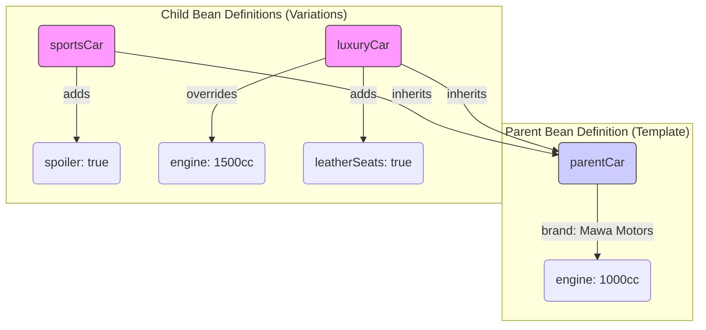

# Bean Definition Inheritance: The "Like Father, Like Son" Rule 👨‍👦

Mawa, manam Spring IoC Container gurinchi chala nerchukunnam. Ippudu, ee chapter lo final topic, oka "blast from the past" lanti concept: **Bean Definition Inheritance**.

Ee rojullo manam Java config (`@Configuration`) vadatam valla, normal Java class inheritance eh use chestam. Kani, paatha rojullo, antha XML tho chesinappudu, configuration ni reuse cheyadaniki ee technique chala popular ga undedi.

### Source URL
[https://docs.spring.io/spring-framework/reference/core/beans/inheritance.html](https://docs.spring.io/spring-framework/reference/core/beans/inheritance.html)

### What is it? The Car Showroom Analogy 🚗
Imagine nuvvu oka car showroom owner. Nuvvu oka "base model" car (`parent bean`) ni define chesav.
-   **Base Model (Parent):**
    -   `brand`: "Mawa Motors"
    -   `engine`: "1000cc"

Ippudu, ee base model nunchi, nuvvu konni variations create cheyali anukuntunnav.
-   **Sports Model (Child):** Inherits brand and engine from the base model, but adds a `spoiler`.
-   **Luxury Model (Child):** Inherits brand and engine, but overrides the engine to `1500cc` and adds `leatherSeats`.

Bean definition inheritance ante ide! Oka parent bean definition ni create chesi, daanni child bean definitions ki template la vadukovadam. The child can inherit all properties and even override them.



### How it Works (The XML Way)
Ee feature `parent` attribute tho XML configuration lo implement chestaru.

```xml
<bean id="parentCar" class="io.mawa.spring.core.inheritance.ParentBean">
    <property name="brand" value="Mawa Motors"/>
    <property name="engine" value="1000cc"/>
</bean>

<bean id="sportsCar" class="io.mawa.spring.core.inheritance.ChildBean" parent="parentCar">
    <property name="spoiler" value="true"/>
</bean>

<bean id="luxuryCar" class="io.mawa.spring.core.inheritance.ChildBean" parent="parentCar">
    <property name="engine" value="1500cc"/> <!-- Overriding the parent's value -->
    <property name="leatherSeats" value="true"/>
</bean>
```

**Important Note:** Child bean definition lo class specify cheyakapothe, adi parent class ne teeskuntundi. Kani, child ki vere class unte, adi kuda possible eh.

### Why is it Less Common Now?
Mawa, Java-based configuration (`@Configuration`) vachaka, ee XML `parent` attribute avasaram taggipoindi. Endukante, manam normal Java class inheritance ne vadukovachu.

```java
// Parent class in Java
public class ParentBean {
    // fields...
}

// Child class in Java
public class ChildBean extends ParentBean {
    // additional fields...
}
```
And manam config lo ee child beans ni direct ga create cheyochu. It's more natural and type-safe. Kani, legacy projects lo or konni specific cases lo XML chusinappudu, ee `parent` attribute kanipiste, deeni venaka unna concept ide ani neeku teliyali.

---
### Code Reference: The Car Showroom in Action
Ee concept ni live lo chudadaniki, manam `io.mawa.spring.core.inheritance` package lo code and `resources` folder lo oka XML file create cheddam.

1.  **`ParentBean.java` & `ChildBean.java`**: Simple POJOs to hold car properties.
2.  **`bean-inheritance.xml`**: Mana main XML configuration file with the `parent` attribute.
3.  **`InheritanceDemoApp.java`**: Ee main app, `ClassPathXmlApplicationContext` use chesi, XML file ni load chesi, child beans ni retrieve chesi, vaati properties (inherited and new) ni print chestundi.

Let's build this final piece of our IoC container puzzle!
