# `@Autowired` Deep Dive: The Art of Wiring* 🎨

Mawa, manam `@Autowired` gurinchi already konchem chusam. Adi Spring lo unde oka magic wand lantiది, automatic ga dependencies ni inject chestundi. Ippudu, daani gurinchi inka konchem deep ga, docs lo unna prathi detail ni cover cheddam.

\* **(Very Important for interviews and daily work)**

### Source URL
[https://docs.spring.io/spring-framework/reference/core/beans/annotation-config/autowired.html](https://docs.spring.io/spring-framework/reference/core/beans/annotation-config/autowired.html)

### The Master Electrician Analogy ⚡
Imagine Spring anedi oka "Master Electrician".
-   **Your Bean:** Oka kotha illu.
-   **Dependency:** Ee intlo neeku oka AC kavali.
-   **`@Autowired`:** Nuvvu wall meeda AC kosam oka socket (`@Autowired` field) petti vellipothav.
-   **Spring's Job:** Master Electrician (Spring) vachi, aa socket chusi, automatic ga main power line (`AC` bean in the container) nunchi connection laagi, aa socket ki set chesestadu. Nuvvu wiring gurinchi tension padalsina avasaram ledu.

### The `required` Attribute: Is this connection mandatory?
Idi `@Autowired` lo unna oka important switch.
`@Autowired(required = true)` (This is the **default**)
-   **Meaning:** "Electrician, ee AC connection **pakka** kavali. Main power line lekapothe, asalu ee intike power ivvaku!"
-   **Spring Behavior:** If Spring cannot find a matching bean to inject, it will throw an **error** and the application will **fail to start**. This is good because it finds problems early.

`@Autowired(required = false)`
-   **Meaning:** "Electrician, ee AC connection unte pettu, lekapote light teesko. It's optional."
-   **Spring Behavior:** If Spring cannot find a matching bean, it will **not** throw an error. It will simply leave the field as `null`. The application will start successfully.

**When to use `required=false`?**
Oka dependency optional ayinappudu. For example, oka `LoggingService` undi anuko. Adi unte log chestam, lekapote silent ga undali. Appudu `required=false` vadatam manchidi.

```mermaid
graph TD
    subgraph "Scenario 1: required = true (Default)"
        A["@Autowired<br/>private PowerSource power;"];
        B{Spring Container};
        C["PowerSource Bean NOT Found ❌"];
        B -- "searches for" --> C;
        A -- "needs" --> B;
        C -- "leads to" --> D[💥 Application Fails to Start!];
    end
    subgraph "Scenario 2: required = false"
        E["@Autowired(required=false)<br/>private PowerSource power;"];
        F{Spring Container};
        G["PowerSource Bean NOT Found ❌"];
        F -- "searches for" --> G;
        E -- "needs" --> F;
        G -- "leads to" --> H["✅ App Starts Fine<br/>(power field is null)"];
    end
```



---
### Code Reference: The Optional Gadget
The code for this is in the `io.mawa.spring.core.annotationconfig.autowired` package.

1.  **`OptionalGadget.java`**: An interface for which we will *not* provide a bean.
2.  **`Hero.java`**: This `@Component` attempts to autowire the `OptionalGadget` but marks it as `required = false`.
3.  **`AutowiredConfig.java`**: The configuration class that enables component scanning but does not define an `OptionalGadget` bean.
4.  **`AutowiredApp.java`**: The main application to run the demo.

### How to Run
Project root `Spring-Project` folder lo undi, ee command run cheyi:
```bash
mvn compile exec:java -Dexec.mainClass="io.mawa.spring.core.annotationconfig.autowired.AutowiredApp"
```
**Expected Output:**
```
--- Starting the Spring Container ---
--- Container started successfully! ---
--- Checking for optional gadget ---
No optional gadget was found. Continuing without it. 👍
```
Chusava! `OptionalGadget` bean lekapoina, mana application crash avvaledu. Endukante, manam `required=false` ani cheppam. Spring aa field ni `null` ga vదిlesi, munduku vellipoindi. That's how you handle optional dependencies!

Next, we'll see what happens when there isn't a *missing* dependency, but there are *too many*! We'll learn how to use `@Primary` to tell Spring which one is our favorite. Ready? 💪
