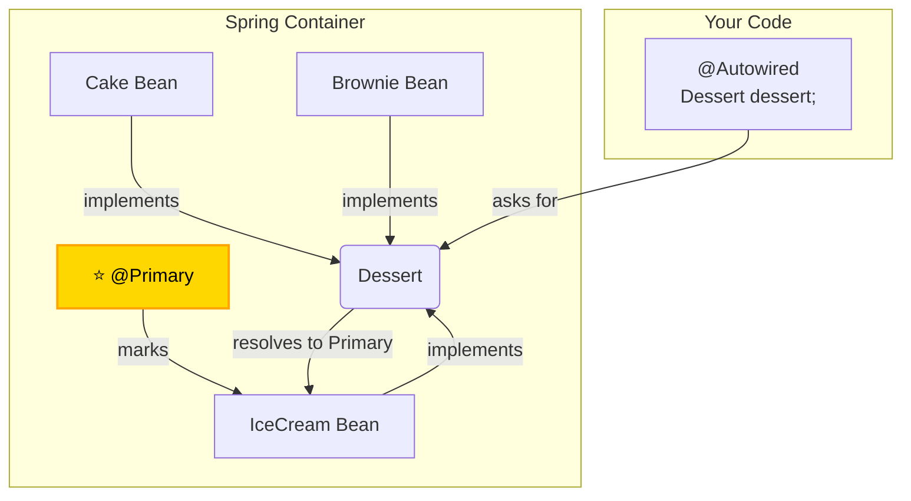

# @Primary: The "My Favorite" Sticker for Beans* ⭐

Mawa, manam `@Autowired` gurinchi chusam. Adi type batti automatic ga inject chestundi. Kani, oka chinna problem undi. Okavela, oke type ki, container lo **multiple beans** unte?

For example, `Dessert` ane interface undi, daaniki `IceCream` and `Cake` ane rendu implementations unnayi. Ippudu, nuvvu `Dessert` ni autowire cheste, Spring ki confusion vastundi. "Boss, nuvvu dessert adigav, kani ikkada rendu unnayi. Nenu ice cream ivvala, cake ivvala?" 🤷‍♂️

Ee confusion lo, Spring `NoUniqueBeanDefinitionException` ane error isthundi, and app start avvadu. Ee problem ni solve cheyadaniki, manaki unna first weapon eh **`@Primary`**.

\* **(Very Important for interviews and daily work)**

### Source URL
[https://docs.spring.io/spring-framework/reference/core/beans/annotation-config/autowired-primary.html](https://docs.spring.io/spring-framework/reference/core/beans/annotation-config/autowired-primary.html)

### The Ice Cream Shop Analogy 🍦
Imagine nuvvu oka ice cream shop (`Spring Container`) ki vellav. Counter lo chala flavors (`IceCream`, `Cake`, `Brownie` beans) unnayi.
-   **You:** "Naaku oka dessert kavali." (`@Autowired Dessert dessert;`)
-   **Shopkeeper (Spring):** "Em dessert kavali, sir? Ikkada chala unnayi." -> **Error!**

Ippudu, shop owner vachi, `IceCream` tub meeda **"Today's Special - Our #1 Choice!"** ane oka sticker (`@Primary` annotation) vesadu anuko.
-   **You:** "Naaku oka dessert kavali."
-   **Shopkeeper (Spring):** "Em cheppakapothe, memu default ga Ice Cream istam, adi ma primary choice." -> **Success!** You get the `IceCream` bean.

`@Primary` ante ide. When there are multiple candidates, it tells Spring which one is the **default** or **preferred** choice.



---
### Code Reference: The Default Dessert
The code for this is in the `io.mawa.spring.core.annotationconfig.primary` package.

1.  **`Dessert.java`**: Our simple interface.
2.  **`IceCream.java`**: An implementation of `Dessert`, marked with `@Component` and `@Primary`.
3.  **`Cake.java`**: Another implementation, marked only with `@Component`.
4.  **`DessertShop.java`**: A component that autowires a `Dessert`.
5.  **`PrimaryConfig.java`**: A configuration class that just enables component scanning.
6.  **`PrimaryApp.java`**: The main application to run the demo.

### How to Run
Project root `Spring-Project` folder lo undi, ee command run cheyi:
```bash
mvn compile exec:java -Dexec.mainClass="io.mawa.spring.core.annotationconfig.primary.PrimaryApp"
```
**Expected Output:**
```
--- Starting the Spring Container ---
--- Container started successfully! ---
Today's special dessert is: Cool and sweet! 🍦
```
Chusava! `DessertShop` lo manam `Dessert` ni adigithe, Spring container lo `IceCream` and `Cake` rendu unna, adi automatic ga `@Primary` unna `IceCream` ni inject chesindi.

But what if we don't want the default? What if we *specifically* want the cake? For that, we need a more powerful weapon: `@Qualifier`. Adi manam next lesson lo chuddam! Ready aa? 🔥
