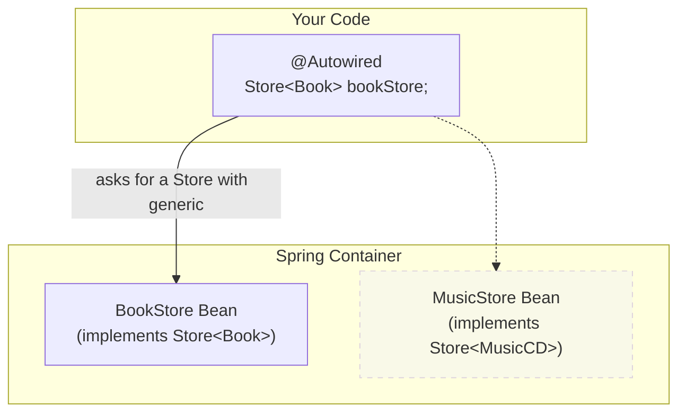

# Generics as Qualifiers: Super-Specific Autowiring 🧠

Mawa, manam ambiguity ni solve cheyadaniki `@Primary` and `@Qualifier` vadatam chusam. Kani, Spring lo inko hidden power undi. Adi **Java Generics** ni use chesi, automatic ga correct bean ni select cheyagaladu.

This is an advanced topic, but it shows how smart the Spring container is.

### Source URL
[https://docs.spring.io/spring-framework/reference/core/beans/annotation-config/generics-as-qualifiers.html](https://docs.spring.io/spring-framework/reference/core/beans/annotation-config/generics-as-qualifiers.html)

### The Bookstore Analogy 📚
Imagine nuvvu oka generic `Store<T>` interface create chesav. Ante, adi ഏ-type of item ni ayina store cheyochu.
-   `BookStore` implements `Store<Book>`
-   `MusicStore` implements `Store<MusicCD>`
-   `ToyStore` implements `Store<Toy>`

Ippudu, nee code lo, neeku specific ga book store kavali. Nuvvu ila autowire chestav:
```java
@Autowired
private Store<Book> bookStore;
```
Ikkada, manam `@Qualifier` emi vadaledu. Kani, Spring chala smart. Adi chustundi, "Okay, ikkada `Store` kavali, kani specific ga `<Book>` type unna `Store` kavali." Appudu, adi container lo vethiki, `BookStore` (because it implements `Store<Book>`) ni correct ga find chesi, inject chestundi. It ignores `MusicStore` and `ToyStore`.

The generic type itself acts as a qualifier!



### Why is this useful?
This is very useful when you have a generic service or repository and multiple implementations for different data types. It keeps your code clean and type-safe, without needing extra `@Qualifier` annotations everywhere.

---
### Code Reference: The Generic Store
The code for this is in the `io.mawa.spring.core.annotationconfig.generics` package.

1.  **`Item.java`, `Book.java`, `MusicCD.java`**: Our data model classes.
2.  **`Store.java`**: The generic `Store<T>` interface.
3.  **`BookStore.java`** and **`MusicStore.java`**: The two concrete implementations of `Store`, each with a different generic type.
4.  **`StoreService.java`**: This service autowires both `Store<Book>` and `Store<MusicCD>` to demonstrate the resolution.
5.  **`GenericsConfig.java`**: A configuration class that just enables component scanning.
6.  **`GenericsApp.java`**: The main application to run the demo.

### How to Run
Project root `Spring-Project` folder lo undi, ee command run cheyi:
```bash
mvn compile exec:java -Dexec.mainClass="io.mawa.spring.core.annotationconfig.generics.GenericsApp"
```
**Expected Output:**
```
--- Starting the Spring Container ---
--- Container started successfully! ---
--- Store Service ---
Injecting Store<Book>: This is a Book Store! 📚
Injecting Store<MusicCD>: This is a Music Store! 🎶
```
Chusava! Manam `@Qualifier` use cheyakapoina, Spring just generic type (`<Book>` or `<MusicCD>`) ni chusi, correct bean ni inject chesindi. How smart is that!

Next, we'll look at another standard annotation for injection that comes from Jakarta EE: `@Resource`. Ready? 🔥
