# Classpath Scanning: The Automatic Detective Agency* 🕵️‍♀️

Mawa, manam ippati varaku chala sarlu `@ComponentScan` use chesam, kani daani gurinchi deep ga matladukoledu. Ippudu matladukundam. Idi Spring Boot ki heart lantiది. Without this, there is no "convention over configuration".

Manam prathi bean ki `@Bean` method rayadam start cheste, pedda projects lo adi oka nightmare aipotundi. `@ComponentScan` ee problem ni solve chestundi.

\* **(Extremely Important for interviews and daily work. This is how modern Spring works.)**

### Source URL
[https://docs.spring.io/spring-framework/reference/core/beans/classpath-scanning.html](https://docs.spring.io/spring-framework/reference/core/beans/classpath-scanning.html)

### The Detective Agency Analogy 🕵️‍♀️
Imagine you are starting a company (`Spring Container`).
-   **The Problem:** You need to hire specialists (a `Developer`, a `Manager`, a `Tester`). You can go and hire each one individually (`@Bean` methods).
-   **The Solution (`@ComponentScan`):** You hire a "Detective Agency" (`@ComponentScan`). You give them a location to search, for example, "Search the 'Ameerpet' area" (`basePackages = "io.mawa"`).
-   **The Detectives (Spring):** The detectives go to Ameerpet and scan everyone. They are looking for people with special badges.
-   **The Badges (Stereotype Annotations):**
    -   `@Component`: A generic "Specialist" badge.
    -   `@Service`: A "Manager" badge (a specialization of Specialist).
    -   `@Repository`: A "Database Expert" badge (another specialization).
    -   `@Controller`: A "Receptionist" badge (a web specialization).

The detectives find everyone with these badges, automatically hire them, and add them to your company's employee list (the `ApplicationContext`).

```mermaid
graph TD
    A["@ComponentScan(basePackages = 'io.mawa')"] --> B{Detective Agency};

    subgraph "Search Area: 'io.mawa' package"
        C["MyComponent<br/>(Badge: @Component)"];
        D["MyService<br/>(Badge: @Service)"];
        E["MyRepository<br/>(Badge: @Repository)"];
        F["SomeOtherClass<br/>(No Badge)"];
    end

    B -- "scans" --> C;
    B -- "scans" --> D;
    B -- "scans" --> E;
    B -- "scans" --> F;

    subgraph "Beans Found & Registered ✅"
        C_Found[myComponent];
        D_Found[myService];
        E_Found[myRepository];
    end

    C -- "is found" --> C_Found;
    D -- "is found" --> D_Found;
    E -- "is found" --> E_Found;

    subgraph "Ignored ❌"
      F_Ignored["SomeOtherClass"];
    end

    F -- "is ignored" --> F_Ignored;
```



### The Stereotype Family
-   **`@Component`**: The parent of all stereotype annotations. It tells Spring, "I am a bean, please manage me."
-   **`@Service`**: Used for the business logic layer.
-   **`@Repository`**: Used for the persistence/DAO layer. It also enables special exception translation.
-   **`@Controller`** / **`@RestController`**: Used for the presentation/web layer.

Functionally, they all do the same thing: register a class as a bean. But using the specific ones makes our code more readable and communicates the *intent* of the class.

---
### Code Reference: The Agency at Work
The code for this is in the `io.mawa.spring.core.classpathscanning` package.

1.  **`MyComponent.java`, `MyService.java`, `MyRepository.java`**: Three simple classes, each with a different stereotype annotation.
2.  **`ScanningConfig.java`**: A `@Configuration` class that just uses `@ComponentScan` to tell the "Detective Agency" where to look.
3.  **`ScanningApp.java`**: The main application that starts the context and then prints the names of all the beans that were automatically discovered.

### How to Run
Project root `Spring-Project` folder lo undi, ee command run cheyi:
```bash
mvn compile exec:java -Dexec.mainClass="io.mawa.spring.core.classpathscanning.ScanningApp"
```
**Expected Output:**
```
--- Starting the Spring Container ---
--- Container started successfully! ---

--- Beans found by the Detective Agency (@ComponentScan) ---
 - Found bean: scanningConfig
 - Found bean: myComponent
 - Found bean: myRepository
 - Found bean: myService

Verification: Serving you from MyService!
```
Chusava! Manam ekkada `@Bean` methods rayaledu. Just classes meeda badges (`@Component`, etc.) vesam. Spring's Detective Agency vachi, vaatini automatic ga find chesi, container lo register chesesindi. This is the core of Spring Boot's auto-configuration magic!

You've now mastered a fundamental concept. Ready for the next one? 💪
