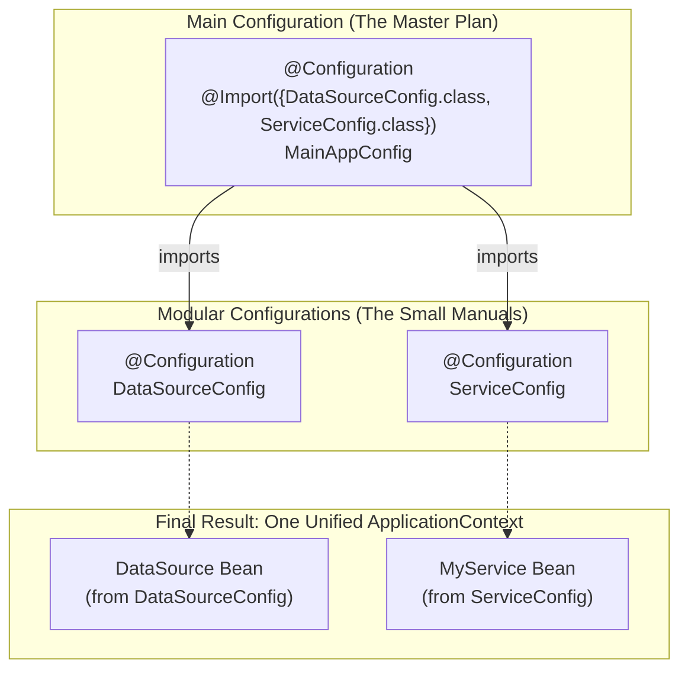

# Composing Configurations with @Import: The Master Blueprint* 📜+📜

Mawa, manam ippudu chala beans ni define cheyagalam. Kani, oka real-world application lo 100s or even 1000s of beans undochu. Anni oke okka `@Configuration` class lo pedithe, aa file chala peddaga, messy ga, and maintain cheyadaniki kastam ga aipotundi.

The solution is to be organized! Manam mana configuration ni chinna chinna, logical files ga break chesi, tarvata vaatini kaluputam. Ee "kalapadam" (composing) paniki, Spring manaki **`@Import`** ane powerful annotation istundi.

\* **(Extremely important. This is the standard way to organize configuration in all non-trivial Spring applications.)**

### Source URL
[https://docs.spring.io/spring-framework/reference/core/beans/java/composing-configuration-classes.html](https://docs.spring.io/spring-framework/reference/core/beans/java/composing-configuration-classes.html)

### The Master LEGO Plan Analogy 🏙️
Imagine you are building a whole LEGO city.
-   **The Messy Way:** You have one single, 1000-page instruction manual for the entire city. Chala confusing.
-   **The Organized Way (`@Import`):** You have separate, smaller manuals: one for the "Hospital" 🏥, one for the "Police Station" 🚓, and one for the "Fire Station" 🚒.
-   Then, you have a "Master Plan" (`MainAppConfig.java`). Ee master plan lo emi undadu, kevalam ila rastaru: "To build the city, just follow the instructions in the Hospital, Police Station, and Fire Station manuals."
    `@Import({HospitalConfig.class, PoliceConfig.class, FireStationConfig.class})`

`@Import` lets you create a clean, modular structure.


When you start the application using just `MainAppConfig`, Spring will see the `@Import` annotation and automatically load all the beans defined in `DataSourceConfig` and `ServiceConfig` as well. Antha kalisi, oke okka `ApplicationContext` lo untayi.

---
### Code Reference: Building the App from Modules
The code for this is in the `io.mawa.spring.core.javaconfig.composing` package.

1.  **`DataSourceConfig.java`**: Defines our data-layer beans.
2.  **`ServiceConfig.java`**: Defines our service-layer beans and depends on beans from the data layer.
3.  **`MainAppConfig.java`**: The master configuration that uses `@Import` to combine the other two.
4.  **`ComposingDemoApp.java`**: The main application that starts the context by using only `MainAppConfig`.

### How to Run
Project root `Spring-Project` folder lo undi, ee command run cheyi:
```bash
mvn compile exec:java -Dexec.mainClass="io.mawa.spring.core.javaconfig.composing.ComposingDemoApp"
```
**Expected Output:**
```
--- Starting the Spring Container with ONLY MainAppConfig ---
--- Container started successfully! ---

--- Retrieving MyService bean (which was defined in ServiceConfig) ---
MyService is working with DataSource: Connected to DB!

It works! The @Import annotation successfully loaded beans from other configuration classes.
```
Chusava! Manam just `MainAppConfig` tho context ni start chesam, kani `@Import` valla, `DataSourceConfig` and `ServiceConfig` lo unna beans kuda load ayyi, automatic ga wire aipoyayi. This is how you keep your configuration clean and modular in big projects.

Great job, Mawa! We're making steady, high-quality progress. What's the next topic on our list to master? 🤔
