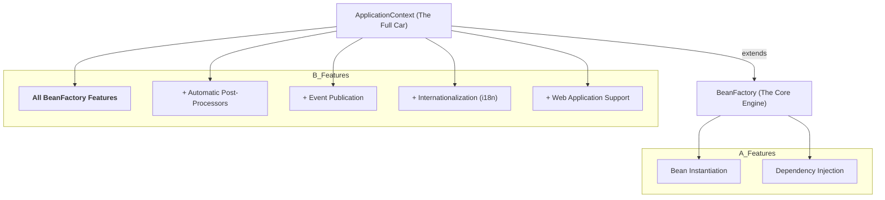

# The BeanFactory: Under the Hood of the ApplicationContext 🏭

Mawa, manam eppudu `ApplicationContext` ane word vadutunnam. Kani, daani venaka, daaniki power icche oka core engine undi. Daani pere **`BeanFactory`**. Idi Spring IoC container ki most basic, fundamental interface.

### Source URL
[https://docs.spring.io/spring-framework/reference/core/beans/beanfactory.html](https://docs.spring.io/spring-framework/reference/core/beans/beanfactory.html)

### The Car Engine vs. The Full Car Analogy 🚗
Ee రెండింటికి తేడా ardam cheskovadaniki idi best analogy.
-   **`BeanFactory` (The Engine):** Idi car ki raw, powerful engine. Idi bean ni create cheyagaladu, dependencies ni ivvagaladu. Anthe. Just the core function.
-   **`ApplicationContext` (The Full Car):** Idi `BeanFactory` engine tho paatu, manaki కావలసిన anni extra features tho vachina full car. It has a dashboard, AC, music system, GPS...
    -   Automatic `BeanPostProcessor` registration.
    -   Automatic `BeanFactoryPostProcessor` registration.
    -   Internationalization (`MessageSource`).
    -   Application Events.
    -   Easy integration with Spring's AOP.

**The Golden Rule:** `ApplicationContext` is a superset of `BeanFactory`. It does everything a `BeanFactory` does, plus a lot more.



### So, When Would You Ever Use a `BeanFactory`?
Mawa, 99.9% of the time, nuvvu **`ApplicationContext`** eh vadatav. It's the recommended approach for all applications.

`BeanFactory` ni kevalam chala memory-constrained environments lo, for example, applets or mobile devices lo, prathi byte of memory important ayinappudu matrame vadataru. For all enterprise applications, `ApplicationContext` is the way to go.

Kani, idi telusukunte, neeku Spring architecture meeda oka deep understanding vastundi.

---
### Code Reference: The Raw Engine
The code for this is in the `io.mawa.spring.core.beanfactory` package.

1.  **`MyBean.java`**: A simple POJO.
2.  **`beanfactory-beans.xml`**: An XML file in `src/main/resources` that defines our bean.
3.  **`BeanFactoryDemo.java`**: The main application that demonstrates the manual, "raw" process of using a `BeanFactory` and an `XmlBeanDefinitionReader`.

### How to Run
Project root `Spring-Project` folder lo undi, ee command run cheyi:
```bash
mvn compile exec:java -Dexec.mainClass="io.mawa.spring.core.beanfactory.BeanFactoryDemo"
```
**Expected Output:**
```
--- Manually setting up a BeanFactory ---
Loading bean definitions from XML...

--- Factory setup complete. Now retrieving the bean. ---
Hello from a bean created by a raw BeanFactory!
```
Chusava! Manam `ApplicationContext` isthunna convenience lekunda, `BeanFactory` tho pani cheyali ante entha manual work undoo. This helps us appreciate the power of the `ApplicationContext` even more.

We have one final, super-advanced topic to cover before we can say we have truly mastered the IoC container: `LoadTimeWeaver`. Ready for the final boss? 👾
