# Resources: The Universal Key for Files 🔑

Mawa, manam Java lo files tho pani chesetappudu, chala sarlu confusion untundi.
-   File system lo unna file kosam `FileInputStream` vadali.
-   Internet lo unna file kosam `URL.openStream()` vadali.
-   Mana `jar` file lo unna resource kosam `ClassLoader.getResourceAsStream()` vadali.

Prati daniki oka separate approach. Idi chala messy and mana code ni inflexible ga chestundi.

Ee problem ki Spring gadu ichina solution eh `org.springframework.core.io.Resource` interface.

### Source URL
[https://docs.spring.io/spring-framework/reference/core/resources.html#resources-resource](https://docs.spring.io/spring-framework/reference/core/resources.html#resources-resource)

### The Universal Key Analogy 🔑
Imagine, neeku 3 doors unnayi: oka intlo door, oka car door, and oka safe door. Prati daniki vere vere key vadalante chala kashtam. What if you had one **Universal Key** that could open all three?

Spring's `Resource` interface is exactly that universal key. Adi file system, classpath, or URL - ekkada unna resource ni ayina, oke okka standard way lo open cheyadaniki, read cheyadaniki help chestundi.

```mermaid
graph TD
    subgraph "Physical Resources & Specific Implementations"
        A[File on Disk 💾] --> ImplA(FileSystemResource)
        B[File in Classpath 📦] --> ImplB(ClassPathResource)
        C[File via URL 🌐] --> ImplC(UrlResource)
    end

    subgraph "Spring's Unified Abstraction"
        D{Resource Interface}
    end

    ImplA -- implements --> D
    ImplB -- implements --> D
    ImplC -- implements --> D

    style D fill:#cde4ff,stroke:#004a9e,stroke-width:3px
    classDef impl fill:#fff2cc,stroke:#d6b656,stroke-width:2px
    class ImplA,ImplB,ImplC impl
```



### Important Methods of the `Resource` Interface
Ee universal key ki konni important methods unnayi, as per the documentation:

-   `boolean exists()`: Asalu ee resource unda, leda? Returns `true` or `false`.
-   `boolean isReadable()`: Ee resource ni manam chadavagalama?
-   `boolean isOpen()`: Ee resource already open chesi unda? (Idi `InputStreamResource` lanti వాటికి important).
-   `URL getURL()`: Resource ki oka `URL` object ni istundi.
-   `File getFile()`: Resource ni oka `File` object ga istundi (file system lo unte matrame pani chestundi).
-   `InputStream getInputStream()`: Idi most important. Resource ni read cheyadaniki oka kotha `InputStream` ni istundi.
-   `String getFilename()`: Resource file name ni istundi.
-   `String getDescription()`: A detailed description of the resource, useful for error messages (e.g., "file [/path/to/file.txt]").

Ee methods use chesi, manam resource type gurinchi tension padakunda, consistent code rayochu.

### A Quick Example 🧑‍💻
Let's see how easy it is to use this universal key. Ee code lo, manam Spring `ResourceLoader` ni use chesi, classpath lo unna `my-resource.txt` ni load cheddam.

```java
// Get a ResourceLoader (we'll learn more about this soon!)
ResourceLoader resourceLoader = new DefaultResourceLoader();

// Ask the loader for a resource from the classpath
Resource resource = resourceLoader.getResource("classpath:my-resource.txt");

// Now we can use the universal key's methods!
System.out.println("Resource exists? " + resource.exists()); // true
System.out.println("Filename: " + resource.getFilename()); // my-resource.txt

// We can easily get an InputStream to read it
try (InputStream is = resource.getInputStream()) {
    // ... read the file content ...
}
```
Chusava, entha simple ga undi! We don't care where the file is; we just ask for it and start using it.

---
### Code Reference: The Universal Key in Action
The code for this is in the `io.mawa.spring.core.resources.introduction` package.

1.  **`my-resource.txt`**: A simple text file in `src/main/resources`.
2.  **`ResourceIntroDemo.java`**: A standalone Java app that uses Spring's `DefaultResourceLoader` to load resources and print their details by using the methods we discussed.

### How to Run
Project root `Spring-Project` folder lo undi, ee command run cheyi:
```bash
mvn compile exec:java -Dexec.mainClass="io.mawa.spring.core.resources.introduction.ResourceIntroDemo"
```
**Expected Output:**
```
--- 1. Loading a Classpath Resource ---
Resource exists?      : true
...
Filename              : my-resource.txt
Description           : class path resource [my-resource.txt]
...
--- Reading content ---
Hello from a classpath resource!
This file is used to demonstrate Spring's Resource interface.

--- 2. Loading a File System Resource ---
Resource exists?      : true
...
Filename              : pom.xml
Description           : file [/.../Spring-Project/pom.xml]
...

--- 3. Loading a non-existent Resource ---
Resource exists?      : false
...
```
Chusava! Oke `Resource` object tho, manam `classpath` nunchi and `file system` nunchi entha easy ga load chesamo! That's the power of the universal key.

Ready for the next topic? We'll look at the different types of keys (Resource implementations) in detail. 🔥
