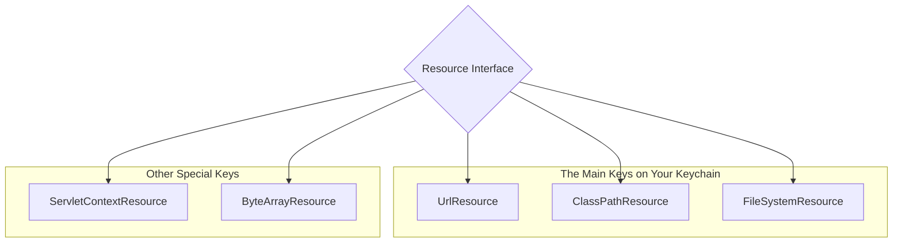

# Built-in Resources: The Keys on Your Keychain 🔑

Mawa, manam `Resource` anedi oka universal key anukunnam. Ippudu, aa keychain lo unna different keys gurinchi matladukundam. Prati key (`Resource` implementation) oka specific type of lock (resource location) ni open cheyadaniki design chesaru.

### Source URL
[https://docs.spring.io/spring-framework/reference/core/resources.html#resources-implementations](https://docs.spring.io/spring-framework/reference/core/resources.html#resources-implementations)

### The Main Keys You'll Use
Spring chala implementations istundi, kani ee moodu manam 95% of the time vadatam:

1.  **`UrlResource`**: The Internet Key 🌐. Idi `java.net.URL` ni wrap chestundi. `http://`, `https://`, `ftp://`, or even `file://` lanti standard URL prefixes unna ഏ-resource ni ayina access chestundi.
2.  **`ClassPathResource`**: The "Inside the Box" Key 📦. Idi mana application classpath nunchi resource ni load chestundi. Ante, mana project `src/main/resources` folder lo or mana dependency `jar` files lo unna files ni access cheyadaniki idi perfect. This is probably the most common one you'll see.
    ```java
    // Looks for my-file.txt in src/main/resources
    Resource resource = new ClassPathResource("my-file.txt");
    ```
3.  **`FileSystemResource`**: The "On My Computer" Key 🖥️. Idi mana computer's file system lo ekkado unna file ni direct ga access cheyadaniki. You need to provide the full or relative path to the file.
    ```java
    // Looks for pom.xml in the project's root directory
    Resource resource = new FileSystemResource("pom.xml");
    ```

**Other Special Keys:**
-   `ServletContextResource`: Web applications lo `WEB-INF` folder lanti places nunchi resource load cheyadaniki.
-   `ByteArrayResource`: Oka byte array ni (memory lo unna data) oka resource la treat cheyadaniki.



### The Magic of Prefixes
Mawa, manam last lesson lo `resourceLoader.getResource("classpath:my-file.txt")` ani use chesam kada. Akkada `classpath:` ane prefix chusi, Spring automatic ga `ClassPathResource` ni create chesindi. `file:` ane prefix chusi, `FileSystemResource` (or `UrlResource` with a file URL) ni create chesindi.

So, manam direct ga `new ClassPathResource(...)` ani rayakapoina, ee prefixes use chesi, Spring ki correct implementation ni select cheyamani chepochu.

---
### Code Reference: Using the Keys Directly
The code for this is in the `io.mawa.spring.core.resources.implementations` package.

1.  **`ResourceImplementationsDemo.java`**: In this standalone Java app, we will directly instantiate `ClassPathResource` and `FileSystemResource` to see how they work. We'll then use the same helper method to print their details, proving they both act as a `Resource`.

### How to Run
Project root `Spring-Project` folder lo undi, ee command run cheyi:
```bash
mvn compile exec:java -Dexec.mainClass="io.mawa.spring.core.resources.implementations.ResourceImplementationsDemo"
```
**Expected Output:**
```
--- 1. Directly creating a ClassPathResource ---
Implementation Class  : ClassPathResource
Resource exists?      : true
Description           : class path resource [my-resource.txt]

--- Reading content ---
Hello from a classpath resource!
This file is used to demonstrate Spring's Resource interface.


--- 2. Directly creating a FileSystemResource ---
Implementation Class  : FileSystemResource
Resource exists?      : true
Description           : file [pom.xml]
```
Chusava! Manam different "key" classes (`ClassPathResource`, `FileSystemResource`) ni create chesina, avi rendu oke "universal key" (`Resource`) interface la pani chesayi.

Next, we will learn about the `ResourceLoader`, the "key maker" who gives us these resources. Ready aa? 🔥
