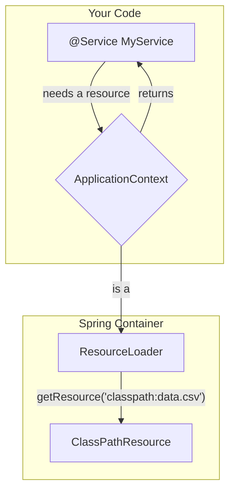

# The ResourceLoader: The "Key Maker" 🔑🏭

Mawa, manam last two lessons lo `Resource` objects ni create chesam. First time `DefaultResourceLoader` use chesam, second time `new ClassPathResource(...)` ani direct ga create chesam.

Kani, real Spring applications lo, manam ee pani cheyam. Manaki ee "keys" ni create chesi icche oka powerful "Key Maker" unnadu. Ade `ResourceLoader`.

### Source URL
[https://docs.spring.io/spring-framework/reference/core/resources.html#resources-resourceloader](https://docs.spring.io/spring-framework/reference/core/resources.html#resources-resourceloader)

### The Key Maker Analogy
Imagine nuvvu oka Locksmith (`ResourceLoader`) daggarki vellav.
-   **You:** "Naaku `classpath:my-config.xml` ane address ki key kavali."
-   **Locksmith:** "Oh, `classpath:` aa? Aithe idiగో, a special Classpath Key (`ClassPathResource`)."
-   **You:** "Naaku `file:///home/mawa/secret.txt` ane address ki key kavali."
-   **Locksmith:** "Oh, `file:` aa? Aithe idiగో, a File System Key (`FileSystemResource`)."

The `ResourceLoader` is a factory that takes a `String` path and gives you the correct `Resource` object. Its main method is simple:
`Resource getResource(String location)`

### The Biggest Secret: The `ApplicationContext` IS the Key Maker!
Mawa, idi chala important point. **Every Spring `ApplicationContext` is also a `ResourceLoader`**. Ante, mana Spring container eh mana key maker!

Manam separate ga `DefaultResourceLoader` create cheyanakkarledu. Manam direct ga mana `ApplicationContext` nunchi resources ni adagochu.

### Example in Action 🎬
In any of your Spring beans (`@Component`, `@Service`, etc.), you can just autowire the `ApplicationContext` and use it to get resources.

```java
@Component
public class MyDemoBean implements CommandLineRunner {

    // The ApplicationContext itself is the ResourceLoader!
    @Autowired
    private ApplicationContext context;

    @Override
    public void run(String... args) throws Exception {
        // Use the context to get a resource
        Resource resource = context.getResource("classpath:my-resource.txt");

        System.out.println("Resource exists: " + resource.exists());
    }
}
```



**How it behaves depends on the Context type:**
-   If you use `ClassPathXmlApplicationContext` and ask for `getResource("data.xml")` (no prefix), it will give you a `ClassPathResource`.
-   If you use `FileSystemXmlApplicationContext` and ask for `getResource("data.xml")`, it will give you a `FileSystemResource`.

But if you use a prefix like `classpath:` or `file:`, it will **always** give you the correct type, no matter what context you are in. Prefixes are king! 👑

---
### Code Reference: The Container as the Key Maker
The code for this is in the `io.mawa.spring.core.resources.resourceloader` package.

1.  **`ResourceLoaderApp.java`**: A standard `@SpringBootApplication` class to start the context.
2.  **`ResourceLoaderDemo.java`**: This `@Component` implements `CommandLineRunner`. It autowires the `ApplicationContext` and uses it to load `my-resource.txt` to prove that the context is a `ResourceLoader`.

### How to Run
Project root `Spring-Project` folder lo undi, ee command run cheyi:
```bash
# Note: For this to work, we need spring-boot-starter as a dependency in our pom.xml
# I have already added it.
mvn compile exec:java -Dexec.mainClass="io.mawa.spring.core.resources.resourceloader.ResourceLoaderApp"
```
**Expected Output:**
```
--- Demo: Using ApplicationContext as a ResourceLoader ---
Resource loaded using ApplicationContext: my-resource.txt
Resource exists: true

--- Reading content ---
Hello from a classpath resource!
This file is used to demonstrate Spring's Resource interface.
```
Perfect! The `ApplicationContext` itself gave us the resource, just as expected.

Next up, what if we want to load not just one file, but all files that match a pattern, like `**/*.xml`? For that, we need an even more powerful key maker: the `ResourcePatternResolver`. Ready? 🔥
