# ResourcePatternResolver: The "Master Key" Maker 🔑*

Mawa, manam `ResourceLoader` gurinchi chusam. Adi oka address (`String location`) isthe, oka key (`Resource`) istundi. Simple.

Kani, real projects lo, manaki okate file kadu, oka pattern tho match ayye anni files kavalsi vastundi. For example, "Find all files ending with `-context.xml` in any subdirectory".

Ee pani cheyadanike, Spring manaki `ResourcePatternResolver` ane inko powerful interface istundi.

### Source URL
[https://docs.spring.io/spring-framework/reference/core/resources.html#resources-resourcepatternresolver](https://docs.spring.io/spring-framework/reference/core/resources.html#resources-resourcepatternresolver)

### The Master Key Maker Analogy
Imagine `ResourceLoader` anedi oka normal "Key Maker". Nuvvu oka specific house address isthe, aa house key istadu.

`ResourcePatternResolver` anedi oka "Master Key Maker" or a "Detective" 🕵️‍♂️. Nuvvu daaniki oka clue or pattern isthav, for example, "Ee street lo unna anni blue color doors ki keys kavali". Adi vethiki, aa street lo unna anni blue doors ki keys (`Resource[]`) oka bunch ga neeku istundi.

The main method of this interface is:
`Resource[] getResources(String locationPattern)`

### The Wildcard Patterns (The Clues)
Ee pattern lo manam konni special wildcard characters vadatam:
1.  **`?`**: Matches exactly one character. (e.g., `config-?.xml` matches `config-1.xml` but not `config-10.xml`).
2.  **`*`**: Matches zero or more characters within a single path segment (directory or file name). (e.g., `config/*.xml` matches all `.xml` files inside the `config` folder).
3.  **`**`**: Matches zero or more directories. This is the most powerful one. (e.g., `classpath:/**/service.xml` finds `service.xml` in any subdirectory on the classpath).

### The `classpath*:` Prefix: The Ultimate Search
Mawa, idi chala important.
-   `classpath:my-file.xml`: Classpath lo `my-file.xml` dorikina **first place** nunchi load chestundi. Okavela rendu jar files lo ade file unte, only first di matrame vastundi.
-   `classpath*:/my-file.xml`: Classpath lo unna **anni locations** (all JARs, all folders) lo `my-file.xml` kosam vethiki, anni matching files ni return chestundi.

```mermaid
graph LR
    subgraph "Your Clue"
        A["classpath*:META-INF/*.properties"];
    end

    subgraph "ResourcePatternResolver 🕵️‍♂️"
        B{Resolver};
    end

    subgraph "Search Locations"
        C["JAR 1"];
        D["JAR 2"];
        E["src/main/resources"];
    end

    subgraph "Results (Resource[])"
        F["file1.properties"];
        G["file2.properties"];
        H["file3.properties"];
    end

    A --> B;
    B --> C;
    B --> D;
    B --> E;
    C --> F;
    D --> G;
    E --> H;
```



---
### Code Reference: The Resource Detective
The code for this is in the `io.mawa.spring.core.resources.resolver` package.

1.  **Dummy Files**: I have created two dummy files, `src/main/resources/config/service-a.xml` and `src/main/resources/config/sub/service-b.xml`, for our resolver to find.
2.  **`ResolverDemo.java`**: This is a standalone Java app that directly uses the `PathMatchingResourcePatternResolver` to find files matching the pattern `classpath:config/**/*.xml`.

### How to Run
Project root `Spring-Project` folder lo undi, ee command run cheyi:
```bash
mvn compile exec:java -Dexec.mainClass="io.mawa.spring.core.resources.resolver.ResolverDemo"
```
**Expected Output:**
```
--- 1. Finding all XML files in the 'config' directory and its subdirectories ---
Found 2 files:
 - class path resource [config/service-a.xml]
 - class path resource [config/sub/service-b.xml]

--- 2. Finding a specific file ---
Found 1 file:
 - class path resource [config/service-a.xml]
```
Chusava! Mana detective (`ResolverDemo`) `config` folder lo unna anni sub-folders lo vethiki, `**/*.xml` pattern tho match ayina anni files ni pattukundi.

Next, we'll look at the `ResourceLoaderAware` interface, which is another way for our beans to get a `ResourceLoader`. Ready? 💪
