# ResourceLoaderAware: "Key Maker, Give Me Your Number!" 📞

Mawa, manam `ApplicationContext` ni autowire chesi, daanini `ResourceLoader` la use cheyochu ani chusam. There is another, more classic way for a bean to get a reference to the `ResourceLoader`: by implementing the `ResourceLoaderAware` interface.

Ee `Aware` interfaces gurinchi manam already `BeanNameAware` and `ApplicationContextAware` chusinappudu matladukunnam. Idi kuda anthe.

### Source URL
[https://docs.spring.io/spring-framework/reference/core/resources.html#resources-resourceloaderaware](https://docs.spring.io/spring-framework/reference/core/resources.html#resources-resourceloaderaware)

### The "Direct Phone Line" Analogy
Imagine mana bean oka `EventOrganizer`. Daaniki event jarige time lo, sudden ga konni resources (like chairs, tables) kavalsi vastayi.
-   **Autowiring `ApplicationContext`:** Idi `EventOrganizer` ki full company directory ivvadam lantiది. Daanilo `ResourceLoader` department number untundi, adi chusi call cheskovachu.
-   **Implementing `ResourceLoaderAware`:** Idi `EventOrganizer` ki direct ga, "Idiగో, `ResourceLoader` department direct phone number, save chesko" ani ivvadam lantiది. The bean becomes "aware" of the resource loader.

When a bean implements `ResourceLoaderAware`, it must provide the `setResourceLoader(ResourceLoader resourceLoader)` method. Spring container, bean ni initialize chese time lo, ee method ni call chesi, `ResourceLoader` (tanane) pass chestundi.

**The Lifecycle with `ResourceLoaderAware`**

```mermaid
sequenceDiagram
    participant Container as Spring Container 🏭
    participant Bean as Your Aware Bean 🤖

    Container->>+Bean: 1. Constructor() & DI
    Container->>Bean: 2. setResourceLoader() (if ResourceLoaderAware)
    Note right of Bean: Bean now has a reference to the ResourceLoader!
    Container->>Bean: 3. @PostConstruct Method
    Note right of Bean: Bean is now fully initialized! ✨
```

As you can see, this happens *before* `@PostConstruct`, so you can use the loader in your init method.

### `@Autowired` vs. `ResourceLoaderAware`
Mawa, ee rojullo, code ni Spring tho tightly couple cheyakunda undataniki, manam `@Autowired` eh prefer chestam.
```java
// Modern Way
@Autowired
private ResourceLoader resourceLoader;

// Classic Way
public class MyBean implements ResourceLoaderAware {
    private ResourceLoader resourceLoader;

    @Override
    public void setResourceLoader(ResourceLoader resourceLoader) {
        this.resourceLoader = resourceLoader;
    }
}
```
Functionally, rendu same result istayi. But `@Autowired` is cleaner and doesn't require you to implement a Spring-specific interface. It's good to know about `ResourceLoaderAware` because you might see it in older code or some advanced framework integrations.

---
### Code Reference: Getting the Direct Line
The code for this is in the `io.mawa.spring.core.resources.aware` package.

1.  **`MyResourceAwareBean.java`**: This bean implements `ResourceLoaderAware` and uses the injected loader to get a resource.
2.  **`ResourceAwareConfig.java`**: A simple configuration class that defines our bean.
3.  **`ResourceAwareDemoApp.java`**: The main app that demonstrates the process.

### How to Run
Project root `Spring-Project` folder lo undi, ee command run cheyi:
```bash
mvn compile exec:java -Dexec.mainClass="io.mawa.spring.core.resources.aware.ResourceAwareDemoApp"
```
**Expected Output:**
```
--- Starting the Spring Container ---
setResourceLoader() called. The container gave me its direct number!

--- Container started. Now retrieving the bean... ---

--- Asking the bean to use its ResourceLoader ---
Using the injected ResourceLoader to get a resource...
Found resource: my-resource.txt
Resource exists: true

--- Demo Complete ---
```
Chusava! Container start ayye process lo, mana bean `setResourceLoader` method ni call chesi, `ResourceLoader` ni ichesindi.

Ok, mawa. We have one final, and very common, topic left in this chapter: How to inject a `Resource` directly into a bean as a dependency. Let's finish strong! 💪
