# App Contexts & Resource Paths: The Postman of Spring! 📮

Mawa, manam `Resource` ane universal key gurinchi nerchukunnam. Kani aa key ni use chesi resource ni load chesedi evaru? Mana `ApplicationContext` eh! Ee topic lo, manam Spring container lopaliki velli, adi resource paths ni ela handle chestundo chuddam. Idi konchem advanced, kani idi ardam aithe, nuvvu resource loading lo pro aipothav! 💪

### Source URL
[https://docs.spring.io/spring-framework/reference/core/resources.html#resources-app-ctx](https://docs.spring.io/spring-framework/reference/core/resources.html#resources-app-ctx)

### Why it Matters
Mawa, idi interview lo adagadaniki chala chance unna "expert-level" question. "How does `ClassPathXmlApplicationContext` resolve a path vs. `FileSystemXmlApplicationContext`?" ani adigithe, ee knowledge ne ninnu migatha valla kante mundu nilabedtundi. Spring Boot lanti frameworks "under-the-hood" ela pani chestayo ardam cheskovadaniki kuda idi foundation. So, let's become a master postman! 🚀

---

### The Postman Analogy 💌

Imagine Spring `ApplicationContext` anedi oka **Postman**.
*   **`FileSystemXmlApplicationContext`**: Eeyana oka city lo pani chese real-world postman. 🏙️
*   **`ClassPathXmlApplicationContext`**: Eeyana oka pedda software company internal mailroom lo pani chese postman. 🏢

Ippudu, manam vaallaki address (resource path) istham.

1.  **Local Address (No Prefix):** Nuvvu postman ki just `"data.xml"` ani isthe, `FileSystem` postman emo daanini current working directory lo vethukutadu. `ClassPath` postman emo daanini classpath (mana project's compiled folders/jars) lo vethukutadu. Prati postman ki valla default area lo ela vethakalo telusu.
2.  **Full Address (With Prefix):** Nuvvu `"classpath:data.xml"` or `"file:///data/config.xml"` ani isthe, adi full address with pincode ichinattu. Ippudu area tho sambandam ledu, * ఏ* postman ayina aa address ni correct ga deliver cheyagaladu. The prefix overrides the default behavior!

```mermaid
graph TD
    subgraph "ApplicationContext (The Postman 📮)"
        A["String Path: 'data.xml'"] --> B{Prefix unda?};
        B -- "No Prefix 🤷" --> C{Context Type Enti?};
        C -- "FileSystemContext" --> D[Load as FileSystemResource];
        C -- "ClassPathContext" --> E[Load as ClassPathResource];

        F["String Path: 'classpath:data.xml'"] --> G{Prefix unda?};
        G -- "Yes! 'classpath:' ✨" --> H[Load as ClassPathResource];
    end
```



---

### The Rules of Resource Loading

#### 1. The Default Rule: Context is King 👑
Mana postman analogy prakaram, nuvvu prefix ivvakapothe, context type batti resource type decide avutundi.

*   **`FileSystemXmlApplicationContext`**
    ```java
    // Ee context "conf/beans.xml" ni file system lo vethukutundi
    ApplicationContext ctx = new FileSystemXmlApplicationContext("conf/beans.xml");
    ```
*   **`ClassPathXmlApplicationContext`**
    ```java
    // Ee context "conf/beans.xml" ni classpath lo vethukutundi
    ApplicationContext ctx = new ClassPathXmlApplicationContext("conf/beans.xml");
    ```

#### 2. The Override Rule: Prefix is the Boss 😎
Nuvvu `classpath:`, `file:`, or `https:` lanti prefix isthe, adi context default ni override chestundi.

```java
// Manam FileSystem context vadutunna kuda,
// ee prefix valla, adi bean definitions ni CLASSPATH nunchi load chestundi!
ApplicationContext ctx = new FileSystemXmlApplicationContext("classpath:conf/beans.xml");
```
Idi chala powerful mawa! Ante, nee context type tho sambandam lekunda, neeku kavalasina chota nunchi resource ni load cheyochu.

#### 3. The Wildcard Power-Up: The `*` and `**` Jokers 🃏
Spring Ant-style patterns ni support chestundi. Ante mana paths lo wildcards vadukovachu.

*   `*`: Matches zero or more characters in a *single* path segment. (e.g., `*-context.xml` matches `services-context.xml` and `data-context.xml`).
*   `**`: Matches zero or more *directories* in a path. (e.g., `com/mycompany/**/applicationContext.xml` matches any `applicationContext.xml` inside any sub-directory of `com/mycompany/`).

**Example:**
```java
// Ee line `com/mawa` loni anni sub-folders lo unna `-beans.xml` files ni load chestundi
ApplicationContext ctx = new ClassPathXmlApplicationContext("classpath:com/mawa/**/*-beans.xml");
```

#### 4. The SUPER Wildcard: `classpath*:` (The Broadcast Message 📢)
Idi chala important interview topic. `classpath:` vs `classpath*:`

*   `classpath:conf/beans.xml`: Classpath lo `conf/beans.xml` kosam vethiki, **first dorikina daanini** teeskuntundi. Okavela nee project lo rendu JARs lo ade path unte, okati matrame vastundi.
*   `classpath*:/conf/beans.xml`: Classpath lo unna **anni JARs and folders** lo vethiki, `conf/beans.xml` ane peru tho unna *anni* files ni teeskuni, vaatini kalipi (merge) load chestundi!

**Why is this a SUPER power?**
Imagine nee project chala modules (JARs) ga undi. Prati module ki daani `module-beans.xml` undi anuko. Nuvvu main application lo simple ga `classpath*:META-INF/module-beans.xml` ani isthe chalu, Spring automatic ga anni modules nunchi configuration ni pick cheskuntundi. Application assembly ki idi oka super weapon! ⚔️

---

### A Small Warning: The `FileSystemResource` Caveat ⚠️
Mawa, oka chinna "gotcha" undi. Backwards compatibility kosam, `FileSystemXmlApplicationContext` anedi absolute paths (`/conf/context.xml`) ni kuda relative paths ga ne treat chestundi. Idi konchem confusing ga undochu.

> **Pro Tip:** Eppudu confusion voddu anukunte, absolute file paths kosam eppudu `file:///` prefix vadu. Example: `ctx.getResource("file:///some/resource/path/myTemplate.txt")`. Appudu adi eppudu correct ga ne work avutundi.

---
<br>

**Cliffhanger:**
Mawa, you're now a certified Spring Postmaster, able to find any file, anywhere! 💌 But what good is a file if the data inside is junk? In the next chapter, we become detectives 🕵️‍♂️ and learn how Spring validates data, binds it to our objects, and converts it between types. Get ready, the real data-magic is about to begin!
