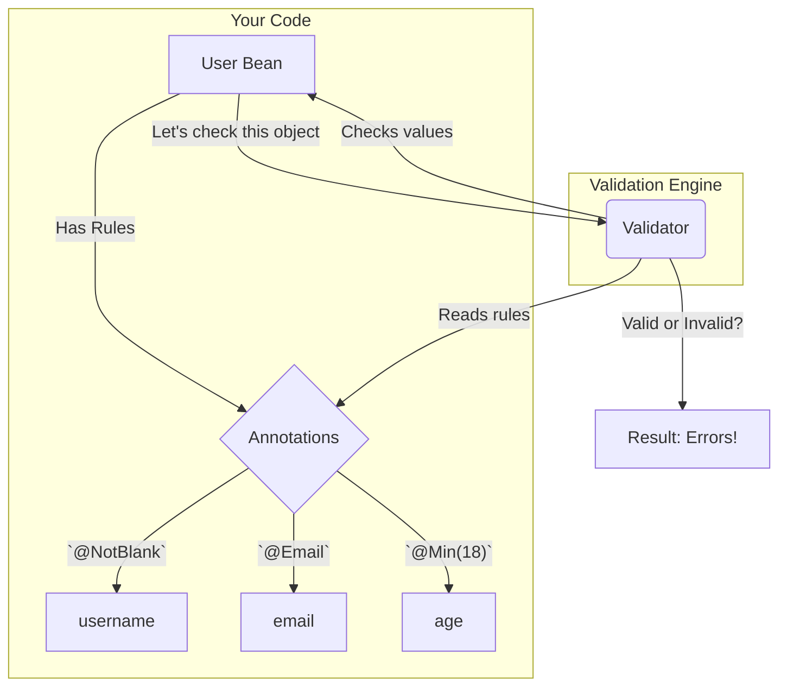

# 02. Java Bean Validation (The Universal Standard)

Mawa, last time we discussed needing a bouncer for our application. Now, the question is, what kind of rules should our bouncer follow? Luckily, there's a universal standard that almost everyone in the Java world agrees on. Welcome to Java Bean Validation!

## The Traffic Signs Analogy 🚦

Imagine you're driving in a new country. You might not speak the language, but you still understand what a red octagonal "STOP" sign means. Why? Because it's a universal standard.

**Java Bean Validation annotations (`@NotNull`, `@Size`, etc.) are the traffic signs of programming.**

*   They are part of a standard specification (JSR-380).
*   You can use them in any modern Java framework (Spring, Quarkus, etc.), and they will work the same way.
*   This makes your code more portable and easier for other developers to understand. Spring integrates with this standard seamlessly.

## The "Must-Know" Annotations

For 90% of your validation needs, these standard annotations are all you need. Let's look at the most important ones.

*   `@NotNull`: The field cannot be null. It can be empty, though!
    *   `@NotNull String name;` // `name = null` is invalid, but `name = ""` is valid.
*   `@NotEmpty`: The field cannot be null AND its size/length must be greater than 0.
    *   `@NotEmpty String name;` // `name = null` and `name = ""` are both invalid.
*   `@NotBlank`: The field cannot be null AND must contain at least one non-whitespace character. This is often the most useful one for Strings.
    *   `@NotBlank String name;` // `null`, `""`, and `"   "` are all invalid.
*   `@Size(min=, max=)`: Checks if a String, Collection, Map, or array's size is within a certain range.
    *   `@Size(min = 2, max = 30) String username;`
*   `@Min(value)`: For numbers. The value must be greater than or equal to the specified minimum.
    *   `@Min(18) int age;`
*   `@Max(value)`: For numbers. The value must be less than or equal to the specified maximum.
    *   `@Max(100) int level;`
*   `@Email`: Checks if a String is a well-formed email address.
    *   `@Email String userEmail;`
*   `@Pattern(regexp=)`: For when you need the ultimate power of a regular expression.
    *   `@Pattern(regexp = "[a-zA-Z0-9]+") String username;`

## How it Works: A Visual

Here’s a simple diagram showing how we apply these annotations to a bean. The validator then checks the bean against these rules.



## The Dependency You Need 📦

To use these annotations, you need to add the `spring-boot-starter-validation` dependency to your `pom.xml`. This brings in all the necessary libraries, including Hibernate Validator, which is the reference implementation of the Bean Validation spec.

```xml
<dependency>
    <groupId>org.springframework.boot</groupId>
    <artifactId>spring-boot-starter-validation</artifactId>
</dependency>
```

***

### Mawa's Cliffhanger 🧗

These standard annotations are amazing for checking single fields. But what if you have a rule that involves *multiple* fields? For example, "The 'confirmPassword' field must match the 'password' field." 🤷‍♂️ A simple annotation can't do that. For that, we need to call in a specialist. In our next topic, we'll learn how to write our own custom detective with Spring's `Validator` interface!
