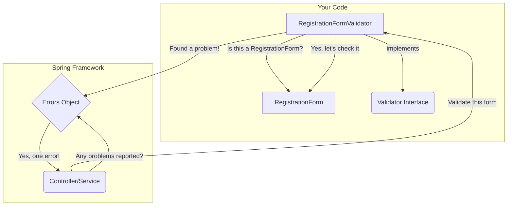

# 03. Custom Validation with Spring's `Validator` Interface

Mawa, last time we saw how to use standard "traffic sign" annotations for simple rules. But what happens when the rules get complicated? What if you need to check if two fields are related to each other? For that, we need to call in a specialist. 🕵️‍♂️

## The Specialist Detective Analogy 🕵️‍♂️

Think of the standard annotations as your regular security guards. They can check simple things like an ID card (`@NotNull`) or age (`@Min(18)`).

But what if you have a complex case? For example: **"The password and confirm password fields must match."**

A simple `@NotBlank` on each field can't solve this. They don't know about each other! For this, you need a **specialist detective** who can look at the *whole picture* (the entire object) and apply complex business rules.

**Spring's `Validator` interface lets you create that specialist detective.**

## Building Your Custom Validator

To create your own validator, you just need to implement the `Validator` interface. It has two simple methods:

1.  `supports(Class<?> clazz)`:
    *   **Analogy:** The detective first asks, "Am I the right person for this case?"
    *   This method is where your validator tells Spring which classes it's designed to validate. For example, a `RegistrationFormValidator` should only validate `RegistrationForm` objects.
    *   You simply return `true` if the class matches, `false` otherwise.

2.  `validate(Object target, Errors errors)`:
    *   **Analogy:** This is where the actual detective work happens! 🕵️‍♀️
    *   `target`: This is the object you need to validate (e.g., your `RegistrationForm` instance).
    *   `errors`: This is a crucial object. It's like the detective's notebook. If you find something wrong, you don't throw an exception; you record the problem in the `errors` notebook.

## The `Errors` Object: Your Detective's Notebook 📓

The `errors` object is where you report your findings. The two most common methods you'll use are:

*   `rejectValue(String field, String errorCode, String defaultMessage)`:
    *   Use this when a **specific field** is invalid.
    *   `field`: The name of the property that has an error (e.g., `"confirmPassword"`).
    *   `errorCode`: A short code for the error (e.g., `"password.mismatch"`). We'll use this later to show pretty messages!
    *   `defaultMessage`: A fallback message if the error code can't be found.

*   `reject(String errorCode, String defaultMessage)`:
    *   Use this for a **global error** that isn't tied to a single field, but to the object as a whole.

## How it Works: A Visual

Here's how a custom validator fits into the process.

This approach gives you complete control to implement any validation logic you can imagine, no matter how complex!

***

### Mawa's Cliffhanger 🧗

Okay, so we've built our super-smart detective. But how do we tell Spring to actually *use* it? How does the data from a user request get neatly packaged up and handed over to our validator for inspection? For that, we need to meet the detective's diligent assistant: the `DataBinder`. Next up, we'll see how it all connects! ✨
