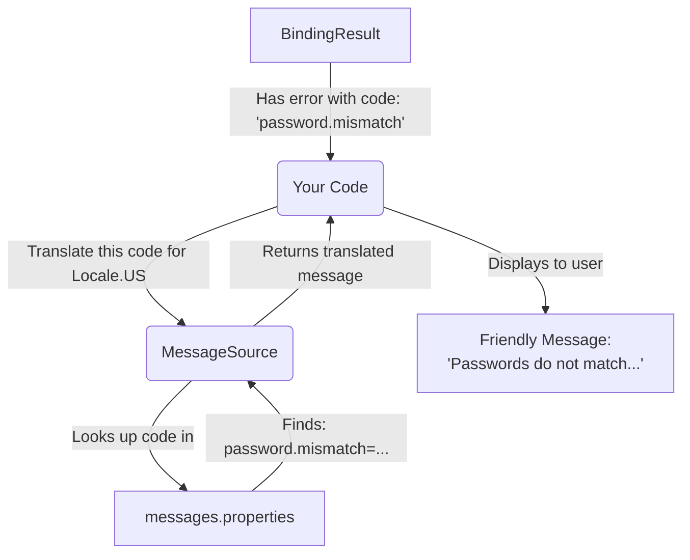

# 05. Turning Error Codes into Readable Messages

Mawa, our validation system is working great! The `DataBinder` assistant fills the form, and the `Validator` detective finds the problems. But there's one issue... when the detective reports a problem, he uses a secret code like `password.mismatch`.

This is great for us developers, but it's useless for the end-user. We need a way to translate these codes into friendly, human-readable messages.

## The Secret Decoder Ring Analogy 💍

Imagine you're a spy, and you receive a coded message: "The eagle has landed." This means nothing to a normal person. But you have a **secret decoder ring** (`MessageSource`) that tells you this code actually means "The package has been delivered."

**Spring's `MessageSource` interface is your application's secret decoder ring.**

*   It takes an error code (like `password.mismatch`).
*   It takes a `Locale` (so you can have messages in different languages like English, Telugu, or Japanese!).
*   It looks up the code in a properties file (like `messages.properties`) and returns the real, human-readable message.

## How to Set Up Your Messages

The most common way to provide messages is by creating a `messages.properties` file in your `src/main/resources` folder.

It's a simple key-value file:
```properties
# Our custom validation messages
password.mismatch=Passwords do not match, please try again!
password.empty=A password is required to secure your account.
```

If you wanted to support Telugu, you could create a `messages_te.properties` file!
```properties
password.mismatch=మీ పాస్‌వర్డ్‌లు సరిపోలడం లేదు, దయచేసి మళ్లీ ప్రయత్నించండి!
```

## Connecting the `MessageSource`

In a full Spring Boot application, if you have a `messages.properties` file, Spring automatically-configures a `MessageSource` bean for you. You can just `@Autowired` it and use it.

Programmatically, you can create one yourself, usually a `ResourceBundleMessageSource`, and tell it where to find your message files.

Here's the flow:



This makes your application professional and user-friendly. It separates your validation logic from your presentation (the messages), which is a great design principle.

***

### Mawa's Cliffhanger 🧗

We've mastered validation and error messages. But what about the data itself? What if a user enters "1,000.00" for a price, but your Java `double` field can't handle the comma? Or they enter a date as "25/12/2024"? The `DataBinder` will fail! How do we teach Spring to understand these special formats? Up next, we'll dive into the world of Type Conversion and Field Formatting!
