# Application Events: Broadcasting Your Own News* 📢

Mawa, manam ippati varaku beans okati danitho okati direct ga matladukovadam chusam (`service.callRepository()`). Kani, okavela oka component lo oka pani jariginappudu, vere chala components ki aa vishayam teliyali, kani vaallaki okari gurinchi okariki direct ga teliyakudadu anuko.

For example, a user places an order. Ee event jaraganagane:
-   `InventoryService` must update the stock.
-   `NotificationService` must send an email.
-   `ShippingService` must prepare a shipment.

`OrderService` ki ee mugguru gurinchi teliyalsina avasaram ledu. It just needs to shout, "Hey, an order has been placed!" and anyone who cares can listen. This is called **decoupling**, and Spring's event model helps us achieve this beautifully.

\* **(Very important for building clean, maintainable, and reactive microservices.)**

### Source URL
[https://docs.spring.io/spring-framework/reference/core/beans/context-introduction.html#context-functionality-events](https://docs.spring.io/spring-framework/reference/core/beans/context-introduction.html#context-functionality-events)

### The Radio Station Analogy 📻
Imagine your application is a city.
-   **An Event (`ApplicationEvent`):** A news bulletin, like "Heavy rain expected today!" 🌧️.
-   **The Publisher (`ApplicationEventPublisher`):** The Radio Station DJ 🎙️. Their only job is to broadcast the news. They don't know or care who is listening at home.
-   **The Listeners (`@EventListener`):**
    -   An **Office Goer** listens and decides to take an umbrella ☂️.
    -   A **Farmer** listens and feels happy for their crops 🌱.
    -   A **School Kid** listens and hopes for a holiday 🎉.

The DJ just broadcasts. The listeners, who are interested in that specific news, react accordingly. They are all **decoupled**. The DJ doesn't need to call each person individually.

### The Three Components of Spring Events
1.  **The Event:** A simple Java object (POJO) that represents what happened. You can create any custom event class you want.
2.  **The Publisher:** Any bean can become a publisher by injecting the `ApplicationEventPublisher`. To publish an event, you just call `publisher.publishEvent(myEventObject)`.
3.  **The Listener:** Any method in a Spring bean can become a listener by annotating it with `@EventListener`. The type of the method's parameter determines which event it listens for.

```mermaid
sequenceDiagram
    participant Publisher as Publisher Bean 🎙️
    participant Context as ApplicationContext (Event Bus)
    participant ListenerA as Listener A (e.g., Billing)
    participant ListenerB as Listener B (e.g., Notifications)

    Publisher->>Context: 1. publisher.publishEvent(myEvent)
    Note over Publisher,ListenerB: Publisher doesn't know who is listening!

    Context->>+ListenerA: 2. handleEvent(myEvent)
    ListenerA-->>-Context:

    Context->>+ListenerB: 3. handleEvent(myEvent)
    ListenerB-->>-Context:
```



---
### Code Reference: The Hospital Discharge System
The code for this is in the `io.mawa.spring.core.context.events` package.

1.  **`PatientDischargedEvent.java`**: Our custom event POJO.
2.  **`HospitalService.java`**: The publisher bean that injects `ApplicationEventPublisher`.
3.  **`BillingService.java`**: The first listener bean with an `@EventListener` method.
4.  **`NotificationService.java`**: The second listener bean, also with an `@EventListener` method.
5.  **`EventConfig.java`**: A configuration class that just enables component scanning.
6.  **`EventDemoApp.java`**: The main application that gets the publisher and triggers the event.

### How to Run
Project root `Spring-Project` folder lo undi, ee command run cheyi:
```bash
mvn compile exec:java -Dexec.mainClass="io.mawa.spring.core.context.events.EventDemoApp"
```
**Expected Output:**
```
--- Starting the Spring Container ---
--- Container started successfully! ---

--- Getting the HospitalService and discharging a patient ---
Discharging patient: Mawa
Broadcasting PatientDischargedEvent... 📢
BillingService received an event. Generating final bill for patient: Mawa 🧾
NotificationService received an event. Sending discharge notification for: Mawa ✉️
Discharge process complete in HospitalService.

--- Demo Complete ---
```
Chusava! `HospitalService` ki `BillingService` or `NotificationService` gurinchi emi teliyadu. Adi just event ni publish chesindi. Interested listeners automatic ga aa event ni receive cheskuni, valla pani chesayi. This is a super clean and powerful way to design your application!

We're almost at the end of the Core Container topics. Just a few advanced, specialized topics left. Ready? 💪
