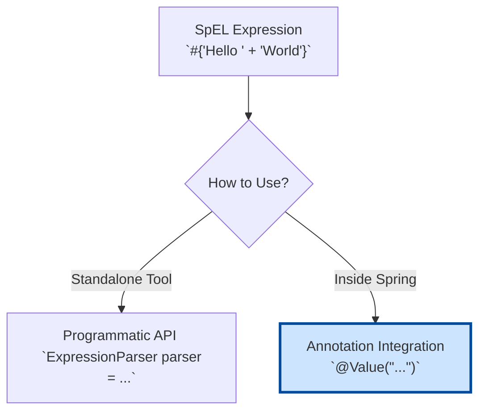

# 01. Introduction to Spring Expression Language (SpEL)

Mawa, welcome to one of Spring's most powerful and flexible features: the Spring Expression Language, or **SpEL**. Idi oka separate programming language laantidi, kani idi mana Java code lopale untundi. Deenitho manam runtime lo objects tho matladachu, daani properties ni chadavachu, methods ni call cheyochu, inka chala operations cheyochu.

### Source URL
[https://docs.spring.io/spring-framework/reference/core/expressions.html](https://docs.spring.io/spring-framework/reference/core/expressions.html)

## Asal SpEL Enduku? (Why SpEL?)

SpEL anedi Spring community kosam create chesina oka standard expression language. Deeni main goal entante, XML or Annotation-based configuration lo, konchem dynamic logic rayadaniki oka easy way ivvadam.

For example, oka bean property ni inkoka bean property value tho set cheyalante, SpEL lekapothe chala complex code rayali. Kani SpEL tho, adi oka simple expression tho cheyochu.

## The Two Main Ways to Use SpEL

SpEL ni manam rendu main ways lo use cheyochu:

1.  **Programmatic API:**
    *   Idi SpEL ni oka standalone tool ga use cheyadam. Manam direct ga Java code lo SpEL parser ni create chesi, expressions ni evaluate cheyochu.
    *   Idi SpEL ela pani chestundo "under-the-hood" ardam cheskovadaniki chala useful. We'll see this in the next topic.

2.  **Integration with Spring (`@Value`):**
    *   This is the **most important and common use case**. 95% of the time, nuvvu SpEL ni ilane vadatav.
    *   Manam `@Value` lanti annotations lo expressions ni direct ga rasi, Spring container ki dynamic ga values ni inject cheyamani chepochu.
    *   For example, inkoka bean method result ni, or oka system property ni, or oka calculation result ni direct ga oka variable ki assign cheyochu.

## Why is this Chapter a Game-Changer? 🧠

Mawa, SpEL is a pro-level tool. Idi neeku complex configuration scenarios ni chala elegant ga solve cheyadaniki help chestundi. Interview lo, `@Value` tho SpEL expressions ela vadutaro explain cheste, nee knowledge depth ardam avutundi. It shows you think beyond simple property injection.

Ee chapter lo manam SpEL ni ground-up nunchi nerchukundam, from basic API calls to advanced collection manipulation.

***

### Mawa's Cliffhanger 🧗

Okay, SpEL anedi entha powerful o manaki ippudu oka idea vachindi. Kani asalu, mana Java code lo, ee expression strings ni parse chesi, result icche aa core components evi? Next topic lo, manam SpEL "spellbook" ni open chesi, daani core API gurinchi nerchukundam. Let's go!
