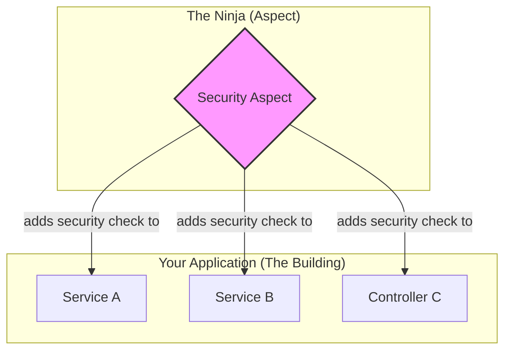

# AOP Introduction: The Art of Invisibility Cloaks! 🧥✨

Mawa, manam ippudu oka pedda, powerful concept loki enter avutunnam: **Aspect-Oriented Programming (AOP)**. Idi OOP (Object-Oriented Programming) ki friend lantiది, kani idi problems ni chuse angle veru.

### Source URL
[https://docs.spring.io/spring-framework/reference/core/aop.html](https://docs.spring.io/spring-framework/reference/core/aop.html)

### Why it Matters
Mawa, idi oka game-changer. Real-world applications lo, konni panulu (concerns) antha application lo repeat avutayi. For example:
-   **Logging:** Prati important method ki enter ayye mundu, exit ayye mundu log cheyadam.
-   **Security:** Ee method ni call chese mundu, user ki permission unda, leda ani check cheyadam.
-   **Transactions:** Database operations start chese mundu transaction begin cheyadam, aipoyaka commit or rollback cheyadam.

Ee code ni prati chota rayadam chala boring and messy. Okavela logging format maristhe? Anni chotla marchali! 😭

AOP ee problem ni solve chestundi. It lets you take these **cross-cutting concerns** and put them in one central place (an "Aspect"). Spring tarvata, ee logic ni automatic ga, mana main business logic ni disturb cheyakunda, correct places lo "weave" (kuttadam) chestundi.

> In short: AOP lets you add extra powers (like logging, security) to your existing code **without touching it**. It's like wearing an invisibility cloak that gives you superpowers!

### The Ninja Analogy 🥷
Imagine your main application code anedi oka pedda building with many rooms (`Services`, `Controllers`).
-   **Your Business Logic:** The main work happening inside each room.
-   **Cross-Cutting Concern (e.g., Security):** The need to have a security camera in *every* room.
-   **The Bad Way (No AOP):** Nuvvu prati room loki velli, manual ga oka security camera ni install cheyadam. Chala pani.
-   **The AOP Way:** Nuvvu oka **Ninja** (`Aspect`) ni hire chestav. Nuvvu ninja ki cheptav, "Prati room door open avvagane (`Pointcut`), nuvvu secret ga lopaliki velli, oka camera (`Advice`) pettey." The ninja does this for all rooms without anyone even noticing.

### How Spring Does It
Spring AOP, ee "weaving" panini, runtime lo **proxies** create cheyadam dwara chestundi. It doesn't modify your actual `.class` files. Idi manam mundu chusina proxy concepts ki chala similar.

Spring lo AOP ki rendu main styles unnayi:
1.  **`@AspectJ` support:** Modern, annotation-based style. Manam ekkuva ide vadatam.
2.  **Schema-based support:** Old, XML-based style.

Ee chapter lo manam ee rendu styles gurinchi nerchukuntam.

### Mawa's Cliffhanger 🧗
Okay, manaki ippudu AOP ante ento oka high-level idea vachindi. Kani ee AOP prapancham lo konni kotha, magic-lanti perlu unnayi: `Aspect`, `Join Point`, `Advice`, `Pointcut`. Veeti ardam enti? Next topic lo, manam AOP dictionary ni open chesi, ee core concepts ni decode cheddam. Ready to learn the secret language of the ninjas? 🥷📜
