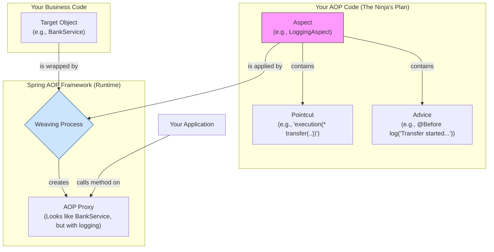

# AOP Concepts: The Ninja's Secret Language 🥷📜

Mawa, manam AOP anedi oka ninja lantiది anukunnam. Ippudu, aa ninja mission report lo unde secret words ni decode cheddam. Ee terminology ardam aithe, AOP meeda neeku full clarity vastundi.

### Source URL
[https://docs.spring.io/spring-framework/reference/core/aop/introduction-defn.html](https://docs.spring.io/spring-framework/reference/core/aop/introduction-defn.html)

### The Core AOP Terminology

Ee terms anni Spring-specific kaadu, ivi general AOP terminology. Spring kuda ide vadutundi so that it's standard.

1.  **Aspect (The Ninja's Master Plan 📜):**
    *   Idi mana cross-cutting concern yokka modularization. Simple ga cheppali ante, idi oka class, daantlo manam `Advice` and `Pointcuts` ni kalipi pedatam.
    *   **Analogy:** The ninja's entire mission plan. Ekkada attack cheyali (`Pointcut`), em cheyali (`Advice`) anedi antha ee plan lo untundi.

2.  **Join Point (A Moment in Time ⏳):**
    *   Idi program execution lo oka specific point. For example, a method call or an exception being thrown.
    *   **Analogy:** A moment where the ninja *could* act. A guard walking past a corner, a door opening, a window being unlatched.
    *   **In Spring AOP, a join point is *always* a method execution.**

3.  **Advice (The Action 💥):**
    *   The actual action taken by the aspect at a join point.
    *   **Analogy:** The action the ninja takes at the right moment. Throwing a smoke bomb, placing a camera, or silently taking down a guard.
    *   **Types of Advice (The Ninja's Moves):**
        *   **`Before`**: Method execute avvaka mundu. (Ninja checks the lock *before* opening the door).
        *   **`After Returning`**: Method successfully execute ayyi, result return chesaka. (Ninja places a tracking device *after* the target leaves the room).
        *   **`After Throwing`**: Method oka exception throw cheste. (Ninja sounds an alarm *if* the door is trapped).
        *   **`After (Finally)`**: Method ela exit ayina (success or error), eppudu execute avutundi. (Ninja cleans up his footprints *regardless* of what happened).
        *   **`Around`**: The most powerful one. It surrounds the method call. It can decide whether to even proceed with the original method call or not. (Ninja can decide to open the door himself, or just pretend to open it and report back).

4.  **Pointcut (The Mission Target 🎯):**
    *   Idi oka predicate or expression that matches join points. It tells the advice *where* to execute.
    *   **Analogy:** The ninja's specific mission order: "Attack only the guards on the third floor, who are carrying a red key." (`execution(* com.mawa.service.SecurityService.openVault(..))`).

5.  **Target Object (The Unsuspecting Victim 👨‍💼):**
    *   The original object that is being "advised" by the aspect. Mana business logic unna normal bean.

6.  **AOP Proxy (The Doppelgänger 🎭):**
    *   Spring AOP, original target object ni direct ga ivvakunda, daani lanti inkoka object ni create chestundi. Ide AOP Proxy. Ee proxy lo original logic tho paatu, aspect logic (advice) kuda untundi.
    *   Your application code talks to this proxy, not the real object.

7.  **Weaving (The Magic Stitch 🧵):**
    *   The process of linking the aspect with the target object to create the final proxied object. Spring AOP does this at **runtime**.

### The Big Picture: How It All Connects

### Mawa's Cliffhanger 🧗
Okay, ippudu manaki AOP dictionary lo unna anni padalu telusu. We know the theory. Kani Spring ee AOP ni enduku use chestundi? Daani goals enti? And asalu ee AOP proxies (JDK vs CGLIB) venaka unna rahasyam enti? Next topic lo, manam Spring AOP yokka capabilities and goals ni explore cheddam!
