# 2. @AspectJ Support: Spring ki Cheppadam, 'AOP Ready!' ✅

Mawa, manam AOP concepts gurinchi nerchukunnam. Super! Ippudu manam mana Spring application ki, "Hey, nenu AOP vadalanukuntunnanu, nuvvu ready ga undu!" ani cheppali. Idi intlo main power switch on chesinattu. Ee switch on cheste gani, mana AOP "appliances" (Aspects) pani cheyavu.

Ee pani cheyadaniki, Spring manaki oka simple and powerful annotation ichindi.

## The Magic Annotation: `@EnableAspectJAutoProxy` 🪄

AOP ni enable cheyadaniki, manam just ee okka annotation ni mana configuration class meeda pettali: `@EnableAspectJAutoProxy`.

**Adi em chestundi?**
Ee annotation ni chudagane, Spring container active avutundi. Adi mana project lo `@Aspect` annotation unna beans kosam vethukutundi. Okavela alanti beans kanipisthe, Spring automatic ga vaati kosam AOP proxies ni create chesi, weaving process ni start chestundi. Basically, it brings our AOP world to life!

```mermaid
graph TD
    A["@Configuration Class"] -- "Manam add chestam" --> B["@EnableAspectJAutoProxy"];
    B -- "Activates" --> C{Spring's Auto-Proxy System};
    C -- "Scans for" --> D["@Aspect Beans"];
    D -- "If found" --> E["Creates AOP Proxy ✨"];
    E -- "Wraps" --> F[Target Bean];
```



### Where to Put It?

Ee `@EnableAspectJAutoProxy` annotation ni manam oka `@Configuration` class meeda pettali. Manam project lo oka separate `AopConfig.java` file create chesi, daanilo pedadam. This keeps our configuration clean.

```java
// In Spring-Project/src/main/java/io/mawa/spring/core/aop/AopConfig.java
package io.mawa.spring.core.aop;

import org.springframework.context.annotation.Configuration;
import org.springframework.context.annotation.EnableAspectJAutoProxy;

@Configuration
@EnableAspectJAutoProxy
public class AopConfig {
    // Inthe, mawa! Just ee class create chesi,
    // ee annotation pedithe chalu.
    // Spring will take care of the rest.
}
```

### A Very Important Note for Spring Boot Users 🤫

Mawa, idi oka important point. Manam `pom.xml` lo `spring-boot-starter-aop` dependency add chesam kada?

> **Spring Boot is very smart!** ❤️ Adi `spring-boot-starter-aop` ni classpath lo chudagane, adhe automatic ga AOP support ni enable chesestundi. Ante, manam ee `@EnableAspectJAutoProxy` annotation ni pettakapoina, AOP pani chestundi.

Mari manam ippudu enduku pedutunnam?
Just for learning! Manam explicitly ee annotation petti, asalu AOP ela enable avutundo "under the hood" ardam cheskuntunnam. Real-world Spring Boot projects lo, nuvvu ee annotation ni chala takkuva sarlu chustav because Boot handles it for you. But knowing this mechanism is what makes you a pro! 😉

---

### Mawa's Cliffhanger 🧗

Super! Mana AOP system ippudu 'ON' aipoindi. It's powered up and waiting for our instructions.

So, next enti? Manam mana modati 'spy' ni create cheddam - our first **Aspect**! Let's see how to write a simple Java class and turn it into a powerful Aspect that can watch over our other beans. Next chapter lo code rayadaniki ready ga undu! 🚀
