# 3. Declaring an Aspect: Mana Modati 'Spy' Agent! 🕵️

Mawa, mana AOP system power on aipoindi. Ippudu asalu magic chese component ni create cheddam: the **Aspect**.

Think of an Aspect as a special agent. Its job is to sit quietly, watch our application, and jump in to perform a special task (like logging or security) at precisely the right moment.

Ee agent ni create cheyadam chala simple. It's just a normal Java class with a special "badge".

## The Two Badges: `@Aspect` and `@Component`

Mana spy agent ni Spring gurtinchali ante, daaniki rendu badges kavali.

1.  **`@Aspect` Badge:**
    *   Idi main badge. Ee annotation pettagane, Spring ki ardam avutundi, "Oh, this is not a normal class. This is a special Aspect class containing AOP logic (advice, pointcuts)."
    *   But, ee okka annotation saripodu! Why? Because Spring ki asalu ee class undani kuda teliyali kada?

2.  **`@Component` Badge:**
    *   Idi second, but equally important badge. Manam `@Component` (or `@Service`, `@Repository`) petti ee Aspect class ni oka **Spring Bean** ga chestam.
    *   Spring container startup lo beans kosam scan chesinappudu, ee `@Component` valla mana Aspect class ni pick cheskuntundi. Appudu daani meeda unna `@Aspect` badge ni chusi, AOP logic ni configure chestundi.
    *   **Interview Tip:** Ee point chala mandi marchipotaru. Just `@Aspect` pedithe saripodu, it must also be a bean!

```mermaid
graph TD
    A["Our POJO (Plain Old Java Object)"] -- "Step 1: Add the @Aspect badge" --> B{Marked as an Aspect};
    A -- "Step 2: Add the @Component badge" --> C{Becomes a Spring Bean};
    B & C --> D["Spring Container says:<br>'Aha! An Aspect bean.<br>I'll process it for AOP!' ✅"];

    subgraph "The Two-Badge Rule"
        direction LR
        A
        B
        C
        D
    end
```



### Our First Aspect: `LoggingAspect`

Manam ippudu `LoggingAspect` ane oka "spy" ni create cheddam. For now, it's just an empty shell. Daaniki missions (Pointcuts) and tasks (Advice) manam next lessons lo istham.

Ee code ni manam `Spring-Project` lo `io.mawa.spring.core.aop` package lo pedadam.

```java
// In Spring-Project/src/main/java/io/mawa/spring/core/aop/LoggingAspect.java

package io.mawa.spring.core.aop;

import org.aspectj.lang.annotation.Aspect;
import org.springframework.stereotype.Component;

/**
 * This is our first Aspect! A "spy" agent for our application.
 *
 * @Aspect - This annotation tells Spring that this class is an Aspect.
 * @Component - This makes the Aspect a Spring bean, so the Spring container
 *              can find it and use it.
 */
@Aspect
@Component
public class LoggingAspect {

    // Ikkada manam mana Advice and Pointcuts rastam...
    // (This is where we'll define the 'what', 'when', and 'where' of our spy's mission)
    // Coming soon!

}
```

---

### Mawa's Cliffhanger 🧗

Awesome! Mana spy agent (`LoggingAspect`) ippudu ready ga unnadu. We've recruited him and given him his official badges. Kani, daaniki em cheyalo, ekkada cheyalo manam inka cheppaledu. It's like a spy without a mission brief. 📜

Next, we'll give our spy its first mission by defining a **Pointcut** - the precise instruction that tells the spy *which methods to watch*. Get ready to write some powerful expressions that act like a targeting system for our AOP logic!
