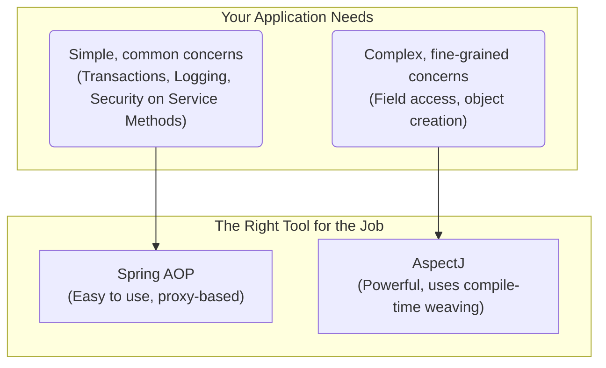

# Spring AOP Capabilities: The "Right Tool for the Job" 🛠️

Mawa, manam ippudu AOP concepts gurinchi nerchukunnam. Kani, Spring AOP anedi AOP prapancham lo unna anni powers ni istunda? Ledu. Spring AOP chala specific goals tho design chesaru. Adi ardam cheskovadam chala important.

### Source URL
[https://docs.spring.io/spring-framework/reference/core/aop/introduction-spring-defn.html](https://docs.spring.io/spring-framework/reference/core/aop/introduction-spring-defn.html)

### The Toolbox Analogy 🧰
Imagine nuvvu oka mechanic. Nee daggara rendu toolboxes unnayi.
1.  **Spring AOP (Your Everyday Toolbox):** Ee box lo, nuvvu roju vadataniki కావలసిన anni important tools (spanners, screwdrivers) unnayi. Ee tools tho nuvvu 80% of your daily work cheseyochu. Idi chala easy to use and perfectly integrated with your workflow.
2.  **AspectJ (The Specialist's Super-Toolbox):** Ee box lo, chala advanced, powerful, and complex tools (like a laser cutter or a 3D printer) unnayi. Veetitho nuvvu ഏ-paninaina cheyochu, kani vaatini vadataniki special training and setup kavali.

Spring AOP anedi aa first toolbox lantiది. It's not designed to do *everything*. It's designed to do the most **common and important** things really, really well, and to work perfectly with the Spring IoC container.

### The Key Capabilities and Limitations of Spring AOP

*   **Pure Java:** Spring AOP anedi 100% Java lo rasaru. Deeniki special compilers or build steps avasaram ledu. Just add the dependency, and you're good to go! ✅

*   **Method Execution Only:** Mawa, idi chala important point. Spring AOP **kevalam method execution** ni matrame advise cheyagaladu. Ante, oka method call ayye mundu or tarvata matrame mana ninja act cheyagaladu.
    *   **What it CAN'T do:** It cannot intercept field access. Ante, `myObject.myField = 10;` lanti statement ni Spring AOP tho intercept cheyalem. Ee level of control kavali ante, manam specialist (`AspectJ`) ni vadali.

*   **Goal: Integration, Not Competition:** Spring AOP goal anedi, AspectJ lanti full-blown AOP framework tho compete cheyadam kadu. Daani main goal, Spring IoC container tho tight ga integrate ayyi, enterprise applications lo vache common problems (like transactions, security) ni solve cheyadaniki oka easy solution ivvadam.

*   **Proxy-Based:** Spring AOP anedi runtime lo proxies create chesi pani chestundi. Idi chala flexible, kani konni limitations unnayi (like advising `final` methods).

### Spring AOP + AspectJ = The Ultimate Team-Up! 🦸‍♂️🦸‍♀️
Spring team ki telusu, valla AOP antha cheyaleni. Anduke, వాళ్ళు Spring ni AspectJ tho super easy ga integrate ayyela design chesaru.
-   Nuvvu simple cross-cutting concerns kosam Spring AOP vadukovachu.
-   Inka complex, fine-grained control (like field interception) kavali anukunte, ade project lo AspectJ kuda vadukovachu.
-   Rendu kalisi, oke application lo peacefully co-exist cheyagalavu. They are complementary, not competitors.

### Mawa's Cliffhanger 🧗
Okay, manam "proxy" ane word ni chala sarlu vadam. Spring AOP ee proxies ni create chesi magic chestundi anukunnam. Kani asalu, enni rakala proxies unnayi? JDK Dynamic Proxies ante enti? CGLIB ante enti? Spring eppudu edi vadutundi? Next topic lo, manam ee proxy mystery ni solve cheddam! Let's go behind the curtain!
