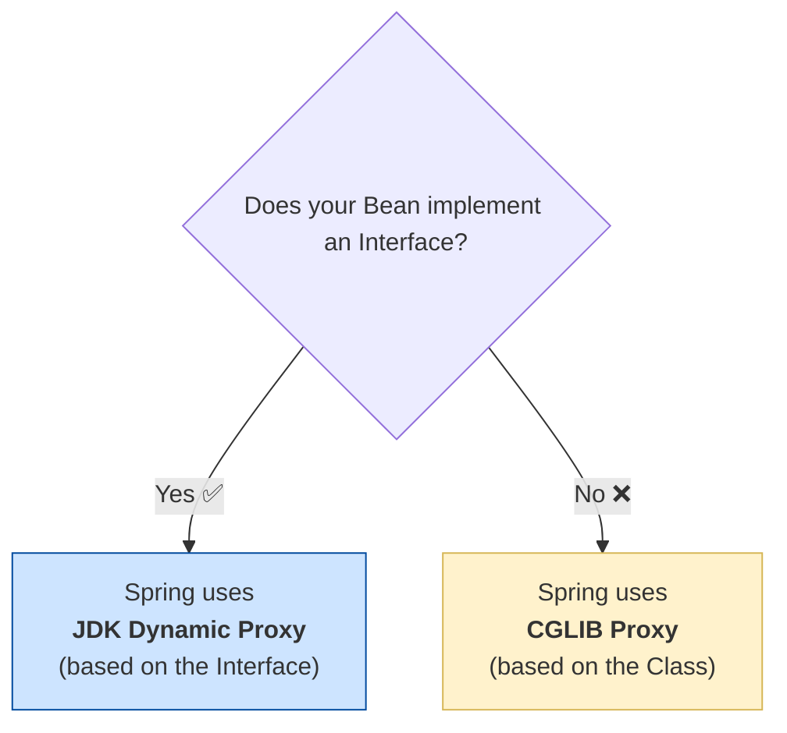

# AOP Proxies: The Two Types of Gift Wrapping 🎁

Mawa, manam AOP anedi oka "Gift Wrapping" process anukunnam kada. Spring mana original gift (`Target Object`) ni a beautiful wrapping paper (`Aspect`) tho wrap chesi, oka final "Wrapped Gift" (`AOP Proxy`) istundi.

Ippudu, aa wrapping cheyadaniki, Spring daggara rendu different techniques unnayi. Ee topic chala important, endukante idi Spring AOP venaka unna core mechanism ni explain chestundi.

### Source URL
[https://docs.spring.io/spring-framework/reference/core/aop/introduction-proxies.html](https://docs.spring.io/spring-framework/reference/core/aop/introduction-proxies.html)

### The Two Wrapping Techniques

1.  **JDK Dynamic Proxies (The "Transparent Box" Method):**
    *   **Analogy:** Imagine your gift is a beautiful watch. You put it inside a **transparent, branded box** (`Interface`). Ee box meeda "Watch" ani rasivundi. Nuvvu aa box ni wrapping paper tho wrap chestav. The final wrapped gift still looks like a "Watch" box because it follows the rules of the original box.
    *   **How it works:** This is the **default** method in Spring. It can only be used if your target bean implements at least one **interface**. Spring creates a proxy class at runtime that implements the same interface.
    *   **Pro:** It's a standard Java feature, built into the JDK.
    *   **Con:** It only works for classes that implement interfaces.

2.  **CGLIB Proxies (The "Custom Box" Method):**
    *   **Analogy:** Imagine your gift is a custom-made sculpture. Daaniki standard box ledu. So, nuvvu daani shape ki taggattu, **oka kotha box ni create chesi** (`subclass`), aa tarvata daanini wrap chestav.
    *   **How it works:** If your target bean *does not* implement an interface, Spring cannot use a JDK proxy. Instead, it uses a library called CGLIB to create a **subclass** of your target class at runtime. This subclass is then used as the proxy.
    *   **Pro:** It can proxy any class, even if it doesn't implement an interface.
    *   **Con:** It cannot proxy a `final` class (because you can't subclass a final class) or `final` methods.

### When Does Spring Use Which One? The Golden Rule 🏆
Ee decision chala simple mawa:
> **"Does the target bean implement an interface? If YES, use a JDK Dynamic Proxy. If NO, use a CGLIB proxy."**

That's it! It's the default behavior.

### Forcing CGLIB: "I Always Want the Custom Box!"
Konni sarlu, mana bean interface ni implement chesina kuda, manam CGLIB proxy ne vadali anukuntam. Enduku?
-   Maybe manam oka method ni advise cheyali, adi interface lo ledu, kani class lo undi.
-   Maybe manam proxy object ni concrete type (`MyServiceImpl` not `MyService`) ga vere method ki pass cheyali.

Alaantappudu, manam Spring ki chepochu, "Eppudu CGLIB eh vadu" ani. Spring Boot lo, ee pani `application.properties` lo oka simple line tho cheyochu:
`spring.aop.proxy-target-class=true`

Ee setting tho, Spring eppudu JDK proxies ni ignore chesi, CGLIB subclass-based proxies ne create chestundi.

### Mawa's Cliffhanger 🧗
Okay, ippudu manaki AOP venaka unna proxy magic gurinchi telisindi. Manam theory antha cover chesam. Ippudu asalu time vachindi: **Let's write some real AOP code!**

Next topic lo, manam `@AspectJ` support ni enable chesi, mana first ever `Aspect` ni create chesi, mana "Gift Wrapping" ni live lo chuddam. Get ready, the real fun is about to begin! 🔥
