# 4. Pointcuts: Mana Spy ki Mission Ivvadam! 🎯

Mawa, mana `LoggingAspect` agent ready ga unnadu, kani daaniki emi pani cheyalo teliyadu. It's just sitting idle. A Pointcut is the **mission brief**. It tells the agent *exactly* which methods to watch and when to act. Idiలేకపోతే AOP anedi ledu. So, konchem concentration pettu, idi chala important and interesting! 💪

## What is a Pointcut?

A Pointcut is a **predicate** or a **query** that matches join points (method executions). Think of it like a SQL query for your methods.

*   `SELECT * FROM methods WHERE package='com.example' AND name LIKE 'get*'`

Ee concept ni Spring lo manam oka special expression tho rastam.

## How to Declare a Pointcut: The `@Pointcut` Annotation

Manam mana Aspect class lo, oka empty method create chesi, daani meeda `@Pointcut` annotation pedatam.
*   The annotation contains the powerful **expression**.
*   The method name becomes the **name of our reusable pointcut**.
*   The method body is always **empty**. Daani pani just annotation ni hold cheyadam.

```java
@Aspect
@Component
public class LoggingAspect {

    @Pointcut("execution(* io.mawa.spring.core.aop.service.*.*(..))")
    public void forServicePackage() {} // This is our named pointcut

    // We'll add advice that USES this pointcut here later
}
```

## The 'execution' Designator: The Ultimate Weapon 💥

Pointcut expressions lo chala designators untayi, kani 95% of the time, nuvvu `execution` matrame vadatav. It's the most powerful and common one. Let's break it down.

The syntax looks scary, kani chala easy, mawa.
`execution(modifiers? return-type package.class.method(params) throws?)`

Let's see the most important parts:

`execution( [return-type] [package.class.method] ( [params] ) )`

*   **`return-type`**: The return type of the method. `*` ante "any return type".
*   **`package.class.method`**: The full path to the method. Ikkada manam wildcards (`*`) vadachu.
*   **`params`**: The parameters of the method.
    *   `()` - No parameters.
    *   `(..)` - Zero or more parameters of any type. (Idi chala common).
    *   `(*)` - Exactly one parameter of any type.
    *   `(String, ..)` - First parameter is String, tarvata emaina undochu.

### Let's See Some Examples:

| Expression                                                   | Meaning                                                     |
| ------------------------------------------------------------ | ----------------------------------------------------------- |
| `execution(public String getName())`                         | `public String getName()` ane method ni match chey.         |
| `execution(* get*())`                                        | `get` tho start ayye, no-argument methods anni. (`*` = any return type). |
| `execution(* com.example.service.AccountService.*(..))`      | `AccountService` lo unna anni methods ni target chey. (`*` = any method, `(..)` = any params). |
| `execution(* com.example.service.*.*(..))`                   | `com.example.service` package lo unna **anni classes lo anni methods** ni target chey. |

### The Two Dots `..` Magic

*   Package lo `..` pedithe, "ee package and daani sub-packages anni" ani ardam.
    *   `com.example..` matches `com.example`, `com.example.service`, `com.example.service.impl`, etc.
*   Parameters lo `..` pedithe, "zero or more parameters" ani ardam.

### Visualizing the Pointcut Filter

Imagine mana application lo chala method calls (join points) unnayi. Mana pointcut expression oka filter laaga pani chesi, manaki kavalsinavi matrame select chestundi.

```mermaid
graph TD
    subgraph "All Method Calls in Application (Join Points)"
        direction LR
        M1["service.Calculator.add()"]
        M2["service.ReportService.generate()"]
        M3["controller.AppController.home()"]
        M4["service.Calculator.subtract()"]
    end

    subgraph "Our Pointcut Filter"
        P["@Pointcut('execution(* service.Calculator.*(..))')"]
    end

    subgraph "Selected Join Points (Our Targets!)"
        direction LR
        S1["service.Calculator.add()"]
        S2["service.Calculator.subtract()"]
    end

    M1 -- "✅ Match" --> P
    M2 -- "❌ No Match" --> P
    M3 -- "❌ No Match" --> P
    M4 -- "✅ Match" --> P

    P --> S1
    P --> S2

    style P fill:#cde4ff,stroke:#004a9e,stroke-width:2px
```



## Combining Pointcuts

Manam pointcuts ni `&&` (AND), `||` (OR), and `!` (NOT) tho combine cheyochu.

```java
@Pointcut("execution(* com.example.service.*.*(..))")
private void forServiceLayer() {}

@Pointcut("execution(* get*(..))")
private void forGetters() {}

// Combination
@Pointcut("forServiceLayer() && !forGetters()")
public void serviceLayerNoGetters() {}
```

---

### Mawa's Cliffhanger 🧗

Perfect! Mana spy agent ki ippudu target lock aipoindi. Daaniki **ekkada** chudalo, **eppudu** chudalo telusu.

Kani... asalu em cheyali? What is the actual task? 🤔

Next lesson lo, manam **"Advice"** gurinchi nerchukundam. We'll finally write the code that our spy will execute when it sees the target method being called. Get ready for some real action! 💥
