# Enabling @AspectJ Support: Flipping the Magic Switch* 💡

Mawa, manam ippudu AOP theory nunchi practical loki first step vestunnam. Mana code lo `@Aspect` lanti annotations ni Spring ardam cheskuni, AOP magic ni start cheyalante, manam daaniki explicit ga cheppali. "Hey Spring, get ready for some AOP action!" ani.

Ee pani chese magic switch eh **`@EnableAspectJAutoProxy`**.

\* **(This is the absolute first step for any annotation-based AOP. Must-know.)**

### Source URL
[https://docs.spring.io/spring-framework/reference/core/aop/ataspectj/aspectj-support.html](https://docs.spring.io/spring-framework/reference/core/aop/ataspectj/aspectj-support.html)

### The Two Things You Need

AOP ni enable cheyadaniki, manaki rendu vishayalu kavali.

1.  **The Magic Switch (`@EnableAspectJAutoProxy`):**
    *   Idi oka annotation, manam mana main `@Configuration` class meeda pedatam.
    *   Ee annotation chudagane, Spring automatic ga `@Aspect` annotations unna beans ni vethiki, vaati pointcuts ni process chesi, correct places lo proxies create cheyadam start chestundi.
    *   Idi lekunte, nee `@Aspect` beans anevi just normal beans la untayi, vaatilo AOP power undadu.

2.  **The Tool (`aspectjweaver` dependency):**
    *   Spring, pointcut expressions (`execution(...)` lantiవి) ni parse cheyadaniki, AspectJ yokka libraries ni vadutundi.
    *   So, manam `org.aspectj:aspectjweaver` ane dependency ni mana `pom.xml` (or `build.gradle`) lo add cheyali.
    *   **Pro Tip:** Manam `spring-boot-starter-aop` ni add cheste, idi automatic ga `aspectjweaver` ni thechi pedutundi, so manam separate ga add cheyanakkarledu.

```mermaid
graph TD
    A["Your @Configuration Class"] -- "is decorated with" --> B["@EnableAspectJAutoProxy"];
    C["Your pom.xml"] -- "must contain" --> D["spring-boot-starter-aop<br/>(which includes aspectjweaver)"];
    B & D -- "together enable" --> E{🚀 AOP is Active!};
```



### How to Do It: The Java Config Way

Ippudu manam AOP ni enable cheyadaniki oka minimal setup create cheddam.

```java
// In your main configuration file
@Configuration
@EnableAspectJAutoProxy // Step 1: Flip the switch!
@ComponentScan("io.mawa.spring.core.aop.aspectj.enabling") // To find our components
public class AopEnablingConfig {
    // That's it! This class is now ready to support aspects.
}
```

And in your `pom.xml`, make sure you have this:
```xml
<!-- Step 2: Add the toolbox -->
<dependency>
    <groupId>org.springframework.boot</groupId>
    <artifactId>spring-boot-starter-aop</artifactId>
</dependency>
```

Anthe mawa! Ee rendu steps tho, mana Spring application AOP aspects ni process cheyadaniki ready ga undi.

### Mawa's Cliffhanger 🧗
Okay, manam AOP engine ni start chesam. The stage is set. Kani, mana "Gift Wrapping" machine ki, asalu wrapping paper (`Aspect`) edi, and daani meeda unna design (`Advice`) enti anedi manam inka cheppaledu. In our very next topic, we will write our first ever `@Aspect` class and officially create our first piece of "wrapping paper". The real coding begins now!
