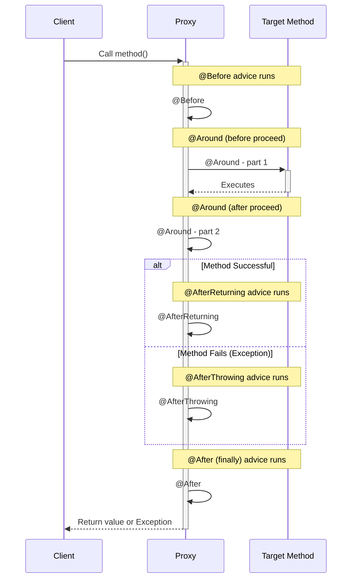

# 5. Declaring Advice: Spy ki Action Plan Ivvadam! 🏃💨

Mawa, welcome to the most exciting part! Mana spy agent (`LoggingAspect`) unnadu, daani target (`@Pointcut`) kuda lock chesam. Ippudu asalu pani cheppali. **Advice** is the actual code, the action plan that our spy executes at the target join point.

Let's give our spy some real missions!

## The 5 Types of Advice

Manaki 5 rakala advices unnayi. Okko daaniki okko purpose undi. Let's see them one by one.



### 1. `@Before` Advice

*   **What it is:** Ee advice target method execute avvadaniki **mundu** run avutundi.
*   **Analogy:** Cinema lo hero entry ki mundu vachhe buildup BGM 🥁 laantidi. It sets the stage.
*   **Use Case:** Logging, security checks, setup tasks.
*   **Important:** It cannot prevent the target method from running.

```java
// In LoggingAspect.java
@Before("forServicePackage()")
public void beforeServiceMethods(JoinPoint joinPoint) {
    String methodName = joinPoint.getSignature().toShortString();
    System.out.println("✅ @Before: Calling method: " + methodName);
}
```

### 2. `@AfterReturning` Advice

*   **What it is:** Target method **successfully** execute ayyi, oka value ni return chesaka ee advice run avutundi. Exception vasthe, idi run avvadu.
*   **Analogy:** Hero fight gelichaka, background lo vachhe victory song 🎶 laantidi.
*   **Use Case:** Logging the return value, post-processing on the result.
*   **How to get the result:** `returning` attribute use chesi, manam return value ni access cheyochu.

```java
// In LoggingAspect.java
@AfterReturning(
    pointcut = "forServicePackage()",
    returning = "result"
)
public void afterReturningFromService(JoinPoint joinPoint, Object result) {
    String methodName = joinPoint.getSignature().toShortString();
    System.out.println("✅ @AfterReturning: Method '" + methodName + "' returned: " + result);
}
```

### 3. `@AfterThrowing` Advice

*   **What it is:** Target method lo oka **exception** throw ayinappudu matrame ee advice run avutundi.
*   **Analogy:** Hero odipoyinappudu or emotional scene lo vachhe sad BGM 🎻 laantidi.
*   **Use Case:** Logging exceptions, sending notifications on failure.
*   **How to get the exception:** `throwing` attribute use chesi, manam exception object ni access cheyochu.

```java
// In LoggingAspect.java
@AfterThrowing(
    pointcut = "forServicePackage()",
    throwing = "exception"
)
public void afterExceptionInService(JoinPoint joinPoint, Throwable exception) {
    String methodName = joinPoint.getSignature().toShortString();
    System.out.println("❌ @AfterThrowing: Exception in method '" + methodName + "'. Exception is: " + exception);
}
```

### 4. `@After` (Finally) Advice

*   **What it is:** Ee advice eppudu run avutundi. Method success ayina, fail ayina (exception vachina), idi pakka execute avutundi. It works just like a `finally` block in Java.
*   **Analogy:** Cinema lo "The End" card. Story happy ending or sad ending, ee card matram padalsindhe.
*   **Use Case:** Releasing resources, cleanup tasks.

```java
// In LoggingAspect.java
@After("forServicePackage()")
public void afterServiceMethods(JoinPoint joinPoint) {
    String methodName = joinPoint.getSignature().toShortString();
    System.out.println("✅ @After: Finished executing method: " + methodName);
}
```

### 5. `@Around` Advice - The Big Boss! 😎

*   **What it is:** Idi anni advices kante powerful. Idi target method ki **chuttu** (around) run avutundi. Ante, method ki mundu logic rayochu, tarvata logic rayochu, and most importantly, **asalu original method ni eppudu call cheyalo kuda control cheyochu**.
*   **Analogy:** Idi cinema **Director** laantidi. Director "Action!" chepthe scene start avutundi, "Cut!" chepthe aagipotundi. Director isthe scene ni modify kuda cheyochu.
*   **Use Case:** Performance monitoring (timing a method), caching, advanced transaction management.
*   **How it works:**
    *   It **must** accept a `ProceedingJoinPoint` as its first parameter.
    *   It **must** call `joinPoint.proceed()` to execute the original target method.
    *   It **must** return a value (the result of the original method).

```java
// In LoggingAspect.java
@Around("forServicePackage()")
public Object aroundServiceMethods(ProceedingJoinPoint proceedingJoinPoint) throws Throwable {
    String methodName = proceedingJoinPoint.getSignature().toShortString();

    // 1. Method ki mundu logic
    long begin = System.currentTimeMillis();
    System.out.println("🔥 @Around: Starting timer for " + methodName);

    // 2. Call the original target method
    Object result = null;
    try {
        result = proceedingJoinPoint.proceed();
    } catch (Throwable e) {
        System.out.println("🔥 @Around: Exception caught! Rethrowing...");
        throw e; // Important to rethrow!
    }

    // 3. Method tarvata logic
    long end = System.currentTimeMillis();
    long duration = end - begin;
    System.out.println("🔥 @Around: Method " + methodName + " took " + duration + " ms");

    return result;
}
```

### Code Reference & How to Run

Ee examples anni `LoggingAspect.java` lo add chesam. Vaatini test cheyadaniki `CalculatorService.java` lo oka method exception throw chese laaga marchali, and `AopDemoApp.java` ni update cheyali.

Ee code antha `io.mawa.spring.core.aop` package lo chudu.

Run cheyadaniki, `Spring-Project` root folder lo undi, ee command run cheyi:
```bash
mvn compile exec:java -Dexec.mainClass="io.mawa.spring.core.aop.AopDemoApp"
```
You will see all the advice messages printed in a specific order!

---

### Mawa's Cliffhanger 🧗

Incredible! Mana spy ippudu full-fledged field agent. It can log before, after, handle success and failure, and even measure performance. We've seen the core of Spring AOP in action.

Kani, manam inka AOP lo chala advanced concepts chudali. What if you want to pass arguments from your target method into your advice? For example, `add(5, 10)` lo `5` and `10` ni manam advice lo ఎలా access cheyali?

Let's dive deeper into passing parameters in the next lesson! Get ready.
